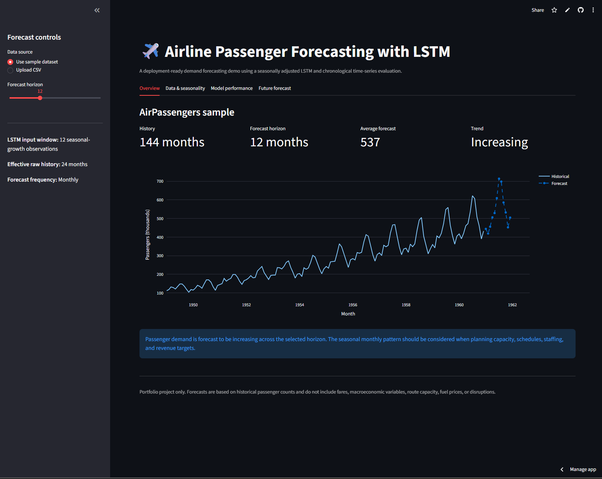
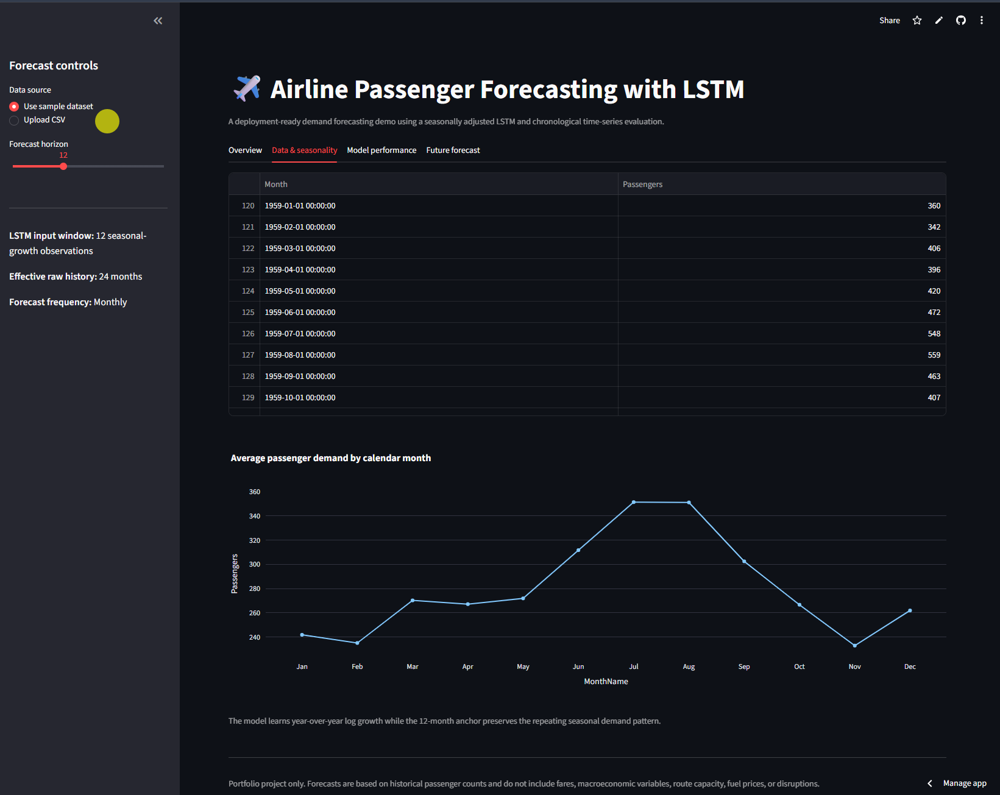
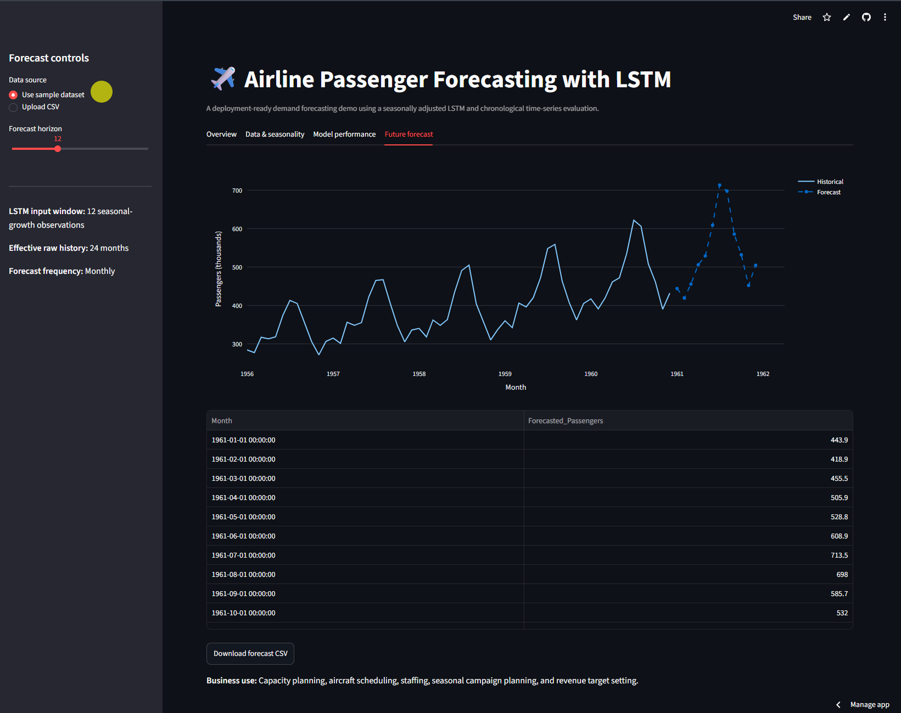
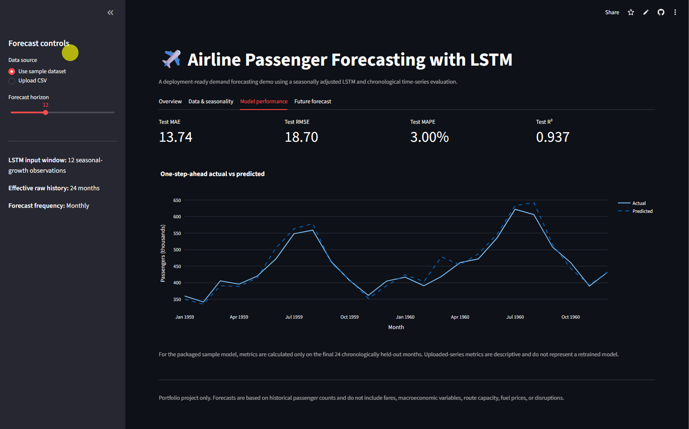

# Airline Passenger Forecasting using LSTM Neural Networks

[](https://www.python.org/)
[](https://keras.io/)
[](https://jax.readthedocs.io/)
[](https://lstm-projects-qtuxsozwu2g7kp6lpeuclq.streamlit.app/)
[](../LICENSE)
[](https://github.com/unit-mole/lstm-projects/actions/workflows/01-airline-passenger-forecasting.yml)

An end-to-end time-series forecasting project that uses a seasonality-aware Long Short-Term Memory
network to forecast monthly airline passenger demand. The project combines chronological validation,
training-only scaling, year-over-year growth modeling, cyclical month features, baseline benchmarking,
recursive multi-step forecasting, saved inference artifacts, automated testing, and an interactive
Streamlit application.

**Status:** Portfolio-ready  
**Live demo:** [Open the Airline Passenger Forecasting application](https://lstm-projects-qtuxsozwu2g7kp6lpeuclq.streamlit.app/)  
[](https://lstm-projects-qtuxsozwu2g7kp6lpeuclq.streamlit.app/)  
**Primary stack:** Python · Keras · JAX · scikit-learn · pandas · Plotly · Streamlit

---

## Business Problem

Airlines and travel organizations need forward-looking passenger-demand estimates to support
capacity planning, aircraft scheduling, workforce allocation, seasonal campaign planning, and
revenue forecasting. Historical passenger totals alone do not directly show how future demand may
change or how repeating seasonal patterns may affect upcoming months.

This project answers:

> Given historical monthly airline passenger counts, what will future passenger demand look like?

The application produces:

- **Forecasted monthly passenger counts**
- **Selectable forecast horizon of 6, 12, 18, or 24 months**
- **Historical trend and seasonal-demand analysis**
- **Actual-versus-predicted model evaluation**
- **Forecast trend direction and business interpretation**
- **Downloadable forecast results**

---

## Project Highlights

- End-to-end monthly demand-forecasting workflow from raw CSV data to deployment
- Seasonality-aware LSTM trained on year-over-year log passenger growth
- Leakage-safe chronological training, validation, and test periods
- Scaler fitted exclusively on the training period
- Month-of-year sine and cosine features for cyclical seasonality
- Comparison against naive, seasonal-naive, moving-average, and linear-trend baselines
- Recursive 6-, 12-, 18-, and 24-month forecasting
- MAE, RMSE, MAPE, R², residual analysis, and forecast visualizations
- Pretrained model loading without retraining during application startup
- CSV upload, data validation, forecast generation, and CSV download
- Modular Python source code, automated tests, GitHub Actions CI, and Streamlit deployment

---

## Application Preview

### 1. Application overview

The application provides an interactive interface for exploring historical airline passenger demand
and generating future forecasts with the deployed LSTM model. Users can select the packaged sample
dataset or upload a compatible monthly passenger CSV file, choose the forecast horizon, and review
the key forecast summary.



### 2. Historical trend and seasonality

The exploratory section presents the long-term passenger-demand trend and the repeating seasonal
pattern across calendar months. These visualizations help explain the growth and seasonality learned
by the forecasting pipeline.



### 3. Future passenger forecast

Users can select a forecast horizon of 6, 12, 18, or 24 months. The application combines the
historical observations with recursively generated LSTM forecasts and reports the expected demand
direction, average forecast, and future monthly passenger counts.



### 4. Model-performance dashboard

The model-performance section reports MAE, RMSE, MAPE, and R² calculated on the final 24
chronologically held-out months. It also includes actual-versus-predicted results and supporting
evaluation visualizations for understanding forecast accuracy and model limitations.



---

## Project Status and Honest Scope

This is a complete, deployable portfolio project built from the classic **AirPassengers** monthly
time-series dataset. The supplied observations cover January 1949 through December 1960 and are used
to demonstrate forecasting methodology, deep learning, evaluation, modular engineering, CI/CD, and
deployment.

The application is suitable for portfolio and educational demonstration. It is **not** a current
airline-planning system and should not be used for operational decisions without retraining and
validating the workflow on recent, governed, route-specific business data.

---

## Dataset

The included sample contains the classic monthly international airline passenger series.

| Dataset detail | Value |
|---|---:|
| Total observations | 144 months |
| Full period | January 1949–December 1960 |
| Training period | January 1949–December 1956 |
| Validation period | January 1957–December 1958 |
| Test period | January 1959–December 1960 |
| Date column | `Month` |
| Target column | `Passengers` |
| Target unit | Thousands of passengers |
| Personal or confidential data | None |

The application also accepts compatible user-uploaded CSV files. It automatically:

- detects and parses the date and passenger columns,
- converts passenger counts to numeric values,
- normalizes dates to monthly timestamps,
- sorts records chronologically,
- aggregates duplicate months,
- inserts missing monthly periods,
- interpolates missing passenger values,
- rejects negative passenger counts.

See [`data/README_data.md`](data/README_data.md) for the expected upload format and dataset notes.

---

## Feature Engineering

The modeling workflow transforms the raw passenger series into three features per LSTM timestep:

- **Standardized year-over-year log growth:** Measures how passenger demand changes relative to the same month one year earlier
- **Month sine encoding:** Represents the cyclical position of each month
- **Month cosine encoding:** Complements the sine feature and preserves the circular month relationship

The core transformation is:

```text
Seasonal log growth at month t
= log(Passengers_t + 1) - log(Passengers_t-12 + 1)
```

The predicted passenger level is reconstructed using the same month from the previous year:

```text
Forecast log level at month t
= log level_t-12 + predicted seasonal log growth_t
```

The LSTM receives the previous 12 seasonal-growth observations. Since each observation already
references the same month one year earlier, the effective raw passenger history is **24 months**.

---

## Technical Workflow

1. Load the packaged sample dataset or a user-uploaded CSV file.
2. Detect the monthly date and passenger-count columns.
3. Parse dates and convert passenger values to numeric form.
4. Aggregate duplicate months and restore missing monthly periods.
5. Sort the series chronologically without random shuffling.
6. Calculate year-over-year log passenger growth.
7. Create sine and cosine calendar-month features.
8. Split the series into chronological training, validation, and test periods.
9. Fit the scaler only on training-period growth values.
10. Generate 12-step LSTM input sequences.
11. Train the compact LSTM using validation-based early stopping.
12. Evaluate the untouched final 24 months.
13. Compare the LSTM with transparent forecasting baselines.
14. Save the trained model, scaler, configuration, metadata, predictions, and plots.
15. Generate recursive future forecasts.
16. Serve forecasts through an interactive Streamlit application.

---

## LSTM Architecture

The Keras architecture contains **1,425 trainable parameters**.

```text
Input: 12 timesteps × 3 features
    -> LSTM, 16 units
    -> Dropout, 10%
    -> Dense, 8 units with ReLU
    -> Dense, 1 regression output
```

Training configuration:

| Setting | Value |
|---|---:|
| Input shape | `(12, 3)` |
| LSTM units | 16 |
| Dropout | 0.10 |
| Dense units | 8 |
| Loss | Huber |
| Optimizer | Adam |
| Initial learning rate | 0.003 |
| Batch size | 8 |
| Maximum epochs | 150 |
| Early-stopping patience | 12 |
| Data shuffling | Disabled |
| Backend | JAX |

The compact architecture is intentional because the dataset contains only 144 monthly observations.

---

## Held-Out Test Results

The final 24 months, January 1959 through December 1960, were not used to fit the model, scaler, or
early-stopping decisions.

| Metric | Result |
|---|---:|
| MAE | **13.74** |
| RMSE | **18.70** |
| MAPE | **3.00%** |
| R² | **0.937** |

### Metric interpretation

- **MAE** represents the average absolute passenger-demand prediction error.
- **RMSE** penalizes larger forecast errors more heavily than MAE.
- **MAPE** expresses the average prediction error as a percentage of actual passenger demand.
- **R²** measures how much test-period variation is explained by the model.
- **Residual analysis** helps identify systematic underprediction, overprediction, and model bias.

---

## Baseline Comparison

| Model | MAE | RMSE | MAPE | R² |
|---|---:|---:|---:|---:|
| **Seasonally adjusted LSTM** | **13.74** | **18.70** | **3.00%** | **0.937** |
| Seasonal naive: previous year | 47.58 | 49.99 | 10.52% | 0.552 |
| Naive: previous month | 44.21 | 51.78 | 9.73% | 0.519 |
| 12-month moving average | 55.39 | 74.31 | 11.35% | 0.010 |
| Linear trend | 54.94 | 74.79 | 11.22% | -0.003 |

The LSTM reduced test RMSE by approximately **62.6%** relative to the strongest baseline by RMSE.

---

## Packaged Forecast Artifact

The repository includes a reproducible 24-month recursive forecast artifact generated from the
historical sample series.

| Forecast detail | Result |
|---|---:|
| Forecast horizon | 24 months |
| Average forecast | 582.38 thousand passengers |
| Ending forecast | 566.02 thousand passengers |
| Change across forecast horizon | 27.50% |
| Interpreted direction | Increasing |

These values demonstrate the saved forecasting pipeline and should not be interpreted as current
airline-industry projections.

---

## Streamlit Application

The deployed application supports:

- Packaged AirPassengers sample data
- Compatible monthly CSV upload
- Automatic time-series validation and preparation
- Historical passenger-data preview
- Historical trend visualization
- Calendar-month seasonality analysis
- LSTM input-window and effective-history details
- Selectable 6-, 12-, 18-, and 24-month forecast horizons
- Test metrics for the packaged model
- Descriptive historical metrics for uploaded datasets
- Actual-versus-predicted visualization
- Future forecast chart and table
- Downloadable forecast CSV
- Business interpretation and documented limitations

**Live application:**  
[Open the Airline Passenger Forecasting application](https://lstm-projects-qtuxsozwu2g7kp6lpeuclq.streamlit.app/)

---

## Project Structure

```text
lstm-projects/
├── .github/
│   └── workflows/
│       └── 01-airline-passenger-forecasting.yml
├── .streamlit/
│   └── config.toml
├── 01-airline-passenger-forecasting/
│   ├── app/
│   │   ├── streamlit_app.py
│   │   └── requirements.txt
│   ├── archive/
│   │   └── original-project-files/
│   ├── data/
│   │   ├── README_data.md
│   │   └── airline_passengers_sample.csv
│   ├── images/
│   │   ├── 01_app_overview.png
│   │   ├── 02_historical_trend_and_seasonality.png
│   │   ├── 03_future_passenger_forecast.png
│   │   └── 04_model_performance.png
│   ├── models/
│   │   ├── airline_passenger_lstm.keras
│   │   ├── seasonal_growth_scaler.pkl
│   │   ├── best_config.json
│   │   └── model_metadata.json
│   ├── notebooks/
│   │   └── airline_passenger_forecasting.ipynb
│   ├── outputs/
│   │   ├── passenger_trend.png
│   │   ├── seasonal_pattern.png
│   │   ├── training_curve.png
│   │   ├── actual_vs_predicted.png
│   │   ├── residual_plot.png
│   │   ├── baseline_comparison.png
│   │   ├── forecast_plot.png
│   │   ├── model_metrics.json
│   │   ├── test_predictions.csv
│   │   ├── training_history.csv
│   │   ├── baseline_comparison.csv
│   │   └── future_forecast_24_months.csv
│   ├── scripts/
│   │   └── validate_project.py
│   ├── src/
│   │   ├── config.py
│   │   ├── data_preprocessing.py
│   │   ├── feature_engineering.py
│   │   ├── sequence_generation.py
│   │   ├── model_training.py
│   │   ├── model_evaluation.py
│   │   ├── forecasting_pipeline.py
│   │   └── visualization.py
│   ├── tests/
│   │   ├── conftest.py
│   │   └── test_pipeline.py
│   ├── .gitignore
│   ├── Dockerfile
│   ├── README.md
│   ├── README_HOSTING.md
│   ├── requirements.txt
│   ├── requirements-dev.txt
│   ├── run_local.bat
│   ├── run_local.sh
│   └── train_model.py
├── .gitignore
├── LICENSE
└── README.md
```

---

## Run Locally

Use Python 3.12 to match the tested local and deployment environments.

### Windows Command Prompt

Clone the repository and enter the project folder:

```bat
git clone https://github.com/unit-mole/lstm-projects.git

cd lstm-projects\01-airline-passenger-forecasting
```

Create and activate a virtual environment:

```bat
py -3.12 -m venv .venv

.venv\Scripts\activate.bat
```

Install the project and testing dependencies:

```bat
python -m pip install --upgrade pip setuptools wheel

python -m pip install -r requirements.txt -r requirements-dev.txt
```

Run the project checks:

```bat
python scripts\validate_project.py

python -m pytest -q
```

Launch the Streamlit application:

```bat
python -m streamlit run app\streamlit_app.py
```

Open the local URL displayed by Streamlit, normally:

```text
http://localhost:8501
```

### Future local runs

After the first installation:

```bat
cd lstm-projects\01-airline-passenger-forecasting

.venv\Scripts\activate.bat

python -m streamlit run app\streamlit_app.py
```

Windows users can also run:

```bat
run_local.bat
```

---

## Optional Retraining

The included pretrained model runs without retraining. To rebuild the model and regenerate all
forecasting artifacts:

```bat
python train_model.py
```

Retraining regenerates:

- the `.keras` LSTM model,
- the training-only scaler,
- model configuration and metadata,
- held-out predictions and metrics,
- baseline-comparison results,
- the future forecast CSV,
- all saved visualizations.

Retraining is not required to run the included Streamlit application.

---

## Deployment

The application is deployed on Streamlit Community Cloud and connected directly to the `main`
branch of this GitHub repository.

**Live application:**  
[Open the Airline Passenger Forecasting application](https://lstm-projects-qtuxsozwu2g7kp6lpeuclq.streamlit.app/)

**Streamlit entry point:**

```text
01-airline-passenger-forecasting/app/streamlit_app.py
```

**Cloud dependency file:**

```text
01-airline-passenger-forecasting/app/requirements.txt
```

Changes pushed to the relevant project files on the `main` branch automatically trigger a Streamlit
application update.

See [`README_HOSTING.md`](README_HOSTING.md) for deployment configuration, maintenance instructions,
and troubleshooting guidance.

---

## Model Artifacts

| Artifact | Purpose |
|---|---|
| `models/airline_passenger_lstm.keras` | Saved LSTM architecture and trained weights |
| `models/seasonal_growth_scaler.pkl` | StandardScaler fitted only on training growth values |
| `models/best_config.json` | Input shape and training configuration |
| `models/model_metadata.json` | Feature list, split dates, target details, and test metrics |

The Streamlit application loads these artifacts directly and does not retrain the model during startup.

---

## Data and Repository Safety

- The included dataset is public, non-confidential demonstration data.
- No personal, customer, employee, or proprietary airline data is included.
- Only a small reproducible sample dataset is stored in the repository.
- Virtual environments, caches, temporary files, logs, and secrets are excluded through `.gitignore`.
- Streamlit secrets must not be committed to GitHub.
- Saved inference artifacts under `models/` are required by the deployed application.
- Uploaded data is processed within the application session and is not used to retrain the model.

---

## Known Limitations

- The sample contains only one univariate historical passenger series.
- The observations end in December 1960 and do not represent present-day airline demand.
- The model does not include fares, GDP, holidays, fuel prices, route capacity, competition, weather, or disruptions.
- Recursive multi-step forecasts accumulate uncertainty over longer horizons.
- Prediction intervals are not currently included.
- Uploaded datasets are scored with the packaged model and are not automatically retrained.
- Historical metrics for uploaded datasets are descriptive and do not constitute independent validation.
- The model is not route-specific and is not a production airline-planning system.
- Structural breaks such as pandemics, recessions, strikes, policy changes, and network redesigns may reduce accuracy.

---

## Future Improvements

- Retrain on recent, governed, route-level airline demand data
- Add fares, GDP, fuel prices, holidays, route capacity, weather, and disruption indicators
- Add walk-forward and rolling-origin cross-validation
- Add probabilistic forecasts and prediction intervals
- Compare against SARIMA, ETS, Prophet, XGBoost, and Temporal Fusion Transformer models
- Add direct multi-horizon forecasting instead of recursive forecasting
- Add route-, region-, and cabin-level forecasting
- Add model and data-drift monitoring
- Add scheduled retraining and model-registry integration
- Add experiment tracking and automated model comparison
- Add downloadable forecast reports and scenario analysis

---

## Skills Demonstrated

`Time-Series Forecasting` · `Long Short-Term Memory Networks` · `Demand Forecasting` ·
`Trend Analysis` · `Seasonality Analysis` · `Feature Engineering` · `Sequence Generation` ·
`Chronological Validation` · `Data-Leakage Prevention` · `Regression Evaluation` ·
`Baseline Benchmarking` · `Residual Analysis` · `Keras` · `JAX` · `scikit-learn` ·
`pandas` · `Plotly` · `Streamlit` · `Model Deployment` · `Testing` · `CI/CD` ·
`Business Translation`

---

## Portfolio Description

**One-line description**

> Built and deployed a seasonality-aware LSTM that forecasts monthly airline passenger demand, outperforms classical baselines, and generates interactive 6–24 month forecasts through Streamlit.

**Pinned-repository description**

> End-to-end airline passenger forecasting project featuring chronological time-series validation, training-only scaling, year-over-year growth modeling, cyclical month features, LSTM forecasting, baseline benchmarking, residual analysis, automated testing, CI/CD, and Streamlit deployment.

---

## Original Notebook Review

See [`IMPROVEMENTS.md`](IMPROVEMENTS.md) for the detailed review of the original notebook and the
methodological improvements introduced in the portfolio-ready version.

---

## Author

**Anmol Tripathi**  
Quality Data Scientist | Data Science | Machine Learning | Applied AI | Analytics
