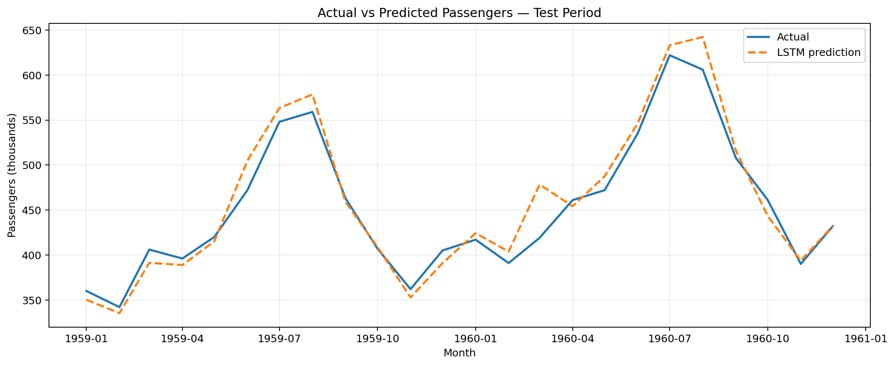
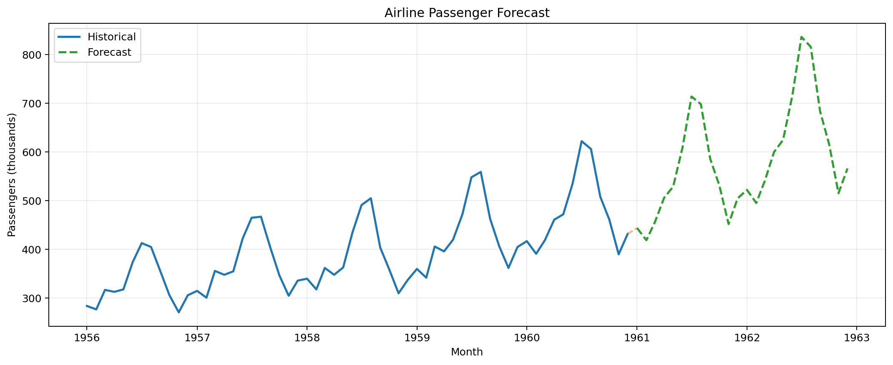

# Airline Passenger Forecasting using LSTM Neural Networks

[](https://www.python.org/)
[](https://keras.io/)
[](https://YOUR-SUBDOMAIN.streamlit.app)

A production-style monthly demand forecasting project that uses a **seasonally adjusted LSTM** to predict airline passenger growth, benchmark performance against classical baselines, generate future forecasts, and serve results through an interactive Streamlit application.

## Live Demo

**Streamlit:** `https://YOUR-SUBDOMAIN.streamlit.app`

Replace this placeholder after deployment.

## Business Problem

Airlines and travel organizations need forward-looking demand estimates for capacity planning, aircraft scheduling, staffing, pricing, marketing, and revenue planning. This project answers:

> Given historical monthly airline passenger counts, what will future passenger demand look like?

The application provides forecasted passenger counts, a selectable forecast horizon, trend direction, model error metrics, visual comparisons, a downloadable forecast, and a concise business interpretation.

## Project Objective

Build an end-to-end and deployment-ready LSTM forecasting workflow that:

- validates and standardizes monthly passenger history,
- preserves chronological order,
- avoids train/test leakage,
- models trend and seasonality,
- compares the neural network against simple baselines,
- forecasts 6, 12, 18, or 24 future months,
- saves all artifacts required for inference,
- exposes the results through Streamlit.

## Key Results

The final 24 months, January 1959 through December 1960, were held out from model training and early-stopping decisions.

| Metric | Seasonally adjusted LSTM |
|---|---:|
| MAE | **13.74** |
| RMSE | **18.70** |
| MAPE | **3.00%** |
| R² | **0.937** |

### Baseline Comparison

| Model | MAE | RMSE | MAPE | R² |
|---|---:|---:|---:|---:|
| Seasonally adjusted LSTM | 13.74 | 18.70 | 3.00% | 0.937 |
| Seasonal naive: previous year | 47.58 | 49.99 | 10.52% | 0.552 |
| Naive: previous month | 44.21 | 51.78 | 9.73% | 0.519 |
| 12-month moving average | 55.39 | 74.31 | 11.35% | 0.010 |
| Linear trend | 54.94 | 74.79 | 11.22% | -0.003 |

The LSTM reduced test RMSE by approximately **62.6%** relative to the strongest baseline by RMSE.

## Dataset

The packaged sample is the classic monthly international airline passenger series:

- 144 monthly observations
- January 1949 through December 1960
- `Month`: monthly timestamp
- `Passengers`: passenger totals in thousands

See [`data/README_data.md`](./data/README_data.md) for source and upload format details.

## Why the Model Predicts Seasonal Growth

The original raw-level LSTM needed to learn an accelerating trend and multiplicative seasonal variation from only 144 observations. The improved pipeline instead models:

```text
Seasonal log growth at month t
= log(Passengers_t + 1) - log(Passengers_t-12 + 1)
```

The LSTM predicts the next standardized seasonal-growth value. The forecasted passenger level is reconstructed as:

```text
Forecast log level_t
= log level_t-12 + predicted seasonal log growth_t
```

This approach preserves the annual seasonal anchor while allowing the neural network to learn how year-over-year demand growth evolves.

## Time-Series Preprocessing

1. Detect the date and passenger columns.
2. Parse monthly timestamps.
3. Convert passenger counts to numeric values.
4. Remove invalid rows.
5. Convert all dates to month-start timestamps.
6. Aggregate duplicate months.
7. Insert missing months and interpolate values.
8. Sort chronologically.
9. Calculate year-over-year log growth.
10. Fit the scaler only on training-period growth values.

The data is never randomly shuffled.

## Chronological Split

| Segment | Raw months | Period | Purpose |
|---|---:|---|---|
| Training | 96 | Jan 1949 – Dec 1956 | Fit scaler and model weights |
| Validation | 24 | Jan 1957 – Dec 1958 | Early stopping and learning-rate control |
| Test | 24 | Jan 1959 – Dec 1960 | Final untouched evaluation |

The scaler sees only growth values associated with the training period.

## Feature Engineering

Each LSTM timestep contains three features:

1. Standardized year-over-year log passenger growth
2. Sine encoding of calendar month
3. Cosine encoding of calendar month

The LSTM input contains the previous 12 seasonal-growth observations. Because each growth value references the same month one year earlier, the effective raw history is **24 months**.

## Sequence Generation

```text
12 monthly seasonal-growth observations
                 ↓
Input tensor shape: (12, 3)
                 ↓
Predict the next seasonal-growth value
                 ↓
Reconstruct the next passenger level from month t-12
```

## Model Architecture

```text
Input: 12 timesteps × 3 features
↓
LSTM: 16 units
↓
Dropout: 10%
↓
Dense: 8 units, ReLU
↓
Dense: 1 regression output
```

Training configuration:

- Loss: Huber loss
- Optimizer: Adam
- Initial learning rate: 0.003
- Batch size: 8
- Early stopping: validation loss, patience 12
- Learning-rate reduction on plateau
- Shuffle: disabled

The compact architecture is intentional because the dataset is small.

## Evaluation Metrics

- **MAE:** average absolute forecast error in passenger-count units.
- **RMSE:** penalizes larger forecast misses more heavily.
- **MAPE:** percentage error relative to actual demand.
- **R²:** proportion of test-period variation explained by the predictions.
- **Residual analysis:** identifies systematic overprediction or underprediction.

## Visual Outputs

| Output | File |
|---|---|
| Historical trend | [`outputs/passenger_trend.png`](./outputs/passenger_trend.png) |
| Seasonal pattern | [`outputs/seasonal_pattern.png`](./outputs/seasonal_pattern.png) |
| Training curve | [`outputs/training_curve.png`](./outputs/training_curve.png) |
| Actual vs predicted | [`outputs/actual_vs_predicted.png`](./outputs/actual_vs_predicted.png) |
| Residual analysis | [`outputs/residual_plot.png`](./outputs/residual_plot.png) |
| Future forecast | [`outputs/forecast_plot.png`](./outputs/forecast_plot.png) |
| Baseline comparison | [`outputs/baseline_comparison.png`](./outputs/baseline_comparison.png) |

### Test Performance



### Future Forecast



## Streamlit Demo Features

- Use the packaged sample dataset
- Upload a monthly CSV file
- Preview processed passenger history
- View historical trend and seasonal pattern
- Select a 6, 12, 18, or 24-month forecast horizon
- View model performance and actual-vs-predicted results
- Generate a future forecast chart
- Download forecast results as CSV
- Read a business interpretation of the predicted trend

The app loads the saved model and scaler and does not retrain during startup.

## Folder Structure

```text
01-airline-passenger-forecasting/
├── README.md
├── IMPROVEMENTS.md
├── README_HOSTING.md
├── train_model.py
├── requirements.txt
├── .gitignore
├── app/
│   └── streamlit_app.py
├── data/
│   ├── airline_passengers_sample.csv
│   └── README_data.md
├── models/
│   ├── airline_passenger_lstm.keras
│   ├── seasonal_growth_scaler.pkl
│   ├── model_metadata.json
│   └── best_config.json
├── notebooks/
│   └── airline_passenger_forecasting.ipynb
├── outputs/
│   ├── passenger_trend.png
│   ├── seasonal_pattern.png
│   ├── training_curve.png
│   ├── actual_vs_predicted.png
│   ├── forecast_plot.png
│   ├── residual_plot.png
│   ├── baseline_comparison.png
│   ├── model_metrics.json
│   ├── test_predictions.csv
│   ├── baseline_comparison.csv
│   ├── future_forecast_24_months.csv
│   └── model_summary.txt
├── src/
│   ├── data_preprocessing.py
│   ├── feature_engineering.py
│   ├── sequence_generation.py
│   ├── model_training.py
│   ├── model_evaluation.py
│   ├── forecasting_pipeline.py
│   └── visualization.py
└── tests/
    └── test_pipeline.py
```

## Run Locally

Open a terminal inside the project folder:

```bash
cd 01-airline-passenger-forecasting
python -m venv .venv
```

Activate the environment.

**Windows PowerShell**

```powershell
.venv\Scripts\Activate.ps1
```

**macOS/Linux**

```bash
source .venv/bin/activate
```

Install dependencies and start the app:

```bash
pip install -r requirements.txt
streamlit run app/streamlit_app.py
```

Windows users can alternatively double-click `run_local.bat`. Open the local URL shown by Streamlit, normally `http://localhost:8501`.

## Retrain the Model

From the project directory:

```bash
cd 01-airline-passenger-forecasting
python train_model.py
```

Retraining regenerates:

- the `.keras` model,
- the scaler,
- configuration and metadata,
- evaluation tables,
- future forecast CSV,
- all saved visualizations.

## Deploy

Use the project-specific Streamlit entrypoint:

```text
01-airline-passenger-forecasting/app/streamlit_app.py
```

The app uses the `requirements.txt` stored inside this project folder. Complete instructions are available in [`README_HOSTING.md`](./README_HOSTING.md).

## Model Artifacts

| Artifact | Purpose |
|---|---|
| `airline_passenger_lstm.keras` | Model architecture and trained weights |
| `seasonal_growth_scaler.pkl` | Training-only StandardScaler |
| `best_config.json` | Input shape and training configuration |
| `model_metadata.json` | Feature list, date ranges, split details, and test metrics |

## Business Interpretation

The model performs well when the historical annual seasonal pattern remains informative and year-over-year growth changes gradually. It may struggle during structural breaks such as recessions, pandemics, route-network changes, major policy shifts, strikes, or capacity constraints.

Forecast error matters operationally:

- underprediction can lead to insufficient capacity and staffing,
- overprediction can lead to unused capacity and higher operating costs,
- seasonal peak errors can affect revenue and customer experience disproportionately.

## Limitations

- The sample contains only one univariate passenger series.
- No external variables are included.
- Recursive forecasts accumulate uncertainty over longer horizons.
- Prediction intervals are not included.
- The model is not route-specific and is not a production airline planning system.
- Uploaded datasets are scored with the packaged model; they are not automatically retrained.

## Future Improvements

- Add fares, GDP, fuel prices, holidays, route capacity, and disruption indicators.
- Add walk-forward cross-validation.
- Add probabilistic prediction intervals.
- Compare against SARIMA, ETS, Prophet, XGBoost, and Temporal Fusion Transformer models.
- Add direct multi-horizon prediction instead of recursive forecasting.
- Add automated data-drift checks and scheduled retraining.
- Add experiment tracking and model registry integration.

## Skills Demonstrated

- LSTM time-series forecasting
- Demand forecasting and travel analytics
- Trend and seasonality analysis
- Leakage prevention and chronological validation
- Sequence generation and cyclical features
- Model evaluation and baseline benchmarking
- Residual analysis and business interpretation
- Model persistence with Keras
- Modular Python development and testing
- Streamlit application deployment

## Portfolio Description

**One-line version:**  
Built a seasonality-aware LSTM demand forecasting system with leakage-safe evaluation, baseline benchmarking, multi-step forecasts, and a deployed Streamlit interface.

**Pinned-repository version:**  
End-to-end airline passenger forecasting using a seasonally adjusted Keras LSTM. Includes chronological train/validation/test splitting, training-only scaling, 3.00% test MAPE, baseline comparison, recursive 6–24 month forecasting, reusable Python modules, saved inference artifacts, and an interactive Streamlit demo.

## Original Notebook Review

See [`IMPROVEMENTS.md`](./IMPROVEMENTS.md) for the detailed review and the methodological changes made to the attached original notebook.
