# Bitcoin Price Prediction using LSTM Neural Networks

[](https://www.python.org/)
[](https://keras.io/)
[](https://lstm-projects-k2ocmukxfs83e9ntudpdgr.streamlit.app/)
[](../LICENSE)
[](https://github.com/unit-mole/lstm-projects/actions/workflows/02-bitcoin-price-prediction.yml)

An end-to-end cryptocurrency time-series forecasting project that uses a multivariate stacked LSTM
to estimate future Bitcoin closing prices from recent price, moving-average, return, and volume
sequences. The project includes chronological preprocessing, pretrained inference, recursive
multi-step forecasting, baseline utilities, residual and volatility analysis, testing, CI/CD,
downloadable outputs, and an interactive Streamlit application.

**Status:** Portfolio-ready and deployed  
**Live demo:** [Open the Bitcoin Price Prediction application](https://lstm-projects-k2ocmukxfs83e9ntudpdgr.streamlit.app/)  
[](https://lstm-projects-k2ocmukxfs83e9ntudpdgr.streamlit.app/)  
**Primary stack:** Python · Keras · JAX · NumPy · scikit-learn · pandas · Plotly · Streamlit

---

## Financial Disclaimer

> **This project is for educational and portfolio demonstration purposes only. It is not financial
> advice. Bitcoin and cryptocurrency prices are highly volatile and difficult to predict. Model
> outputs must not be used for investment, trading, or financial decisions. Consult a qualified
> financial professional before making investment decisions.**

---

## Financial Modeling Problem

Cryptocurrency markets operate continuously and can move sharply in response to market structure,
liquidity, regulation, macroeconomic news, sentiment, and unexpected events. Historical price levels
alone do not provide a reliable investment signal, but they offer a useful sequence-modeling case
study.

This project asks:

> Given recent Bitcoin market history, what closing-price path does the supplied LSTM generate for
> the next 1, 7, 14, or 30 days?

The application provides:

- predicted daily Bitcoin closing prices;
- configurable forecast horizon;
- historical trend and moving-average analysis;
- volatility and return summaries;
- actual-versus-predicted replay diagnostics;
- model error metrics;
- downloadable forecast data;
- a prominent financial disclaimer.

---

## Project Highlights

- Daily `BTC-USD` OHLCV workflow based on the supplied Yahoo Finance notebook
- `Close` selected as the target after inspecting the actual source columns
- Five model inputs: Close, 7-day SMA, 30-day SMA, daily return, and volume
- Thirty-day multivariate sequence windows
- Stacked LSTM with 90,305 trainable parameters
- Recursive 1-, 7-, 14-, and 30-day forecast generation
- Feature recalculation during recursive inference
- Robust CSV upload and optional recent-data retrieval
- Packaged offline fallback so the app does not depend on an external API
- Backend-free NumPy cloud inference using exported trained weights
- MAE, RMSE, MAPE, R², residual, volatility, and baseline utilities
- Automated tests and project-specific GitHub Actions
- Clear documentation of leakage, validation, and financial limitations

---

## Application Preview

### 1. Application overview

The application overview presents the cryptocurrency forecasting objective, selected data source,
forecast horizon, LSTM input configuration, key forecast summary, and the required financial
disclaimer. Users can work with the packaged offline dataset, upload a compatible CSV file, or use
optional recent `BTC-USD` data when network access is available.


### 2. Historical price trend and volatility

The market-analysis section visualizes historical Bitcoin closing prices, the 7-day and 30-day
moving averages, daily returns, and rolling volatility. These views help explain recent trend,
momentum, variability, and the market behavior represented in the model inputs.

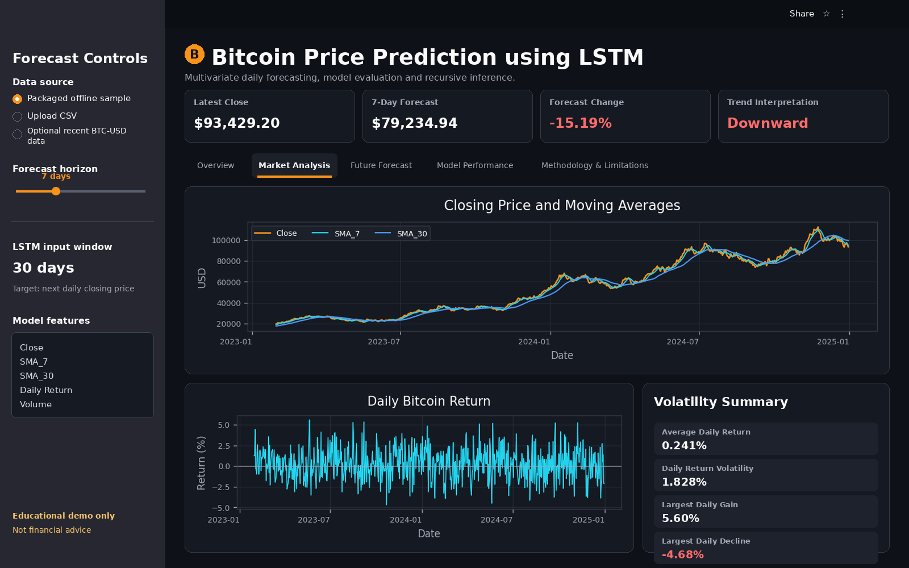

### 3. Future Bitcoin price forecast

Users can generate recursive forecasts for 1, 7, 14, or 30 days. The forecast section combines
recent historical prices with future LSTM predictions and reports the expected direction, average
forecast, ending forecast, and downloadable daily forecast values.

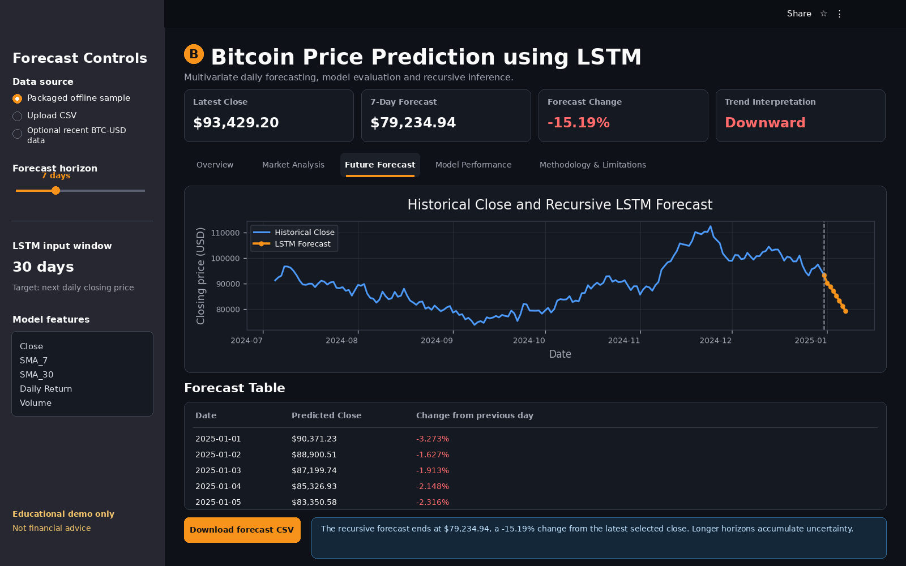

### 4. Model-performance dashboard

The model-performance dashboard reports the supplied notebook metrics and selected-data replay
diagnostics. It provides a concise application-level summary before the supporting technical
evaluation plots.

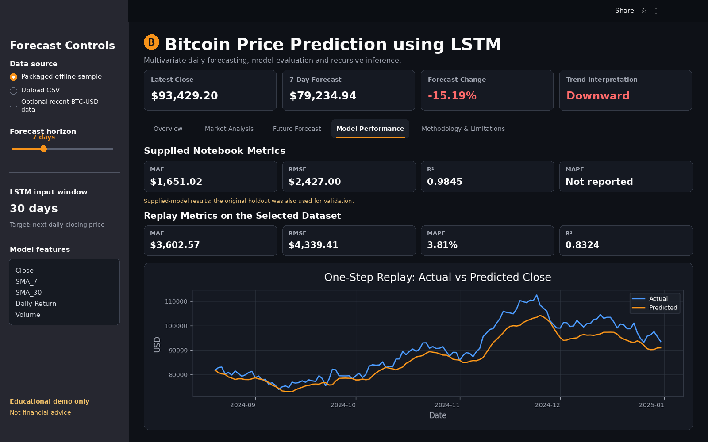

### Detailed Technical Evaluation

#### Closing-price trend

The historical closing-price chart provides context for the long-term growth, drawdowns, regime
changes, and volatility present in the Bitcoin series.

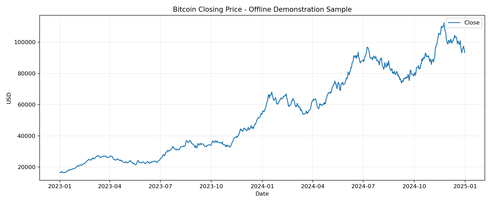

#### Rolling-average analysis

The 7-day and 30-day moving averages summarize short- and medium-term trend behavior and are included
among the packaged LSTM model inputs.

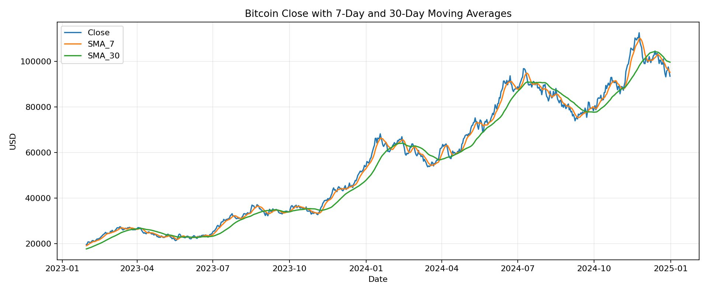

#### Return and volatility analysis

Daily returns and rolling volatility illustrate why cryptocurrency forecasting is difficult and why
forecast uncertainty can change significantly across market regimes.

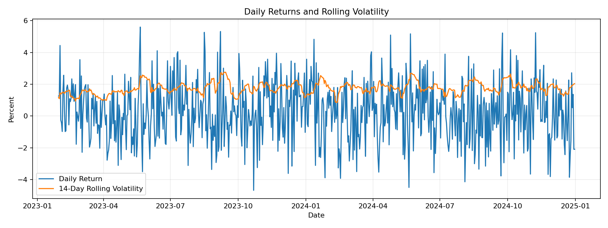

#### Actual versus predicted closing price

This plot compares observed Bitcoin closing prices with one-step LSTM predictions. Closer alignment
between the two series indicates stronger price-level forecasting accuracy.

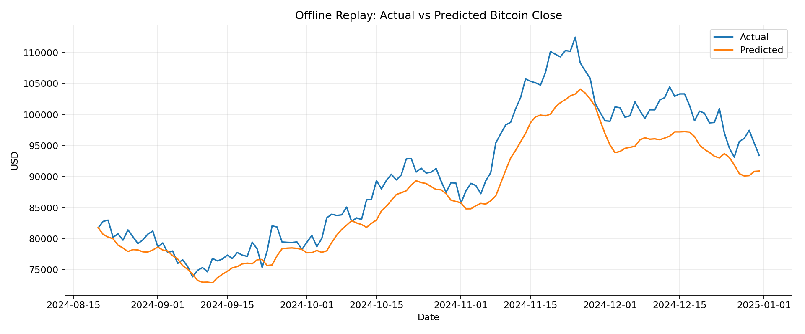

#### Residual analysis

Residuals help reveal systematic underprediction, overprediction, changing error variance, and
periods where the model does not fully capture sharp market movements.

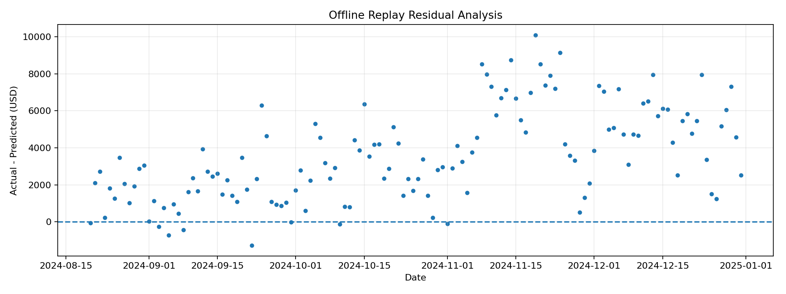

#### Baseline comparison

The LSTM is compared with transparent persistence, moving-average, and linear-trend baselines. This
comparison is essential because adjacent Bitcoin closing prices are highly persistent, and a complex
model should not be judged without simple alternatives.

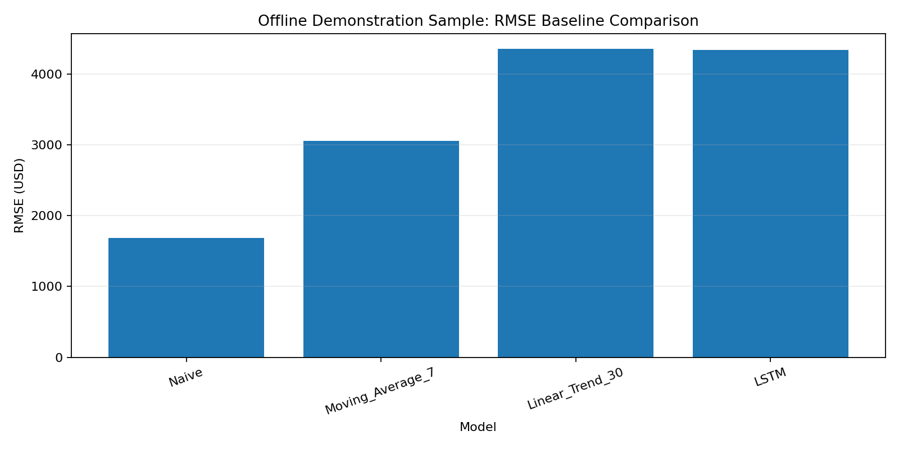

#### Training and validation loss

The training-history chart compares training and validation loss across epochs to help assess
convergence and possible overfitting.

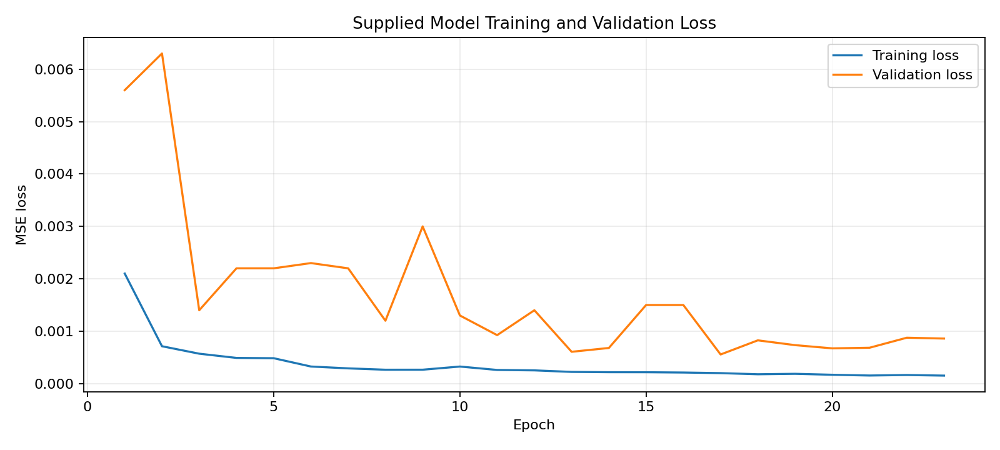

#### Recursive forecast artifact

The saved recursive forecast chart presents recent historical prices together with the packaged
multi-day forecast output.

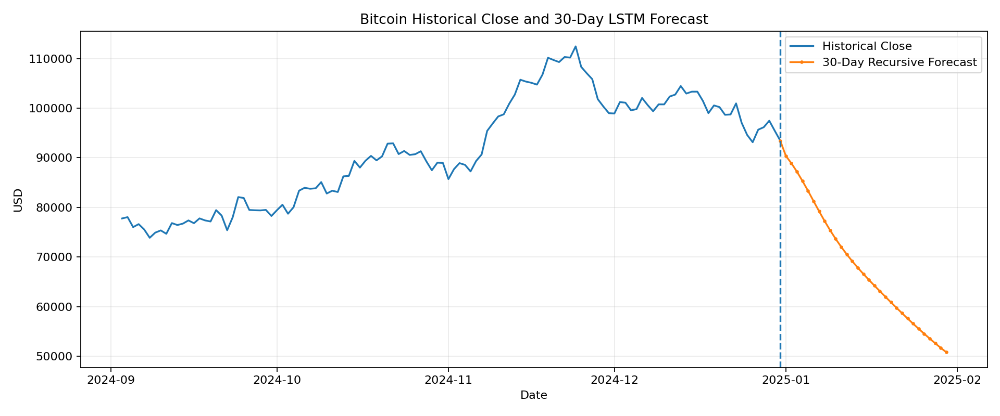

---

## Project Status and Honest Scope

The project is a complete portfolio prototype based on the supplied notebook and trained artifacts.
The original notebook downloaded Yahoo Finance `BTC-USD` data from January 2018 through December
2024.

The included model can demonstrate preprocessing, LSTM inference, recursive forecasting, evaluation,
testing, and deployment. It does **not** demonstrate a production trading edge.

The packaged offline CSV is a deterministic synthetic dataset with the correct OHLCV schema. It keeps
the app usable without network access but is not an official market history or a financial dataset.

---

## Original Dataset

The supplied notebook downloaded 2,557 daily rows with:

| Column | Use |
|---|---|
| `Date` | Chronological index |
| `Open` | Exploratory market field |
| `High` | Exploratory market field |
| `Low` | Exploratory market field |
| `Close` | Forecast target and model input |
| `Adj Close` | Inspected but not retained |
| `Volume` | Model input |

`Close` is used rather than `Adj Close` because the supplied code explicitly modeled `Close`, and the
two values were equal in the inspected Bitcoin sample.

See [`data/README_data.md`](data/README_data.md) for the upload schema, offline sample, and optional
recent-data behavior.

---

## Feature Engineering

The exact packaged model features are:

- **Close:** daily closing price in USD
- **SMA_7:** trailing seven-day average close
- **SMA_30:** trailing thirty-day average close
- **Return:** daily percentage change in close
- **Volume:** daily reported trading volume

The portfolio pipeline additionally calculates price range, open-close difference, rolling
volatility, and volume change for interpretation and visualization. These additional analytical
fields are not passed to the supplied model.

---

## Sequence Generation

The input structure is:

```text
Previous 30 daily rows × 5 features
                    ↓
        Next-day scaled closing price
```

Sequence order is preserved and data is never randomly shuffled for forecasting.

The improved retraining pipeline uses chronological:

```text
70% training
15% validation
15% untouched test
```

and fits the scaler only on the training-period feature rows.

---

## LSTM Architecture

The supplied Keras model contains **90,305 trainable parameters**.

```text
Input: 30 timesteps × 5 features
    -> LSTM, 128 units, return sequences
    -> Dropout, 20%
    -> LSTM, 32 units
    -> Dense, 32 units with ReLU
    -> Dense, 1 closing-price output
```

The supplied notebook used Adam optimization and mean-squared-error loss. The cleaned retraining code
uses Huber loss to reduce sensitivity to extreme price errors.

---

## Supplied Notebook Results

The supplied notebook reported the following on its final 20% chronological period:

| Metric | Result |
|---|---:|
| MAE | **$1,651.02** |
| RMSE | **$2,427.00** |
| R² | **0.9845** |
| MAPE | Not reported |

### Important evaluation qualification

The original scaler was fitted before splitting, and the same final 20% period was used for both
validation and final reporting. These results are therefore presented as **supplied-model metrics**,
not as a strict untouched-test estimate.

The cleaned training pipeline in `src/model_training.py` removes both issues when the project is
retrained on a real downloaded or local OHLCV dataset.

---

## Baseline Interpretation

A previous-close baseline can be difficult to beat for price-level forecasting because adjacent
Bitcoin closing prices are highly persistent. The included offline demonstration comparison may show
the naive baseline outperforming the packaged LSTM.

This is an important result rather than something to hide:

- high price-level R² does not prove profitable forecasting;
- a neural network should be compared against simple persistence models;
- return direction, costs, slippage, and walk-forward evaluation matter for trading usefulness;
- no trading-performance claim is made in this repository.

---

## Recursive Forecasting

The supplied notebook recursively changed only the close feature. The revised pipeline recalculates:

- predicted close;
- seven-day moving average;
- thirty-day moving average;
- daily return;
- recent median volume.

The application supports:

```text
1 day
7 days
14 days
30 days
```

Longer horizons accumulate uncertainty because each new forecast depends on earlier predicted values.

---

## Streamlit Application

The app supports:

- packaged offline OHLCV sample;
- CSV upload;
- optional recent `BTC-USD` retrieval through `yfinance`;
- automatic date and column standardization;
- missing daily-period restoration;
- market history preview;
- close-price and moving-average charts;
- return and volatility summaries;
- forecast-horizon selection;
- recursive forecast chart and table;
- downloadable prepared data;
- downloadable forecast CSV;
- supplied-model and selected-data replay metrics;
- clear limitations and financial disclaimer.

The deployed application loads pretrained artifacts and does not retrain during startup.

**Live application:**  
[Open the Bitcoin Price Prediction application](https://lstm-projects-k2ocmukxfs83e9ntudpdgr.streamlit.app/)

---

## Project Structure

```text
lstm-projects/
├── .github/
│   └── workflows/
│       └── 02-bitcoin-price-prediction.yml
└── 02-bitcoin-price-prediction/
    ├── app/
    │   ├── streamlit_app.py
    │   └── requirements.txt
    ├── archive/
    │   └── original-project-files/
    ├── data/
    │   ├── bitcoin_price_sample.csv
    │   └── README_data.md
    ├── images/
    │   ├── 01_app_overview.png
    │   ├── 02_price_trend_and_volatility.png
    │   ├── 03_future_bitcoin_forecast.png
    │   └── 04_model_performance.png
    ├── models/
    │   ├── bitcoin_lstm_model.keras
    │   ├── bitcoin_lstm_weights.npz
    │   ├── bitcoin_scaler.pkl
    │   ├── best_config.json
    │   └── model_metadata.json
    ├── notebooks/
    │   └── bitcoin_price_prediction.ipynb
    ├── outputs/
    │   ├── bitcoin_price_trend.png
    │   ├── rolling_average_analysis.png
    │   ├── volatility_analysis.png
    │   ├── training_curve.png
    │   ├── actual_vs_predicted.png
    │   ├── residual_plot.png
    │   ├── baseline_comparison.png
    │   ├── forecast_plot.png
    │   ├── model_metrics.json
    │   ├── test_predictions.csv
    │   ├── training_history.csv
    │   ├── baseline_comparison.csv
    │   └── future_forecast_30_days.csv
    ├── scripts/
    │   └── validate_project.py
    ├── src/
    │   ├── cloud_inference.py
    │   ├── config.py
    │   ├── data_preprocessing.py
    │   ├── feature_engineering.py
    │   ├── forecasting_pipeline.py
    │   ├── model_evaluation.py
    │   ├── model_training.py
    │   ├── sequence_generation.py
    │   └── visualization.py
    ├── tests/
    ├── .gitignore
    ├── Dockerfile
    ├── IMPROVEMENTS.md
    ├── PROJECT_AUDIT.md
    ├── README.md
    ├── README_HOSTING.md
    ├── requirements.txt
    ├── requirements-dev.txt
    ├── run_local.bat
    ├── run_local.sh
    └── train_model.py
```

---

## Run Locally

### Windows Command Prompt

```bat
git clone https://github.com/unit-mole/lstm-projects.git
cd lstm-projects\02-bitcoin-price-prediction

py -3.12 -m venv .venv
.venv\Scripts\activate.bat

python -m pip install --upgrade pip setuptools wheel
python -m pip install -r requirements-dev.txt

python scripts\validate_project.py
python -m pytest -q

python -m streamlit run app\streamlit_app.py
```

The local app normally opens at:

```text
http://localhost:8501
```

For later runs:

```bat
cd lstm-projects\02-bitcoin-price-prediction
.venv\Scripts\activate.bat
python -m streamlit run app\streamlit_app.py
```

---

## Optional Strict Retraining

The included app works without retraining.

Retrain using optional recent `BTC-USD` data:

```bat
python train_model.py --ticker BTC-USD --period 8y
```

Or retrain from a local CSV:

```bat
python train_model.py --csv data\your_bitcoin_history.csv
```

The cleaned pipeline:

- preserves chronological order;
- fits the scaler only on training data;
- uses a separate validation period;
- evaluates once on an untouched test period;
- saves a `.keras` model;
- exports NumPy cloud weights;
- saves metadata, predictions, history, and test metrics.

---

## Deployment

The application is deployed on Streamlit Community Cloud and connected directly to the `main`
branch of this GitHub repository.

**Live application:**  
[Open the Bitcoin Price Prediction application](https://lstm-projects-k2ocmukxfs83e9ntudpdgr.streamlit.app/)

**Streamlit entry point:**

```text
02-bitcoin-price-prediction/app/streamlit_app.py
```

**Cloud dependency file:**

```text
02-bitcoin-price-prediction/app/requirements.txt
```

**Deployment configuration:**

```text
Repository: unit-mole/lstm-projects
Branch: main
Python version: 3.12
```

Changes pushed to the relevant Project 02 files on the `main` branch automatically trigger a
Streamlit application update.

See [`README_HOSTING.md`](README_HOSTING.md) for the complete deployment configuration,
maintenance instructions, and troubleshooting guidance.

---

## Model Artifacts

| Artifact | Purpose |
|---|---|
| `bitcoin_lstm_model.keras` | Native Keras model for reproducibility and optional local retraining |
| `bitcoin_lstm_weights.npz` | Lightweight backend-free Streamlit inference |
| `bitcoin_scaler.pkl` | Supplied five-feature MinMaxScaler |
| `best_config.json` | Supplied selected architecture configuration |
| `model_metadata.json` | Dataset, feature, architecture, metric, and limitation metadata |

---

## Known Limitations

- Bitcoin prices are affected by factors not represented in historical OHLCV features.
- The supplied model has preprocessing and validation leakage limitations.
- Price-level persistence can make R² look strong without proving economic value.
- The app does not model transaction costs, slippage, liquidity, or execution.
- Recursive forecast uncertainty compounds across days.
- No prediction intervals are included.
- The packaged sample is synthetic demonstration data.
- Optional current values may be outside the original training range.
- The model does not use sentiment, on-chain, regulatory, macroeconomic, order-book, or derivative data.
- The project is not a trading system and is not financial advice.

---

## Future Improvements

- Retrain on a governed real daily OHLCV dataset
- Add walk-forward and rolling-origin evaluation
- Evaluate returns and directional accuracy
- Add uncertainty intervals and probabilistic forecasting
- Compare against naive, drift, ARIMA, ETS, XGBoost, and transformer baselines
- Add on-chain, sentiment, macroeconomic, derivatives, and order-book features
- Add direct multi-horizon output rather than recursive forecasting
- Add regime detection and volatility-aware models
- Track experiments and models
- Add drift monitoring and scheduled retraining
- Evaluate trading rules only with costs and strict out-of-sample controls

---

## Skills Demonstrated

`LSTM` · `Stacked LSTM` · `Cryptocurrency Analytics` · `Financial Time-Series Forecasting` ·
`OHLCV Data Processing` · `Feature Engineering` · `Moving Averages` · `Return Analysis` ·
`Volatility Analysis` · `Sequence Generation` · `Chronological Validation` ·
`Leakage Prevention` · `Recursive Forecasting` · `Baseline Comparison` · `Residual Analysis` ·
`Keras` · `JAX` · `NumPy` · `scikit-learn` · `pandas` · `Plotly` · `Streamlit` ·
`Testing` · `GitHub Actions` · `CI/CD` · `Responsible Financial Communication`

---

## Portfolio Description

**Live demonstration**

[Open the deployed Streamlit application](https://lstm-projects-k2ocmukxfs83e9ntudpdgr.streamlit.app/)

**One-line description**

> Built and deployed a multivariate stacked LSTM workflow for Bitcoin closing-price forecasting with chronological preprocessing, recursive multi-day inference, volatility analysis, baseline comparison, testing, and Streamlit deployment.

**Pinned-repository description**

> End-to-end Bitcoin forecasting project featuring OHLCV preprocessing, moving-average and return features, 30-day LSTM sequences, recursive forecasts, evaluation, backend-free cloud inference, CI/CD, and responsible financial-model communication.

---

## Original Notebook Review

See [`IMPROVEMENTS.md`](IMPROVEMENTS.md) for the detailed audit and methodology corrections.

---

## Author

**Anmol Tripathi**  
Quality Data Scientist | Data Science | Machine Learning | Applied AI | Analytics
