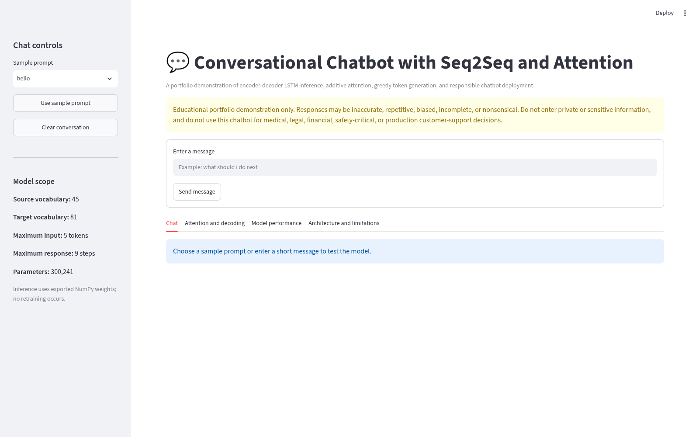
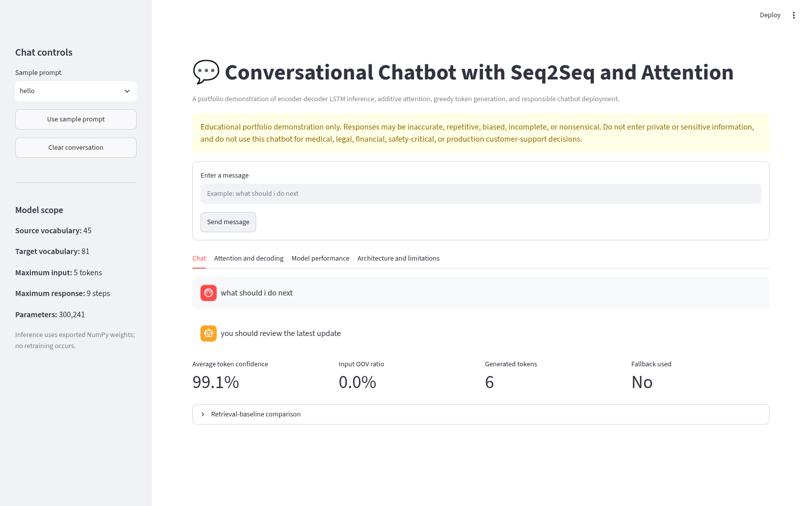
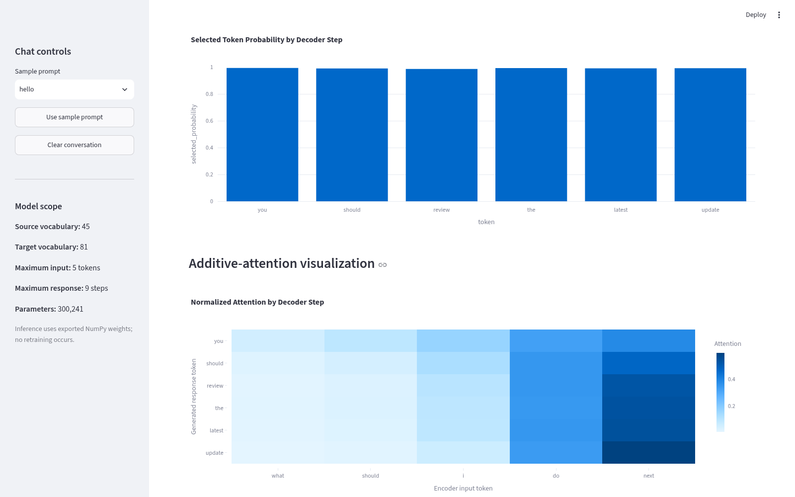
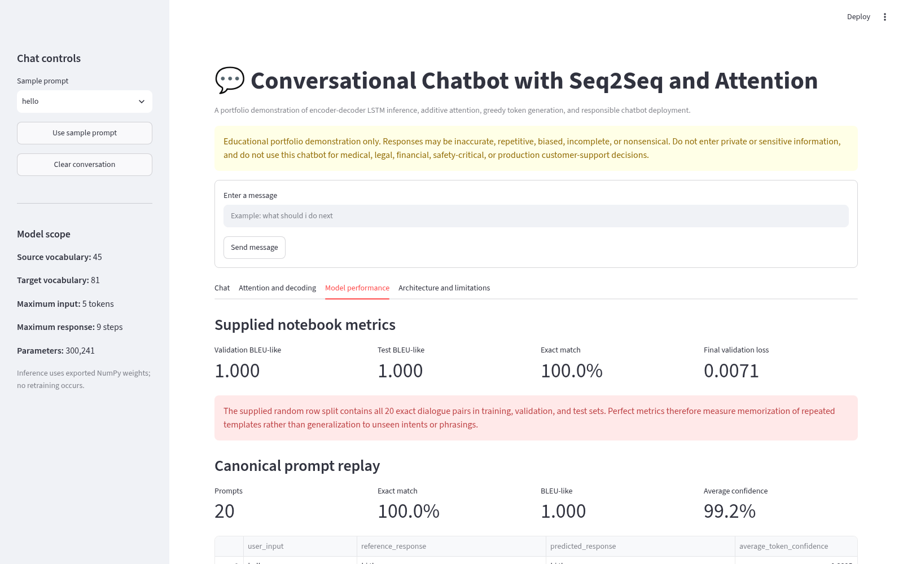
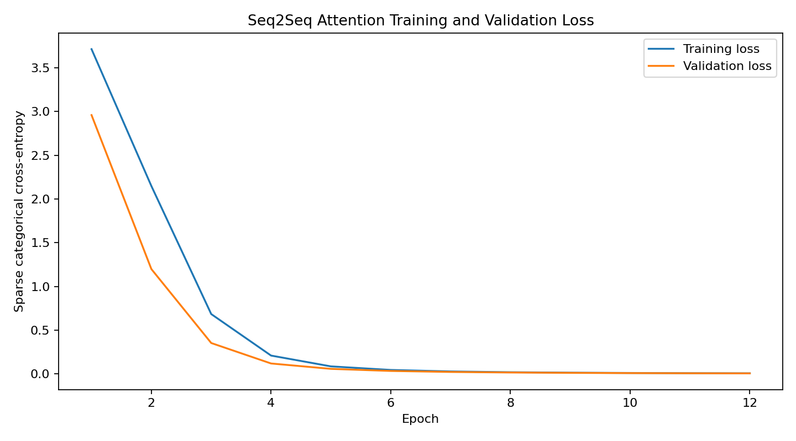
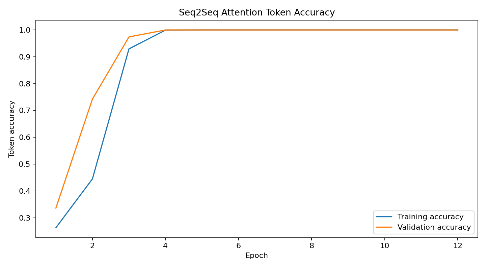
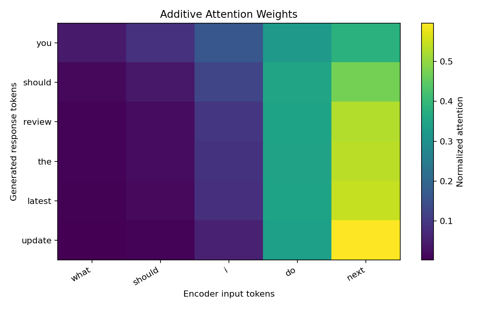
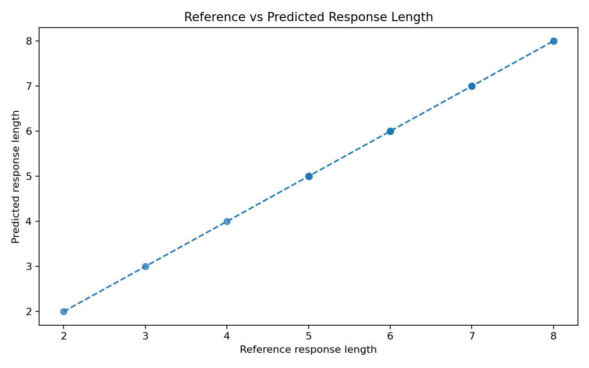
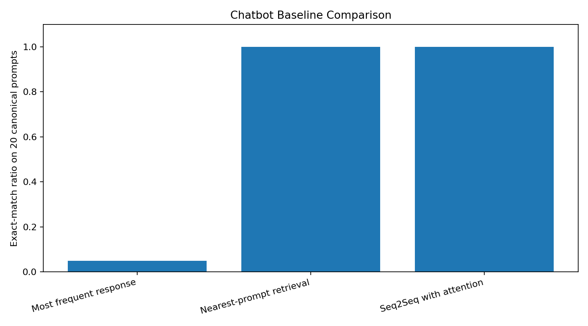

# Conversational Chatbot using Seq2Seq LSTM with Attention

[](https://www.python.org/)
[](https://keras.io/)
[](https://lstm-projects-s6ttobrjhi6uyvgwvyygnm.streamlit.app/)
[](../LICENSE)
[](https://github.com/unit-mole/lstm-projects/actions/workflows/03-conversational-chatbot-seq2seq-attention.yml)

An end-to-end conversational AI project that uses an encoder-decoder LSTM with additive attention
to generate short responses one token at a time. The project includes text preprocessing,
teacher-forcing data preparation, separate encoder and decoder inference, greedy decoding,
attention visualization, baseline comparison, responsible fallback behavior, testing, CI/CD,
and a Streamlit chat application.

**Status:** Portfolio-ready and deployed  
**Live demo:** [Open the Conversational Chatbot application](https://lstm-projects-s6ttobrjhi6uyvgwvyygnm.streamlit.app/)  
[](https://lstm-projects-s6ttobrjhi6uyvgwvyygnm.streamlit.app/)  
**Primary stack:** Python · Keras · JAX · NumPy · pandas · scikit-learn · Plotly · Streamlit

---

## Responsible-Use Notice

> **This project is for educational and portfolio demonstration purposes only. Responses may be
> inaccurate, repetitive, biased, incomplete, or nonsensical. Do not enter private, sensitive,
> confidential, or personal information. The chatbot must not be used for medical, legal,
> financial, safety-critical, or production customer-support decisions. Generated responses
> require human review before real-world use.**

---

## Conversational AI Problem

This project asks:

> Given a short user message, can an encoder-decoder LSTM with attention generate the expected
> response from the limited dialogue patterns represented in its training corpus?

The application provides:

- manual user-message entry;
- generated chatbot response;
- conversation history;
- sample prompts;
- decoder token probabilities;
- additive-attention visualization;
- retrieval-baseline comparison;
- model metrics and architecture details;
- responsible fallback behavior.

---

## Project Highlights

- Encoder-decoder LSTM with Keras additive attention
- Separate 128-dimensional source and target embeddings
- 128-unit encoder and decoder LSTMs
- Teacher-forcing decoder inputs and shifted targets
- Source vocabulary of 45 tokens and target vocabulary of 81 tokens
- Maximum source length of 5 tokens and target length of 10 tokens
- Greedy token-by-token decoding with start and end tokens
- Separate training, encoder, and decoder Keras artifacts
- Exact tokenizer reconstruction from the supplied notebook
- Backend-free NumPy inference matching the saved Keras weights
- Token-confidence and out-of-vocabulary diagnostics
- Responsible fallback for strongly out-of-domain messages
- Attention heatmap and retrieval-baseline comparison
- Automated tests and project-specific GitHub Actions CI

---

## Application Preview

### 1. Application overview

The application overview introduces the Seq2Seq chatbot, responsible-use guidance, sample-prompt
controls, message input, and key model details. The sidebar summarizes the source and target
vocabulary sizes, maximum sequence lengths, and total model parameters.



### 2. Chat response and conversation history

Users can enter a short message or select a sample prompt, submit it to the encoder-decoder model,
and review the generated response in a chat-style interface. The application also reports average
selected-token confidence, out-of-vocabulary ratio, generated-token count, and whether a safety
fallback was used.



### 3. Attention and decoding analysis

The decoding-analysis section shows the probability selected for each generated token and an
additive-attention heatmap. The heatmap connects generated response tokens with encoder input
positions, helping explain which parts of the input were emphasized at each decoder step.



### 4. Model-performance dashboard

The model-performance dashboard reports the supplied BLEU-like score, exact-match result,
validation loss, canonical-prompt replay metrics, and average decoder confidence. It also displays
the critical evaluation warning that the perfect supplied scores reflect repeated-template overlap
rather than generalization to unseen conversations.



### Detailed Technical Evaluation

#### Training and validation loss

The loss curve shows how sparse categorical cross-entropy changed during training and validation.
It helps assess model convergence and whether validation performance began to deteriorate.



#### Token accuracy

The token-accuracy curve compares training and validation token prediction accuracy across epochs.



#### Attention visualization

The saved attention artifact presents a reproducible example of how decoder steps distribute
attention across the encoder input positions.



#### Response-length comparison

The response-length comparison checks whether generated responses reproduce the approximate length
of their reference responses.



#### Baseline comparison

The chatbot is compared with simple most-frequent-response and nearest-prompt retrieval baselines.
This demonstrates the difference between fixed response reuse and token-by-token neural generation.



---

## Project Status and Honest Scope

The corpus contains **3,500 synthetic rows generated from only 20 fixed input-response pairs**.
A random row split placed all 20 exact pairs into the training, validation, and test sets.
Consequently, the perfect supplied BLEU-like and exact-match metrics measure memorization of
repeated templates rather than generalization to unseen intents, paraphrases, or open-domain
conversation.

This project demonstrates Seq2Seq engineering, attention, inference, evaluation, deployment,
and responsible communication. It is not a production chatbot or an LLM replacement.

---

## Dataset

| Dataset detail | Value |
|---|---:|
| Generated rows | 3,500 |
| Unique dialogue pairs | 20 |
| Training rows | 2,450 |
| Validation rows | 525 |
| Test rows | 525 |
| Unique pairs in every split | 20 |
| Private or confidential data | None |

The supplied notebook uses `input_text` and `target_text` columns. See
[`data/README_data.md`](data/README_data.md) for aliases, safe-data guidance, and the evaluation warning.

---

## Text Preprocessing

The supplied model uses intentionally simple normalization:

1. convert text to lowercase;
2. replace non-ASCII letters, digits, and punctuation with spaces;
3. collapse repeated whitespace;
4. add `sostok` and `eostok` to target responses;
5. convert source and target text with separate tokenizers;
6. use an explicit `<unk>` token for unseen vocabulary;
7. post-pad sequences to fixed lengths.

The deployed app uses the same preprocessing and token IDs as training.

---

## Seq2Seq Data Preparation

```text
Full target:
sostok i am doing well eostok

Decoder input:
sostok i am doing well

Decoder target:
i am doing well eostok
```

This shifted arrangement supports teacher forcing during training.

---

## Architecture

The supplied Keras model contains **300,241 trainable parameters**.

```text
User message: 5 source-token positions
    -> Source embedding: 45 × 128
    -> Encoder LSTM: 128 units
    -> Encoder outputs + final hidden and cell states

Target sequence: 9 decoder-input positions
    -> Target embedding: 81 × 128
    -> Decoder LSTM: 128 units
    -> Additive attention over encoder outputs
    -> Concatenate decoder state and attention context
    -> Time-distributed Dense softmax over 81 target tokens
```

The model uses Adam optimization, sparse categorical cross-entropy, token accuracy, early stopping,
and learning-rate reduction.

---

## What Attention Does

At every decoder step, additive attention compares the current decoder state with all encoder
outputs. The resulting weights determine how strongly the decoder uses each input position when
predicting the next response token.

The Streamlit application exposes these weights as a token-level heatmap.

---

## Inference Pipeline

1. Clean the user message.
2. Convert words to source token IDs.
3. Retain and post-pad up to five source positions.
4. Run the encoder once.
5. Initialize the decoder with `sostok`.
6. Predict the next-token distribution.
7. Select the highest-probability token using greedy decoding.
8. Reuse the decoder state and attention context.
9. Stop at `eostok` or the maximum response length.
10. Apply a fallback when most words are unknown or the response is unusable.

```python
result = chatbot_service.respond("how are you")
print(result.response)
```

---

## Supplied Notebook Results

| Metric | Result |
|---|---:|
| Validation BLEU-like | **1.000** |
| Test BLEU-like | **1.000** |
| Exact-match ratio | **1.000** |
| Final training loss | **0.0079** |
| Final validation loss | **0.0071** |
| Final training token accuracy | **1.000** |
| Final validation token accuracy | **1.000** |

### Critical evaluation qualification

These are supplied-artifact metrics, not an estimate of unseen-conversation performance.
All 20 exact dialogue pairs occurred in every split.

The cleaned retraining pipeline uses a unique-pair group split to prevent exact-pair overlap.

---

## Baseline Comparison

| Approach | Strength | Limitation |
|---|---|---|
| Most frequent response | Extremely simple | Repeats one answer |
| Nearest-prompt retrieval | Predictable and grounded in stored pairs | Does not generate new text |
| Seq2Seq without attention | Can generate sequences | Must compress context into final state |
| Seq2Seq with attention | Uses all encoder outputs during decoding | Still limited by corpus size and coverage |

On the 20 canonical prompts, retrieval and Seq2Seq both reproduce stored responses. Retrieval copies
an existing answer; Seq2Seq predicts each token from learned parameters.

---

## Example Responses

| User message | Generated response |
|---|---|
| `hello` | `hi there` |
| `how are you` | `i am doing well` |
| `what is your name` | `i am your virtual assistant` |
| `what should i do next` | `you should review the latest update` |
| `can you summarize this` | `yes i can provide a short summary` |

See [`outputs/sample_chat_responses.csv`](outputs/sample_chat_responses.csv) for all canonical replays.

---

## Streamlit Application

The app supports:

- chat-style conversation history;
- manual text entry and sample prompts;
- clear-conversation control;
- generated Seq2Seq response;
- selected-token confidence;
- input out-of-vocabulary ratio;
- decoder probability chart;
- additive-attention heatmap;
- retrieval-baseline comparison;
- supplied metrics and qualification;
- architecture, limitations, and responsible-use guidance.

The deployed app loads pretrained NumPy weights and does not retrain at startup.

**Live application:**  
[Open the Conversational Chatbot application](https://lstm-projects-s6ttobrjhi6uyvgwvyygnm.streamlit.app/)

---

## Project Structure

```text
lstm-projects/
├── .github/
│   └── workflows/
│       └── 03-conversational-chatbot-seq2seq-attention.yml
└── 03-conversational-chatbot-seq2seq-attention/
    ├── app/
    │   ├── streamlit_app.py
    │   └── requirements.txt
    ├── archive/
    │   └── original-project-files/
    ├── data/
    │   ├── sample_conversations.csv
    │   ├── sample_prompts.json
    │   └── README_data.md
    ├── images/
    │   ├── 01_app_overview.png
    │   ├── 02_chat_response.png
    │   ├── 03_attention_visualization.png
    │   └── 04_model_performance.png
    ├── models/
    │   ├── seq2seq_chatbot.keras
    │   ├── encoder_chatbot.keras
    │   ├── decoder_chatbot.keras
    │   ├── seq2seq_attention_weights.npz
    │   ├── source_tokenizer.json
    │   ├── target_tokenizer.json
    │   ├── tokenizer_meta.json
    │   └── model_metadata.json
    ├── notebooks/
    │   └── conversational_chatbot_seq2seq_attention.ipynb
    ├── outputs/
    │   ├── training_curve.png
    │   ├── token_accuracy_curve.png
    │   ├── attention_visualization.png
    │   ├── response_length_comparison.png
    │   ├── baseline_comparison.png
    │   ├── sample_chat_responses.csv
    │   ├── response_quality_examples.md
    │   ├── model_summary.txt
    │   └── model_metrics.json
    ├── scripts/
    │   └── validate_project.py
    ├── src/
    ├── tests/
    ├── Dockerfile
    ├── IMPROVEMENTS.md
    ├── PROJECT_AUDIT.md
    ├── README.md
    ├── README_HOSTING.md
    ├── requirements.txt
    ├── requirements-dev.txt
    ├── run_local.bat
    ├── run_local.sh
    └── train_model.py
```

---

## Run Locally

```bat
git clone https://github.com/unit-mole/lstm-projects.git
cd lstm-projects\03-conversational-chatbot-seq2seq-attention

py -3.12 -m venv .venv
.venv\Scripts\activate.bat

python -m pip install --upgrade pip
python -m pip install -r app\requirements.txt

python scripts\validate_project.py
python -m pytest -q

python -m streamlit run app\streamlit_app.py
```

The local application normally opens at `http://localhost:8501`.

---

## Optional Retraining

The application works without retraining.

```bat
python -m pip install -r requirements.txt
python train_model.py --data data\sample_conversations.csv
```

A larger and more diverse permitted conversation corpus is strongly recommended.

---

## Deployment

The application is deployed on Streamlit Community Cloud and connected directly to the `main`
branch of this GitHub repository.

**Live application:**  
[Open the Conversational Chatbot application](https://lstm-projects-s6ttobrjhi6uyvgwvyygnm.streamlit.app/)

**Streamlit entry point:**

```text
03-conversational-chatbot-seq2seq-attention/app/streamlit_app.py
```

**Cloud dependency file:**

```text
03-conversational-chatbot-seq2seq-attention/app/requirements.txt
```

**Deployment configuration:**

```text
Repository: unit-mole/lstm-projects
Branch: main
Python version: 3.12
```

Changes pushed to the relevant Project 03 files on the `main` branch automatically trigger a
Streamlit application update.

See [`README_HOSTING.md`](README_HOSTING.md) for deployment maintenance and troubleshooting
instructions.

---

## Model Artifacts

| Artifact | Purpose |
|---|---|
| `seq2seq_chatbot.keras` | Complete native Keras training model |
| `encoder_chatbot.keras` | Native encoder inference model |
| `decoder_chatbot.keras` | Native decoder inference model |
| `seq2seq_attention_weights.npz` | Lightweight backend-free cloud inference |
| `source_tokenizer.json` | Source vocabulary and ID mapping |
| `target_tokenizer.json` | Target vocabulary and reverse mapping |
| `tokenizer_meta.json` | Sequence lengths, token IDs, and dimensions |
| `model_metadata.json` | Corpus, architecture, metrics, and limitations |

---

## Known Limitations

- Only 20 fixed synthetic dialogue templates are represented.
- Exact pairs overlap across the supplied train, validation, and test splits.
- Perfect metrics do not demonstrate unseen-intent or paraphrase generalization.
- The maximum source length is five tokens.
- The chatbot has no persistent long-term dialogue memory.
- Greedy decoding can produce generic or repetitive responses.
- Unknown vocabulary can cause fallback behavior.
- The model does not retrieve facts or verify generated content.
- It is not a Transformer, LLM, or production customer-support system.
- Responses may be inaccurate or inappropriate and require human review.

---

## Future Improvements

- Train on a larger, licensed, diverse conversation corpus
- Use unique-conversation or intent-group validation
- Add paraphrase-based robustness testing
- Compare against Seq2Seq without attention
- Add beam search and top-k decoding
- Add coverage penalties to reduce repetition
- Add BLEU, ROUGE, BERTScore, and human rating workflows
- Add multi-turn context encoding
- Add subword tokenization
- Add uncertainty calibration and safer abstention
- Compare with Transformer encoder-decoder baselines
- Add monitoring for unsafe or sensitive input

---

## Skills Demonstrated

`Natural Language Processing` · `Seq2Seq` · `Encoder-Decoder Architecture` ·
`Long Short-Term Memory Networks` · `Additive Attention` · `Teacher Forcing` ·
`Text Preprocessing` · `Tokenization` · `Vocabulary Management` · `Sequence Padding` ·
`Greedy Decoding` · `Text Generation` · `BLEU-like Evaluation` · `Exact-Match Evaluation` ·
`Attention Visualization` · `Baseline Comparison` · `NumPy Inference` · `Keras` · `JAX` ·
`pandas` · `Plotly` · `Streamlit` · `Testing` · `GitHub Actions` · `CI/CD` ·
`Responsible AI Communication`

---

## Portfolio Description

**Live demonstration**

[Open the deployed Streamlit chatbot](https://lstm-projects-s6ttobrjhi6uyvgwvyygnm.streamlit.app/)

**One-line description**

> Built a deployable encoder-decoder LSTM chatbot with additive attention, greedy token generation,
> attention visualization, safe fallback behavior, automated testing, and Streamlit deployment.

**Pinned-repository description**

> End-to-end conversational AI project featuring text preprocessing, teacher-forcing Seq2Seq data
> preparation, encoder-decoder LSTMs, additive attention, separate inference, token-level diagnostics,
> baseline comparison, responsible-use controls, CI/CD, and a Streamlit chat demo.

---

## Original Notebook Review

See [`PROJECT_AUDIT.md`](PROJECT_AUDIT.md) and [`IMPROVEMENTS.md`](IMPROVEMENTS.md).

---

## Author

**Anmol Tripathi**  
Quality Data Scientist | Data Science | Machine Learning | Applied AI | Analytics
