# ECG Anomaly Detection using LSTM Autoencoder with Temporal Attention Analysis

[](https://www.python.org/)
[](https://keras.io/)
[](https://lstm-projects-3k2k8kbwyfws9doojmvfwf.streamlit.app/)
[](../LICENSE)
[](https://github.com/unit-mole/lstm-projects/actions/workflows/04-ecg-anomaly-detection-lstm-autoencoder-attention.yml)

An end-to-end healthcare-style signal analytics project that uses a normal-only stacked LSTM
Autoencoder to reconstruct synthetic ECG-like sequences and identify anomalous patterns through
reconstruction error. The project includes threshold analysis, classification evaluation,
baseline comparison, temporal focus explainability, cloud-safe NumPy inference, automated tests,
CI/CD, and an interactive Streamlit application.

**Status:** Portfolio-ready and deployed  
**Live demo:** [Open the ECG Anomaly Detection application](https://lstm-projects-3k2k8kbwyfws9doojmvfwf.streamlit.app/)  
[](https://lstm-projects-3k2k8kbwyfws9doojmvfwf.streamlit.app/)  
**Primary stack:** Python · Keras · JAX · NumPy · scikit-learn · pandas · Plotly · Streamlit

---

## Healthcare Disclaimer

> **This project is for educational and portfolio demonstration purposes only. It is not a medical
> diagnostic tool. The model must not be used to diagnose heart conditions, make treatment
> decisions, replace qualified ECG interpretation, or support clinical care. Predictions may be
> incorrect and are based only on synthetic demonstration data.**

---

## Healthcare Signal Analytics Problem

ECG anomaly detection is a time-series reconstruction problem. A model trained on normal signal
patterns should reconstruct similar normal sequences with relatively low error, while unfamiliar or
distorted patterns may produce higher reconstruction error.

This project asks:

> Given a fixed-length ECG-like signal sequence, does its reconstruction error indicate a normal or
> anomalous pattern relative to the synthetic normal training distribution?

The application provides:

- anomaly status;
- reconstruction error;
- learned threshold;
- normalized anomaly score;
- original and reconstructed signal comparison;
- pointwise error and temporal focus;
- dataset-level anomaly scoring;
- model metrics and baseline comparison;
- downloadable prediction results.

---

## Project Highlights

- 3,000 synthetic, privacy-safe ECG-like sequences
- 2,200 normal and 800 anomalous signals
- Fixed 140-timestep univariate sequences
- Stratified 70% training, 15% validation, and 15% test split
- Autoencoder training restricted to 1,540 normal training sequences
- Stacked encoder and decoder LSTMs with 62,529 parameters
- Mean absolute reconstruction error for anomaly scoring
- Threshold selected as normal-training mean plus three standard deviations
- 99.78% supplied test accuracy and 100% anomaly recall
- ROC-AUC and PR-AUC evaluation
- Statistical and Isolation Forest baseline comparison
- Exact NumPy reproduction of the supplied Keras model
- CSV upload, batch scoring, interactive signal review, and downloadable results
- Healthcare disclaimer and explicit non-diagnostic scope
- Automated tests and project-specific GitHub Actions

---

## Important Attention Qualification

The supplied notebook and pretrained Keras artifact contain a stacked LSTM Autoencoder but **do not
contain a trainable attention layer**.

To preserve factual accuracy:

- the deployed reconstruction uses the supplied LSTM Autoencoder;
- the application calculates post-hoc temporal focus from pointwise absolute reconstruction error;
- this focus view identifies time positions contributing most strongly to the anomaly score;
- it is not presented as learned model attention;
- the optional cleaned retraining pipeline in `src/model_training.py` defines a true trainable
  temporal-attention pooling layer.

This distinction prevents the portfolio from overstating the supplied artifact.

---

## Application Preview

### 1. Application overview

The application overview introduces the ECG anomaly-detection workflow, healthcare disclaimer,
data-source controls, selected signal, model configuration, reconstruction error, learned
threshold, and normalized anomaly score. It clearly communicates that the application is an
educational synthetic-data demonstration rather than a medical diagnostic system.

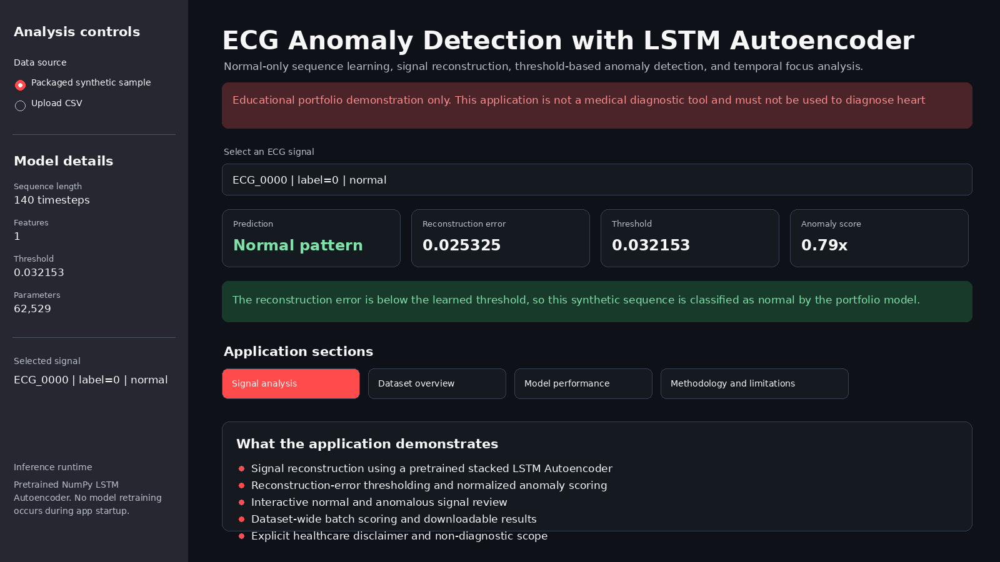

### 2. Original and reconstructed signal

The signal-analysis section compares the selected ECG-like sequence with the LSTM Autoencoder
reconstruction. It also displays the pointwise absolute reconstruction error, helping users
understand where the reconstructed signal differs most strongly from the original sequence.

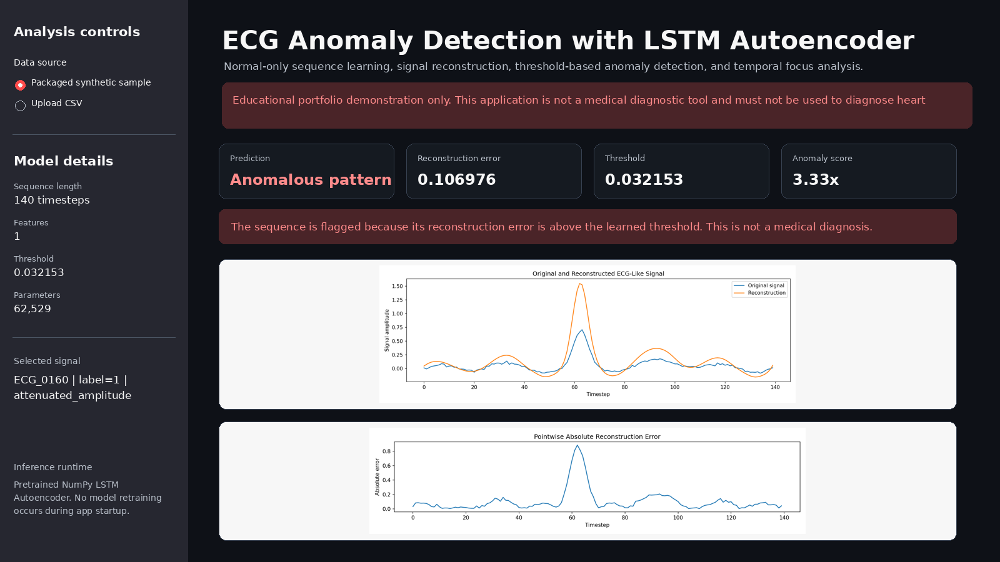

### 3. Reconstruction-error distribution and anomaly results

The dataset-level analysis reports the number of processed signals, flagged anomalies, average
reconstruction error, and maximum anomaly score. The reconstruction-error distribution is shown
with the selected threshold, followed by a preview of downloadable anomaly predictions.

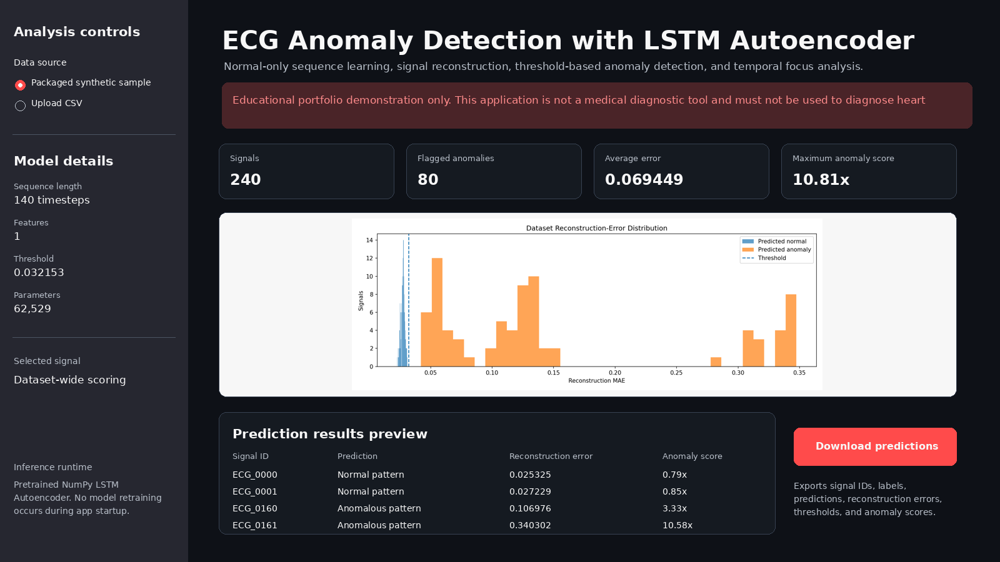

### 4. Model-performance dashboard

The model-performance dashboard reports accuracy, anomaly precision, recall, F1, ROC-AUC, and
PR-AUC on the held-out synthetic test set. It also includes the confusion matrix, class-specific
reconstruction-error distribution, baseline comparison, and an explicit warning that the strong
results do not establish clinical validity.

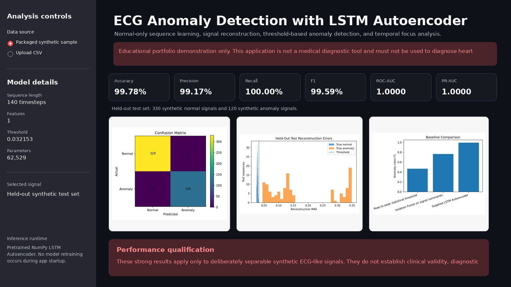

### Detailed Technical Evaluation

#### Synthetic ECG-like signal examples

The synthetic examples illustrate the waveform characteristics used for normal and anomalous
demonstration signals.

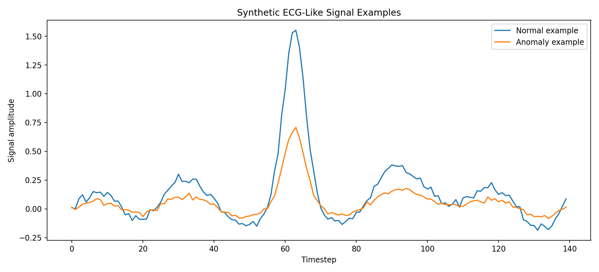

#### Mean normal and anomaly signals

The class-average comparison helps visualize how the generated anomaly distribution differs from
the synthetic normal-signal distribution.

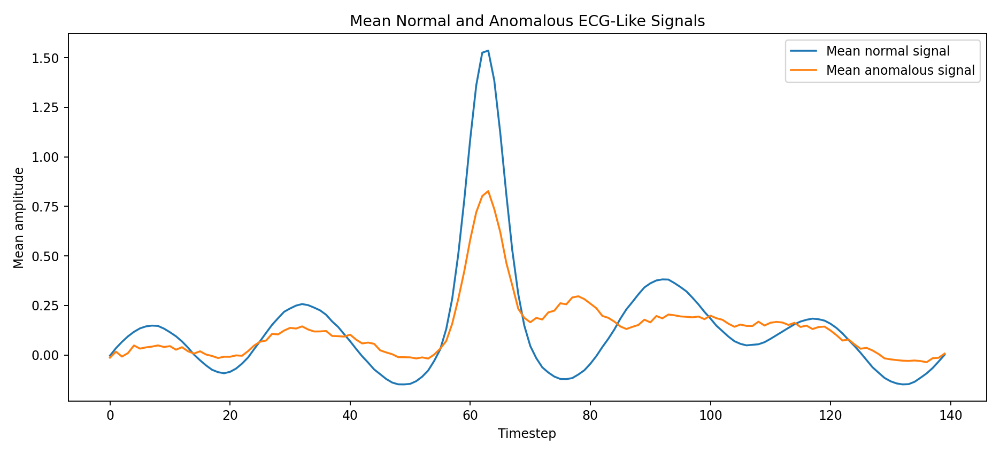

#### Training reconstruction-error distribution

The training-normal reconstruction-error distribution is used to calculate the anomaly threshold.

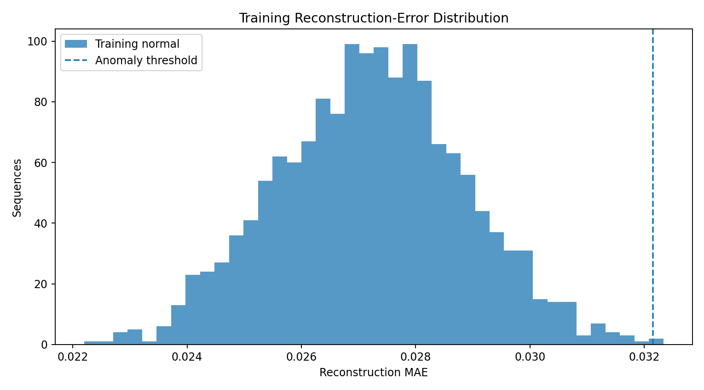

#### Threshold sensitivity

Threshold sensitivity shows how anomaly precision, recall, and F1 change as the reconstruction-error
cutoff is adjusted.

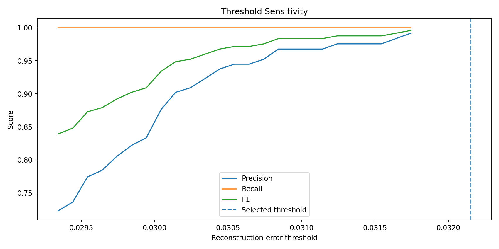

#### Test reconstruction-error distribution

The held-out test distribution demonstrates the separation between synthetic normal and anomalous
signals under the supplied model.

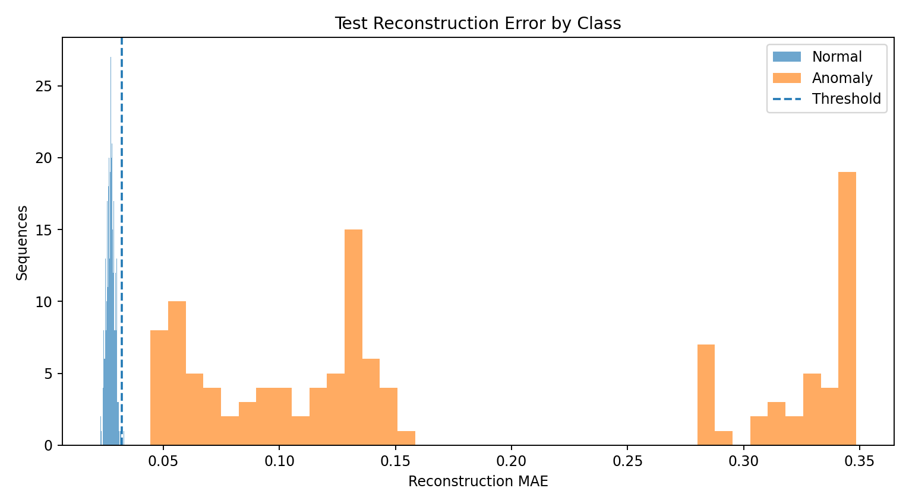

#### Training and validation loss

The loss curve shows how the LSTM Autoencoder reconstruction objective changed during training.

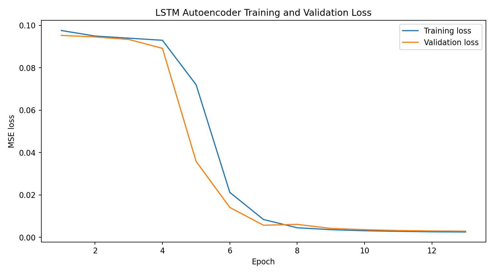

#### Training and validation MAE

The MAE curve reports the absolute reconstruction error observed during training and validation.

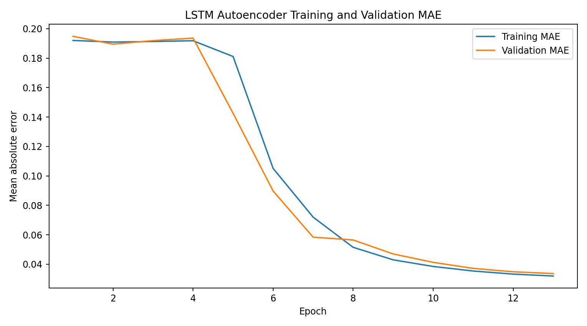

#### Original versus reconstructed signal

This saved artifact compares an anomalous synthetic signal with the corresponding Autoencoder
reconstruction.

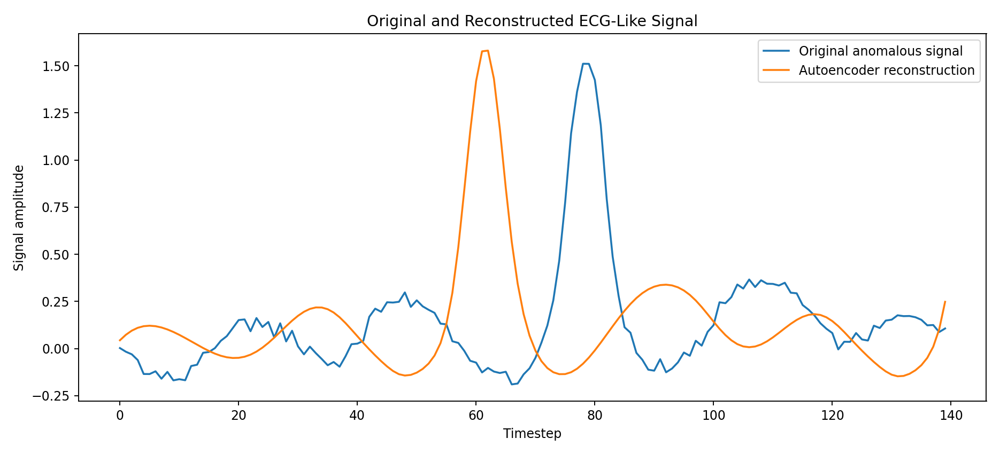

#### Post-hoc temporal focus

The temporal-focus visualization converts pointwise reconstruction errors into normalized focus
weights. These are post-hoc explainability values and are not trainable model-attention weights.

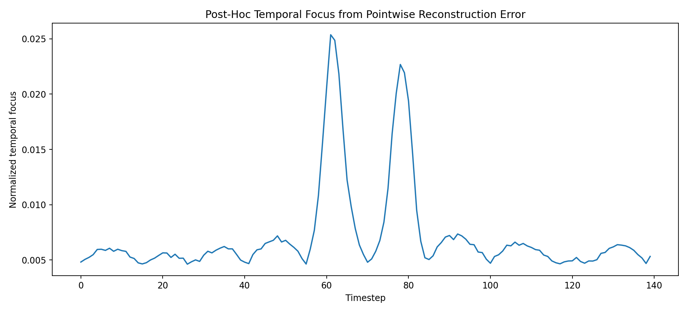

#### Confusion matrix

The confusion matrix summarizes normal and anomaly predictions on the held-out synthetic test set.

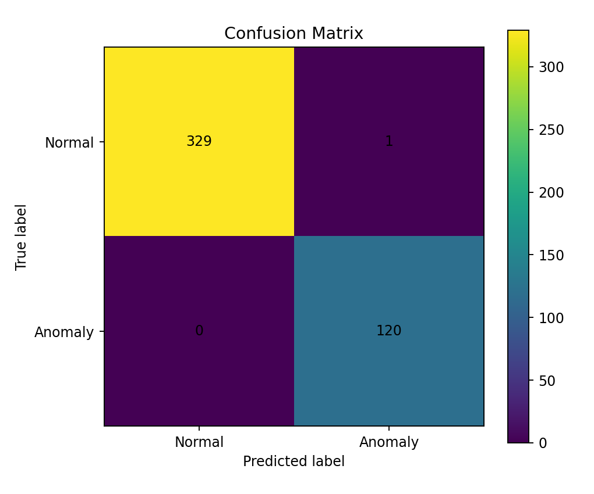

#### Precision-recall curve

The precision-recall curve emphasizes anomaly-detection performance across decision thresholds.

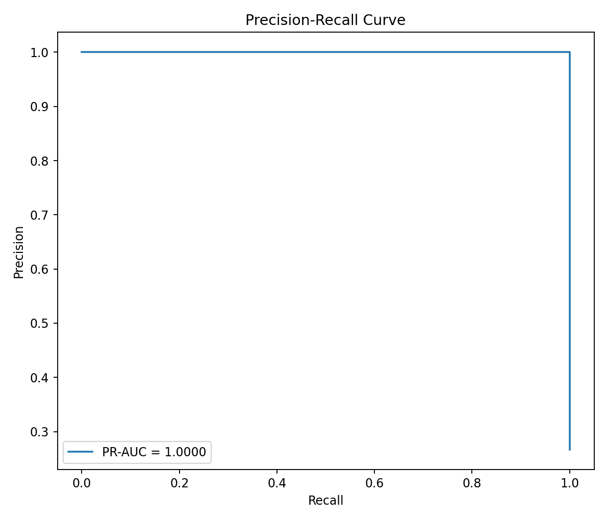

#### ROC curve

The ROC curve shows the model's ranking performance across reconstruction-error thresholds.

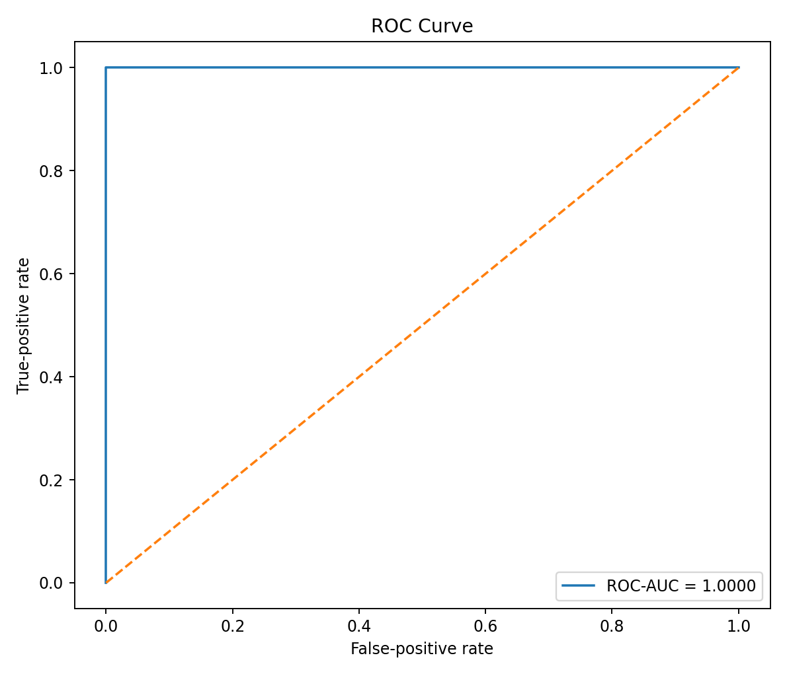

#### Baseline comparison

The LSTM Autoencoder is compared with a peak-to-peak statistical rule and an Isolation Forest
baseline using signal-summary features.

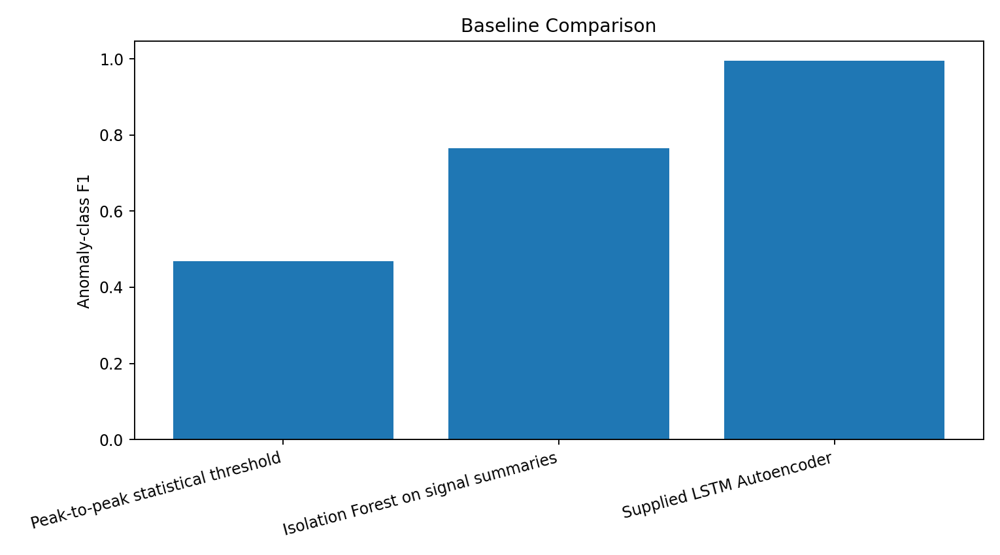

---

## Project Status and Honest Scope

This is a complete deployable portfolio prototype built from the supplied notebook and trained model.

The dataset is **synthetic and privacy-safe**. It contains generated waveform components and four
deliberately simple anomaly modes. It does not contain patient data, clinical diagnoses, protected
health information, or real medical-device recordings.

The strong metrics demonstrate that the autoencoder separates the supplied synthetic distributions.
They do not establish clinical validity, generalization to real ECG recordings, or diagnostic
performance.

---

## Dataset

| Dataset detail | Value |
|---|---:|
| Total sequences | 3,000 |
| Normal sequences | 2,200 |
| Anomalous sequences | 800 |
| Sequence length | 140 timesteps |
| Features per timestep | 1 |
| Training rows before normal filtering | 2,100 |
| Normal-only training rows | 1,540 |
| Validation rows | 450 |
| Test rows | 450 |
| Test normal rows | 330 |
| Test anomaly rows | 120 |
| Patient or protected health data | None |

Synthetic anomaly modes include:

- high signal noise;
- attenuated amplitude;
- temporal waveform shift;
- localized spike injection.

See [`data/README_data.md`](data/README_data.md) for the upload schema and medical-data safety
guidance.

---

## Signal Preprocessing

The supplied training workflow uses already aligned 140-point synthetic sequences. The portfolio
pipeline adds:

1. ECG signal-column detection;
2. numeric conversion;
3. within-row missing-value interpolation;
4. duplicate signal removal;
5. signal-shape validation;
6. optional metadata-column standardization;
7. amplitude safety checks for manual processing.

The supplied pretrained model was trained directly on raw synthetic float32 amplitudes, so no
external scaler is applied to deployed inference. Applying an unverified scaler would change the
model input distribution and invalidate the saved threshold.

The optional attention-enabled retraining pipeline fits a `StandardScaler` only on normal training
values and saves that scaler with the retrained model.

---

## Anomaly-Detection Workflow

```text
Normal training sequences
        ↓
Stacked LSTM encoder
        ↓
32-dimensional latent representation
        ↓
Repeated latent sequence
        ↓
Stacked LSTM decoder
        ↓
Reconstructed ECG-like signal
        ↓
Mean absolute reconstruction error
        ↓
Compare with learned threshold
        ↓
Normal pattern or anomalous pattern
```

The autoencoder is trained only on normal signals. The intended behavior is:

- normal-like patterns reconstruct with lower error;
- unfamiliar or distorted patterns reconstruct with higher error;
- sequences at or above the threshold are flagged as anomalies.

---

## Supplied LSTM Autoencoder Architecture

The supplied Keras model contains **62,529 trainable parameters**.

```text
Input: 140 timesteps × 1 feature
    -> LSTM, 64 units, return sequences
    -> LSTM, 32 units, latent vector
    -> RepeatVector, 140 positions
    -> LSTM, 32 units, return sequences
    -> LSTM, 64 units, return sequences
    -> TimeDistributed Dense, 1 reconstructed value
```

Training configuration:

| Setting | Value |
|---|---:|
| Loss | Mean-squared error |
| Reported metric | Mean absolute error |
| Optimizer | Adam |
| Initial learning rate | 0.001 |
| Batch size | 64 |
| Maximum epochs | 20 |
| Early-stopping patience | 5 |
| Learning-rate reduction patience | 2 |
| Training data | Normal sequences only |

---

## Optional Trainable Attention Architecture

The cleaned retraining module adds temporal attention after the encoder sequence:

```text
Input ECG sequence
    -> Encoder LSTM, return sequences
    -> Trainable timestep scores
    -> Softmax temporal attention weights
    -> Weighted context vector
    -> 32-dimensional latent projection
    -> RepeatVector
    -> Decoder LSTMs
    -> Reconstructed signal
```

This optional architecture must be retrained and independently evaluated before its results are
compared with the supplied model.

---

## Reconstruction Error

The deployed anomaly score uses mean absolute reconstruction error:

```text
Reconstruction MAE
= mean(abs(original signal - reconstructed signal))
```

For one sequence:

```text
Anomaly score = reconstruction MAE / threshold
```

Interpretation:

- score below `1.0`: below the selected threshold;
- score at or above `1.0`: flagged as an anomalous pattern.

The classification is a machine-learning output, not a diagnosis.

---

## Threshold Selection

The supplied threshold is:

```text
0.0321530313231051
```

It was calculated from normal training reconstruction errors:

```text
threshold
= mean(training normal reconstruction MAE)
+ 3 × standard deviation(training normal reconstruction MAE)
```

The exported NumPy inference engine independently reproduced:

```text
0.032153058797
```

The tiny difference is numerical rounding across inference runtimes.

---

## Supplied Test Results

| Metric | Result |
|---|---:|
| Validation accuracy | **99.56%** |
| Validation ROC-AUC | **1.0000** |
| Test accuracy | **99.78%** |
| Test anomaly precision | **99.17%** |
| Test anomaly recall | **100.00%** |
| Test anomaly F1 | **99.59%** |
| Test ROC-AUC | **1.0000** |
| Test PR-AUC | **1.0000** |

### Test confusion matrix

|  | Predicted normal | Predicted anomaly |
|---|---:|---:|
| Actual normal | 329 | 1 |
| Actual anomaly | 0 | 120 |

### Metric interpretation

- **Precision** indicates how often flagged sequences were synthetic anomalies.
- **Recall** indicates how many synthetic anomalies were detected.
- **F1** balances anomaly precision and recall.
- **ROC-AUC** measures ranking separation across thresholds.
- **PR-AUC** emphasizes anomaly-focused precision and recall.
- **Reconstruction-error distributions** show the separation between normal and anomalous signals.

In healthcare-style screening, false negatives can be especially concerning. The supplied synthetic
test set contains no anomaly false negatives, but this should not be generalized to clinical data.

---

## Baseline Comparison

The project compares:

| Approach | Purpose |
|---|---|
| Peak-to-peak statistical threshold | Simple amplitude-range anomaly rule |
| Isolation Forest | Unsupervised baseline using signal summary features |
| Supplied LSTM Autoencoder | Sequence reconstruction using learned temporal patterns |

See [`outputs/baseline_comparison.csv`](outputs/baseline_comparison.csv) for the measured results.

---

## Streamlit Application

The application supports:

- packaged synthetic ECG-like signals;
- wide CSV upload;
- signal selection;
- original and reconstructed signal visualization;
- pointwise reconstruction error;
- reconstruction-error metric;
- anomaly threshold;
- normalized anomaly score;
- normal or anomalous pattern classification;
- post-hoc temporal focus;
- dataset-wide scoring;
- error-distribution visualization;
- downloadable anomaly results;
- supplied test metrics;
- confusion matrix and baseline comparison;
- methodology, limitations, and healthcare disclaimer.

The deployed app loads the pretrained NumPy weights and does not retrain at startup.

**Live application:**  
[Open the ECG Anomaly Detection application](https://lstm-projects-3k2k8kbwyfws9doojmvfwf.streamlit.app/)

---

## Project Structure

```text
lstm-projects/
├── .github/
│   └── workflows/
│       └── 04-ecg-anomaly-detection-lstm-autoencoder-attention.yml
└── 04-ecg-anomaly-detection-lstm-autoencoder-attention/
    ├── app/
    │   ├── streamlit_app.py
    │   └── requirements.txt
    ├── archive/
    │   └── original-project-files/
    ├── data/
    │   ├── sample_ecg_signals.csv
    │   └── README_data.md
    ├── images/
    │   ├── 01_app_overview.png
    │   ├── 02_signal_reconstruction.png
    │   ├── 03_anomaly_distribution_and_results.png
    │   └── 04_model_performance.png
    ├── models/
    │   ├── lstm_autoencoder_ecg.keras
    │   ├── lstm_autoencoder_ecg_weights.npz
    │   ├── ecg_meta_supplied.json
    │   └── model_metadata.json
    ├── notebooks/
    │   └── ecg_anomaly_detection_lstm_autoencoder_attention.ipynb
    ├── outputs/
    │   ├── ecg_signal_examples.png
    │   ├── normal_vs_anomaly_signals.png
    │   ├── reconstruction_error_distribution.png
    │   ├── threshold_selection.png
    │   ├── anomaly_detection_results.png
    │   ├── training_curve.png
    │   ├── mae_curve.png
    │   ├── original_vs_reconstructed.png
    │   ├── temporal_focus_visualization.png
    │   ├── confusion_matrix.png
    │   ├── precision_recall_curve.png
    │   ├── roc_curve.png
    │   ├── baseline_comparison.png
    │   ├── model_metrics.json
    │   ├── test_predictions.csv
    │   └── threshold_sensitivity.csv
    ├── scripts/
    │   └── validate_project.py
    ├── src/
    ├── tests/
    ├── Dockerfile
    ├── IMPROVEMENTS.md
    ├── PROJECT_AUDIT.md
    ├── README.md
    ├── README_HOSTING.md
    ├── requirements.txt
    ├── requirements-dev.txt
    ├── run_local.bat
    ├── run_local.sh
    └── train_model.py
```

---

## Run Locally

### Windows Command Prompt

```bat
git clone https://github.com/unit-mole/lstm-projects.git
cd lstm-projects\04-ecg-anomaly-detection-lstm-autoencoder-attention

py -3.12 -m venv .venv
.venv\Scripts\activate.bat

python -m pip install --upgrade pip
python -m pip install -r app\requirements.txt

python scripts\validate_project.py
python -m pytest -q

python -m streamlit run app\streamlit_app.py
```

The local application normally opens at:

```text
http://localhost:8501
```

---

## Optional Attention-Enabled Retraining

The deployed application works without retraining.

To install the full local training dependencies and train the optional attention architecture:

```bat
python -m pip install -r requirements.txt
python train_model.py --epochs 30 --batch-size 64
```

Retraining produces a new native Keras attention model and training-only scaler. It should be
evaluated independently before deployment or comparison with the supplied artifact.

---

## Deployment

The application is deployed on Streamlit Community Cloud and connected directly to the `main`
branch of this GitHub repository.

**Live application:**  
[Open the ECG Anomaly Detection application](https://lstm-projects-3k2k8kbwyfws9doojmvfwf.streamlit.app/)

**Streamlit entry point:**

```text
04-ecg-anomaly-detection-lstm-autoencoder-attention/app/streamlit_app.py
```

**Cloud dependency file:**

```text
04-ecg-anomaly-detection-lstm-autoencoder-attention/app/requirements.txt
```

**Deployment configuration:**

```text
Repository: unit-mole/lstm-projects
Branch: main
Python version: 3.12
```

Changes pushed to the relevant Project 04 files on the `main` branch automatically trigger a
Streamlit application update.

See [`README_HOSTING.md`](README_HOSTING.md) for deployment maintenance and troubleshooting
instructions.

---

## Model Artifacts

| Artifact | Purpose |
|---|---|
| `lstm_autoencoder_ecg.keras` | Supplied native Keras Autoencoder |
| `lstm_autoencoder_ecg_weights.npz` | Exact backend-free NumPy inference weights |
| `ecg_meta_supplied.json` | Supplied sequence length, feature count, threshold, and seed |
| `model_metadata.json` | Architecture, metrics, threshold, attention qualification, and scope |

---

## Data and Repository Safety

- The packaged signals are synthetic and contain no patient information.
- No protected health information is included.
- Only a small reproducible sample dataset is committed.
- Private, raw, or governed medical datasets should remain outside GitHub.
- Streamlit secrets and local environments are ignored.
- Uploaded data is processed within the application session.
- The application is not designed to store medical data.

---

## Known Limitations

- The dataset is synthetic and clinically unrealistic.
- The anomaly modes are intentionally separable.
- The supplied model has no trainable attention layer.
- Temporal focus is post-hoc reconstruction-error explainability.
- The threshold is specific to the supplied synthetic distribution.
- No patient-level, device-level, or external validation is available.
- Sampling rate and measurement units are not clinically defined.
- The model does not identify arrhythmia classes.
- The app does not provide diagnosis, prognosis, or treatment guidance.
- Clinical use would require extensive governance, validation, monitoring, and regulatory review.

---

## Future Improvements

- Train on a permitted real ECG dataset
- Split by patient rather than by individual heartbeat
- Add signal-quality assessment and filtering
- Add clinically appropriate normalization
- Retrain and benchmark the true attention model
- Compare against a basic Autoencoder without attention
- Add convolutional and Transformer baselines
- Add calibrated uncertainty and abstention
- Add patient- and device-level external validation
- Add explainability reviewed by clinical experts
- Add drift and threshold monitoring
- Evaluate sensitivity across clinically meaningful subgroups
- Develop model-card and medical-device governance documentation

---

## Skills Demonstrated

`Healthcare Signal Analytics` · `ECG-Like Time-Series Processing` · `LSTM Autoencoder` ·
`Unsupervised Anomaly Detection` · `Normal-Only Training` · `Signal Reconstruction` ·
`Reconstruction Error` · `Threshold Selection` · `Temporal Attention` ·
`Post-Hoc Explainability` · `Precision-Recall Analysis` · `ROC-AUC` · `PR-AUC` ·
`Confusion Matrix` · `Baseline Comparison` · `NumPy Inference` · `Keras` · `JAX` ·
`scikit-learn` · `pandas` · `Plotly` · `Streamlit` · `Testing` · `GitHub Actions` ·
`CI/CD` · `Responsible Healthcare AI Communication`

---

## Portfolio Description

**Live demonstration**

[Open the deployed ECG Anomaly Detection application](https://lstm-projects-3k2k8kbwyfws9doojmvfwf.streamlit.app/)

**One-line description**

> Built a deployable LSTM Autoencoder workflow that reconstructs synthetic ECG-like sequences,
> flags high-error anomalies, visualizes temporal focus, and communicates healthcare limitations
> through a tested Streamlit application.

**Pinned-repository description**

> End-to-end ECG-style anomaly-detection project featuring normal-only LSTM Autoencoder training,
> reconstruction-error thresholding, anomaly metrics, temporal focus explainability, baseline
> comparison, backend-free cloud inference, CI/CD, and responsible healthcare communication.

---

## Original Notebook Review

See [`PROJECT_AUDIT.md`](PROJECT_AUDIT.md) and [`IMPROVEMENTS.md`](IMPROVEMENTS.md) for the
detailed supplied-artifact review and attention qualification.

---

## Author

**Anmol Tripathi**  
Quality Data Scientist | Data Science | Machine Learning | Applied AI | Analytics
