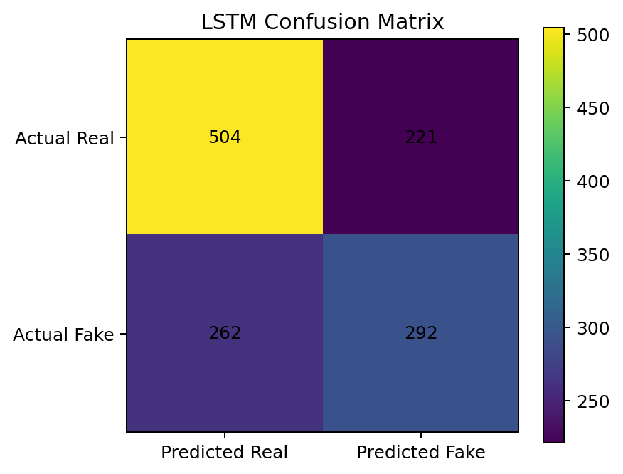
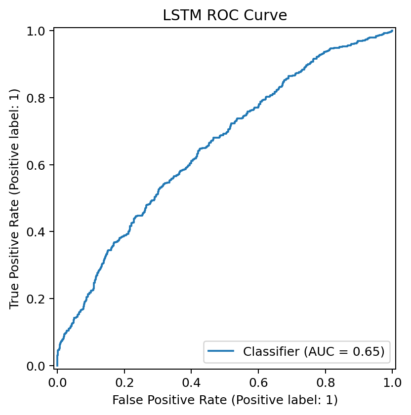
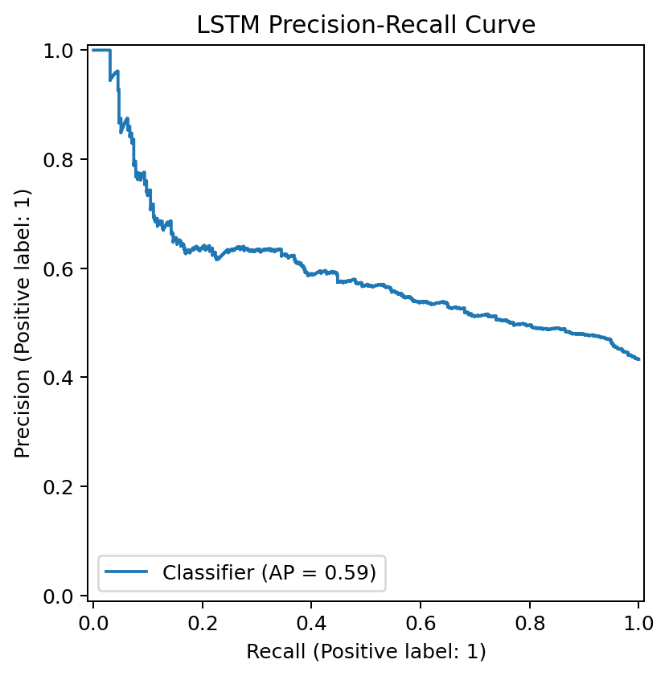
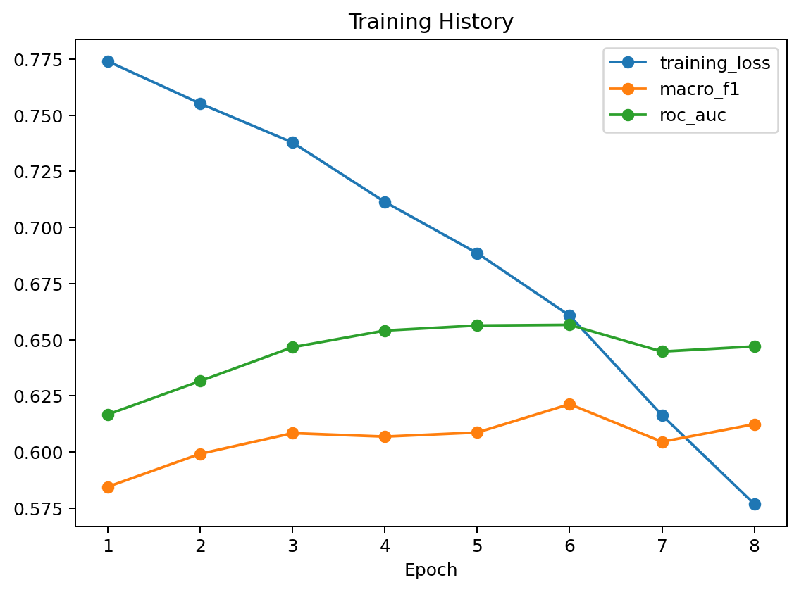
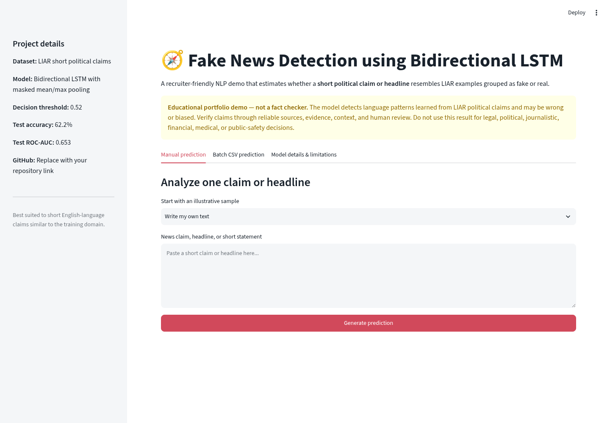
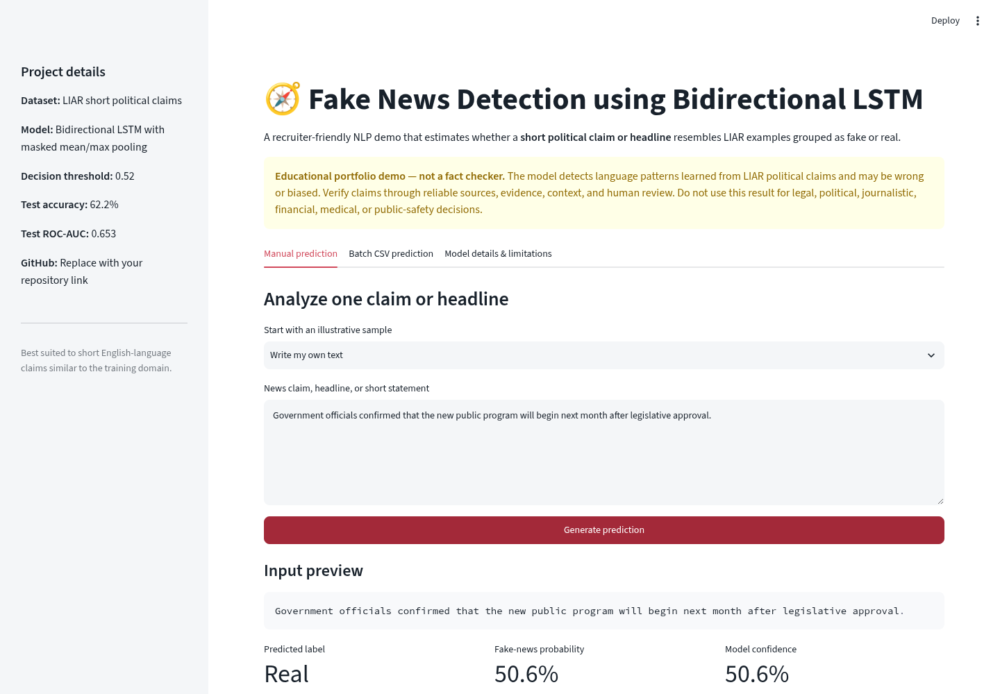
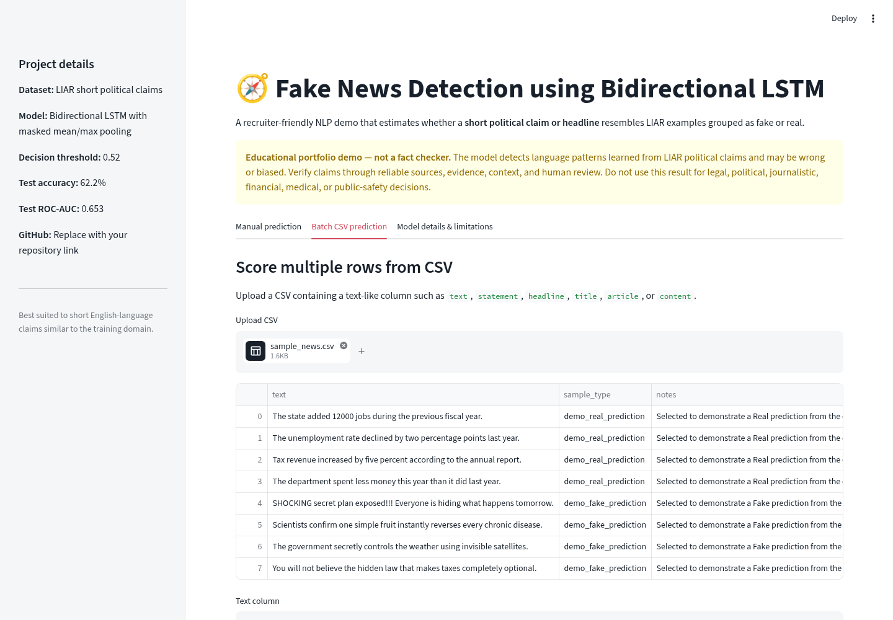
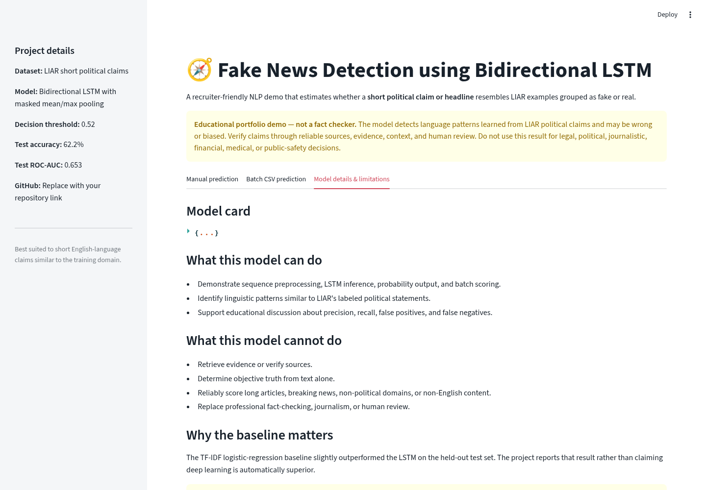

# Fake News Detection using LSTM Neural Networks

[](https://www.python.org/)
[](https://pytorch.org/)
[](https://lstm-projects-ebn4nfredardyuuzskgnpw.streamlit.app/)
[](LICENSE)

An end-to-end Natural Language Processing project that uses Long Short-Term Memory (LSTM) networks to classify statements as **Real** or **Fake**. The repository includes reproducible preprocessing, sequence modeling, model evaluation, probability-based predictions, error analysis, saved artifacts, and a deployable Streamlit application.

**Status:** Portfolio-ready and deployed  
**Live demo:** [Open the Fake News Detection application](https://lstm-projects-ebn4nfredardyuuzskgnpw.streamlit.app/)  
[](https://lstm-projects-ebn4nfredardyuuzskgnpw.streamlit.app/)  
**Primary stack:** Python · PyTorch · LSTM · NLP · scikit-learn · Streamlit

---

## Responsible Use

This project is for educational and portfolio demonstration purposes only.

- It should not be used as the sole source for determining whether news content is true or false.
- The model may make incorrect predictions and may reflect bias from the training data.
- Real-world misinformation detection requires fact-checking, source verification, context analysis, and human review.
- Do not use this project to make legal, political, journalistic, financial, or public-safety decisions.

---

## Business Problem

Online platforms process enormous amounts of text every day. Human review alone cannot scale to identify misleading content.

This project answers:

> Given a statement or news snippet, can an LSTM model estimate whether the content is more similar to fake or real examples from the training data?

The deployed pipeline returns:

- Predicted label
- Fake-news probability
- Confidence score
- Model interpretation
- Responsible-use note

---

## Project Objective

Build a portfolio-ready NLP solution that can:

1. Clean and validate text inputs.
2. Convert text into token sequences.
3. Train a Bidirectional LSTM classifier.
4. Handle class imbalance.
5. Produce probabilities rather than labels alone.
6. Compare LSTM performance with classical NLP baselines.
7. Support manual and batch prediction.
8. Save and reload all inference artifacts.

---

## Dataset

The project is based on the LIAR benchmark dataset containing short political statements labeled for factual reliability.

For this portfolio version:

- Statements are mapped into binary classes: **Real** and **Fake**.
- Duplicate handling and split validation are performed.
- Only safe sample files are included in GitHub.

| Class | Description |
|---|---|
| Real | Statements mapped to factual categories |
| Fake | Statements mapped to misleading categories |

---

## Tools and Technologies

| Area | Technology |
|---|---|
| Language | Python |
| NLP | Tokenization, Sequence Padding |
| Modeling | PyTorch LSTM |
| Data processing | pandas, NumPy |
| Evaluation | scikit-learn, Matplotlib |
| Demo application | Streamlit |
| Model persistence | `.pt`, Pickle, JSON |
| Testing / quality | pytest, compile checks |
| Hosting | Streamlit Community Cloud |

---

## Project Workflow

```text
Raw news statements
        │
        ▼
Text cleaning and validation
        │
        ▼
Tokenization and vocabulary generation
        │
        ▼
Sequence padding and truncation
        │
        ▼
Train / validation / test split
        │
        ▼
Embedding layer
        │
        ▼
Bidirectional LSTM training
        │
        ▼
Threshold selection
        │
        ▼
Evaluation and error analysis
        │
        ▼
Saved model artifacts
        │
        ▼
Streamlit deployment
```

## Text Preprocessing

- Lowercasing
- URL handling
- Special-character cleanup
- Whitespace normalization
- Vocabulary size control
- Out-of-vocabulary token support
- Sequence padding
- Fixed maximum sequence length

---

## LSTM Architecture

```text
Input statement
      ↓
Tokenizer
      ↓
Padded token sequence
      ↓
Embedding layer
      ↓
Bidirectional LSTM
      ↓
Dropout
      ↓
Dense layer
      ↓
Sigmoid probability output
```

Training uses:

- Binary cross-entropy loss
- Adam optimizer
- Early stopping
- Validation monitoring
- Class weighting

---

## Model Results

| Model | Accuracy | ROC-AUC |
|---|---:|---:|
| TF-IDF + Logistic Regression | 63.25% | 0.672 |
| Bidirectional LSTM | 62.24% | 0.653 |

The baseline model slightly outperformed the LSTM model, which is reported transparently.

---

## Class Imbalance

The dataset is not perfectly balanced.

The project uses:

- Stratified splits
- Class weights
- Threshold tuning
- Precision–recall analysis

Important error types:

- False positive: real content classified as fake.
- False negative: fake content classified as real.

---

## Visual Results

| Confusion Matrix | ROC Curve |
|---|---|
|  |  |

| Precision-Recall Curve | Training Curves |
|---|---|
|  |  |

---

## Streamlit Demo

The application supports:

- Manual text prediction
- Sample statements
- CSV upload
- Batch scoring
- Prediction probabilities
- Confidence scores
- Downloadable results
- Model limitations

### Application Overview



### Manual Prediction



### Batch Prediction Dashboard



### Model Details and Limitations



---

## Model Artifacts

| Artifact | Purpose |
|---|---|
| `models/fake_news_lstm_model.pt` | Trained LSTM model |
| `models/tokenizer.pkl` | Tokenizer |
| `models/model_metadata.json` | Model configuration |
| `models/label_mapping.json` | Label definitions |

---

## Run Locally

### 1. Open the project

```bash
cd lstm-projects/05-fake-news-detection
```

### 2. Create a virtual environment

**Windows**

```bat
py -3.12 -m venv .venv
.venv\Scripts\activate
```

**macOS / Linux**

```bash
python3.12 -m venv .venv
source .venv/bin/activate
```

### 3. Install dependencies

```bash
python -m pip install --upgrade pip
python -m pip install -r requirements.txt
```

### 4. Run tests

```bash
python -m pytest -q
python -m compileall app src tests
```

### 5. Launch the app

```bash
streamlit run app/streamlit_app.py
```

Open:

```text
http://localhost:8501
```

---

## Deploy

- **Repository:** `unit-mole/lstm-projects`
- **Branch:** `main`
- **Entrypoint:** `05-fake-news-detection/app/streamlit_app.py`
- **Live application:** https://lstm-projects-ebn4nfredardyuuzskgnpw.streamlit.app/

Deployment uses the local `app/requirements.txt` file.

See `README_HOSTING.md` for details.

---

## Project Structure

```text
lstm-projects/
└── 05-fake-news-detection/
    ├── app/
    ├── data/
    ├── images/
    ├── models/
    ├── notebooks/
    ├── outputs/
    ├── src/
    ├── tests/
    ├── README.md
    ├── README_HOSTING.md
    └── requirements.txt
```

---

## Future Improvements

- Add transformer baselines.
- Compare with BERT and DistilBERT.
- Add explainability methods.
- Evaluate additional datasets.
- Improve calibration and threshold tuning.
- Add API deployment.

---

## Skills Demonstrated

- Natural Language Processing
- Text preprocessing
- Sequence modeling
- Bidirectional LSTM
- Binary classification
- Model evaluation
- Error analysis
- Responsible AI communication
- Streamlit deployment
- Batch inference pipelines
- Model persistence
- Testing and ML engineering

---

## Portfolio Positioning

**One-line description:** LSTM-based NLP system that estimates fake-news probability and provides interactive single-record and batch predictions through Streamlit.

**Pinned repository description:** End-to-end sequence-modeling project with text preprocessing, Bidirectional LSTM training, evaluation, error analysis, responsible AI framing, and deployable inference.

This project demonstrates the transition from Quality Data Science into broader Data Science, Machine Learning, Applied AI, and Analytics Engineering roles.

---

## Author

**Anmol Tripathi**

Quality Data Scientist transitioning toward Data Science, Machine Learning, Applied AI, Analytics Engineering, and Quality Analytics roles.
