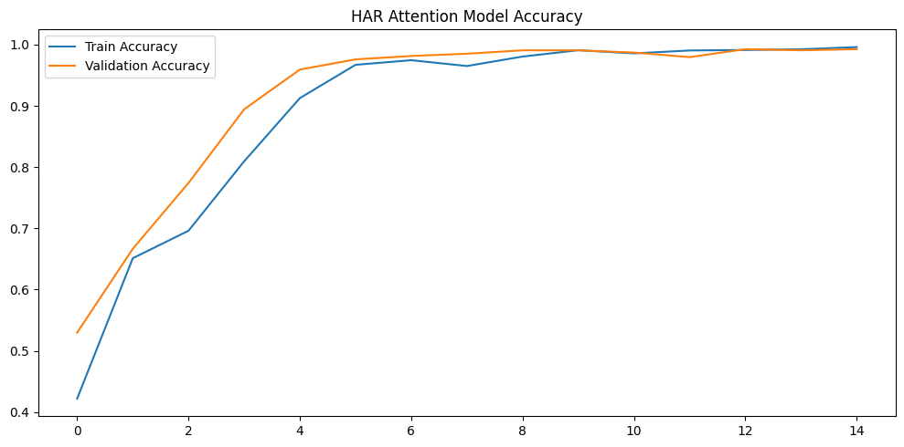
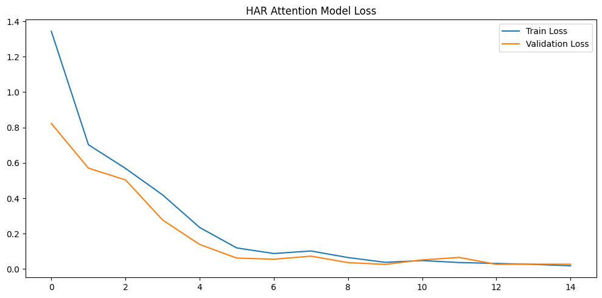
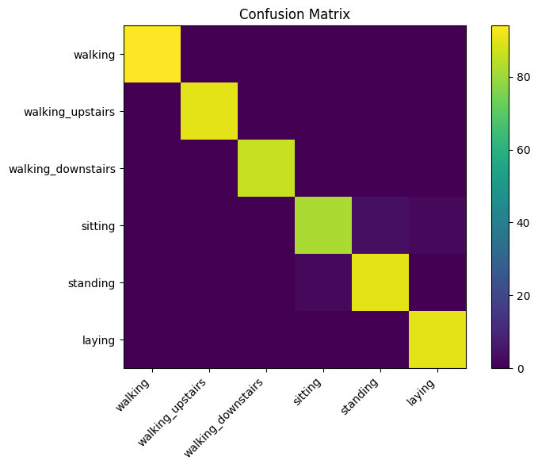
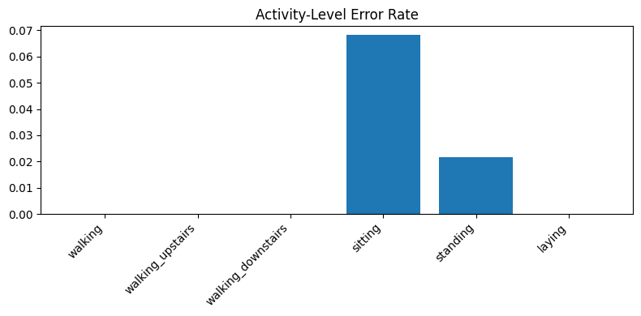

# Human Activity Recognition using LSTM with Attention

[](https://www.python.org/)
[](https://www.tensorflow.org/)
[](#)
[](LICENSE)

An end-to-end wearable-analytics portfolio project that classifies multivariate synthetic sensor sequences using stacked LSTM layers and temporal attention. It includes reproducible data generation, baseline comparison, multiclass evaluation, saved model artifacts, tests, and a deployable Streamlit application.

**Status:** Portfolio-ready  
**Live demo:** Add the deployed Streamlit URL  
[](#)  
**Primary stack:** Python · TensorFlow/Keras · LSTM · Attention · NumPy · pandas · Streamlit

---

## Responsible Use
This educational demo must not be used as the sole basis for healthcare, safety, surveillance, insurance, employment, or legal decisions. Do not upload private sensor data. The model was trained on synthetic patterns and may not generalize to real devices or people.

## Applied AI Problem
> Given 80 ordered readings from six motion-sensor channels, can the model classify the represented physical activity?

Outputs include the predicted activity, confidence, complete class distribution, top-three probabilities, signal chart, and downloadable result.

## Dataset
The notebook deterministically generates 3,600 synthetic windows. Each window has shape **80 × 6** and represents one of six activities: walking, walking upstairs, walking downstairs, sitting, standing, and laying. The included metadata confirms the 80-step input, six features, and six classes.

No real subject identifiers or private wearable records are distributed.

## Model Architecture
```text
80 × 6 sensor sequence
        ↓
LSTM (96 units, return sequences)
        ↓
Dropout (0.30)
        ↓
LSTM (64 units, return sequences)
        ↓
Temporal Attention
        ↓
Dense (64, ReLU) + Dropout
        ↓
Six-class Softmax
```

Attention learns a normalized importance score across time steps and combines the sequence into a context vector for classification.

## Results
| Model | Validation accuracy | Test accuracy |
|---|---:|---:|
| Baseline LSTM | 79.07% | 79.44% |
| LSTM with Attention | 99.07% | 98.52% |

The attention model achieved macro F1 **98.50%** and weighted F1 **98.51%** on the synthetic test set. These results demonstrate successful learning of the designed synthetic patterns, not validated real-world HAR performance.

## Visual Results
| Training accuracy | Training loss |
|---|---|
|  |  |

| Confusion matrix | Activity error rates |
|---|---|
|  |  |

## Streamlit Demo
The app supports generated samples, 80-row CSV uploads, sensor-signal visualization, six-class probabilities, top-three predictions, confidence reporting, and downloadable results.

## Run Locally
```bash
cd lstm-projects/06-human-activity-recognition-lstm-attention
python -m venv .venv
.venv\Scripts\activate
python -m pip install -r requirements.txt
python -m streamlit run app/streamlit_app.py
```

## Deploy
- Repository: `unit-mole/lstm-projects`
- Branch: `main`
- Entrypoint: `06-human-activity-recognition-lstm-attention/app/streamlit_app.py`

See [README_HOSTING.md](README_HOSTING.md).

## Project Structure
```text
06-human-activity-recognition-lstm-attention/
├── app/
├── data/
├── images/
├── models/
├── notebooks/
├── outputs/
├── src/
├── tests/
├── README.md
├── README_HOSTING.md
└── requirements.txt
```

## Future Improvements
- Validate on UCI HAR or WISDM using subject-wise splits.
- Add real attention-weight visualization.
- Compare with CNN-LSTM and transformer encoders.
- Add sensor-noise and device-shift robustness testing.
- Evaluate latency and model compression for edge deployment.

## Skills Demonstrated
LSTM sequence modeling · temporal attention · multivariate time-series classification · synthetic data design · multiclass evaluation · model persistence · Streamlit deployment · responsible AI communication · testing and modular ML engineering

## Portfolio Positioning
**One-line description:** Attention-enhanced LSTM system that classifies six physical activities from multivariate motion-sensor sequences through an interactive Streamlit application.

**Author:** Anmol Tripathi — Quality Data Scientist building a portfolio for Data Science, Machine Learning, Applied AI, Analytics Engineering, and Quality Analytics roles.
