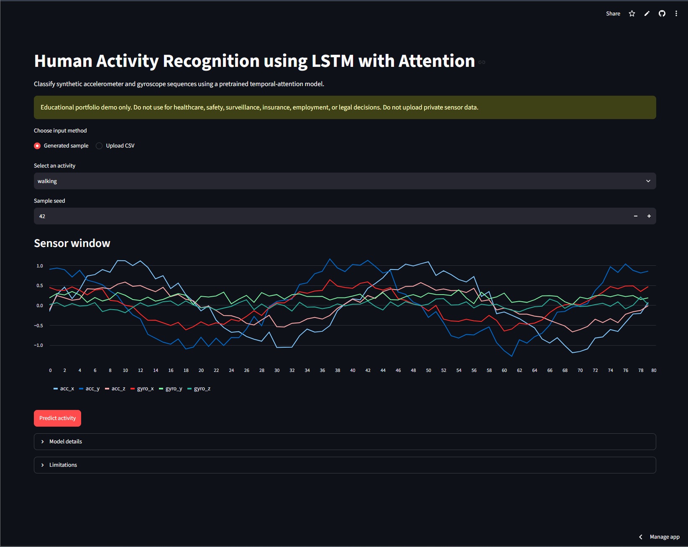
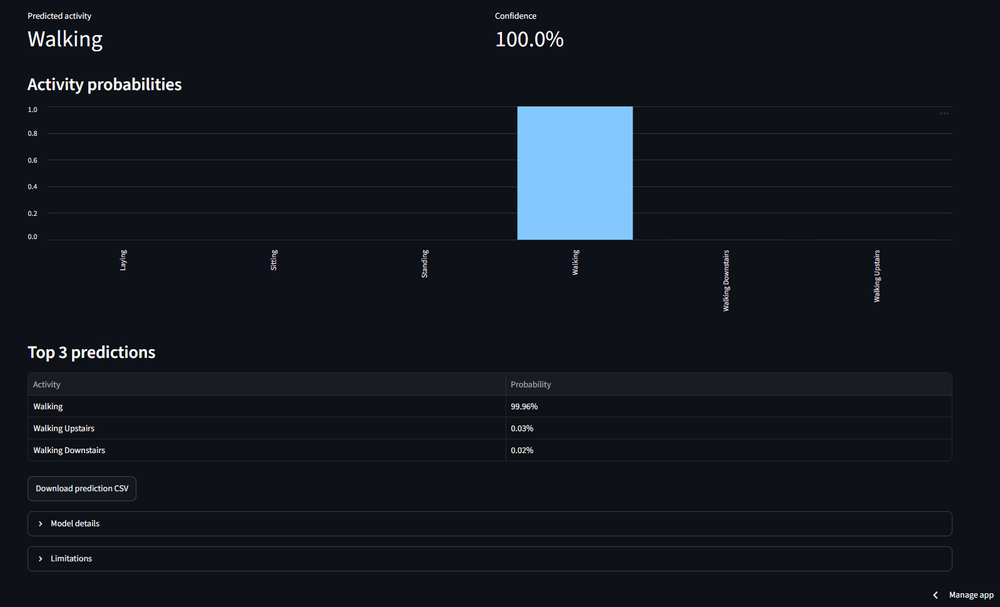
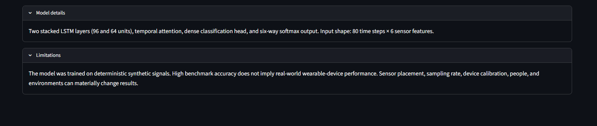

# Human Activity Recognition using LSTM with Attention

[](https://www.python.org/)
[](https://www.tensorflow.org/)
[](https://lstm-projects-tyegesrwm2jemjbldq4fju.streamlit.app/)
[](LICENSE)
[](https://github.com/unit-mole/lstm-projects/actions/workflows/06-human-activity-recognition-lstm-attention.yml)

An end-to-end human activity recognition project that uses stacked Long Short-Term Memory (LSTM) networks and an attention mechanism to classify human activities from multivariate sensor sequences. The repository includes reproducible preprocessing, model evaluation, saved artifacts, interactive visualizations, and a deployable Streamlit application.

**Status:** Portfolio-ready  
**Live demo:** [Open the Streamlit application](https://lstm-projects-tyegesrwm2jemjbldq4fju.streamlit.app/)  
[](https://lstm-projects-tyegesrwm2jemjbldq4fju.streamlit.app/)  
**Primary stack:** Python · TensorFlow · Keras · LSTM · Attention · scikit-learn · Streamlit

---

## Responsible Use and Privacy

This repository is an educational portfolio demonstration.

- Do not use this model for healthcare, safety, surveillance, insurance, employment, or legal decisions.
- Do not upload private sensor or behavioral data to the demo application.
- The model may produce incorrect predictions and should not be treated as a production wearable-analytics system.
- High benchmark performance on synthetic data does not imply real-world wearable-device performance.

---

## Business Problem

Human activity recognition is a multivariate time-series classification problem.

> Given a sequence of accelerometer and gyroscope readings, can a deep-learning model determine which activity a person is performing?

The deployed pipeline predicts:

- Predicted activity
- Confidence score
- Full probability distribution
- Top-three candidate activities
- Sensor-sequence interpretation

---

## Project Objective

This project demonstrates how sequential sensor data can be modeled using an LSTM architecture enhanced with an attention mechanism.

The solution is designed to:

1. Generate and preprocess wearable sensor sequences.
2. Normalize multivariate time-series data.
3. Train a stacked LSTM model.
4. Learn temporal importance using attention.
5. Classify activities from sensor windows.
6. Save reusable model artifacts.
7. Support interactive inference through Streamlit.
8. Demonstrate deployment-ready ML engineering practices.

---

## Portfolio Scope

This repository uses a deterministic synthetic wearable dataset created for educational purposes. It is not a production-grade HAR system and should not be used for operational decision-making.

---

## Dataset

The notebook generates synthetic smartphone-style sensor sequences with:

| Attribute | Value |
|---|---:|
| Sequence length | 80 time steps |
| Sensor features | 6 |
| Activity classes | 6 |

Supported activities:

- Walking
- Walking Upstairs
- Walking Downstairs
- Sitting
- Standing
- Laying

The generated sequences simulate accelerometer and gyroscope patterns commonly observed in wearable activity-recognition systems.

---

## Tools and Technologies

| Area | Technology |
|---|---|
| Language | Python |
| Deep learning | TensorFlow / Keras |
| Sequence modeling | LSTM |
| Attention mechanism | Custom attention layer |
| Data processing | pandas, NumPy |
| Evaluation | scikit-learn |
| Visualization | Matplotlib, Plotly |
| Demo application | Streamlit |
| Artifact storage | Keras, JSON |
| Testing | pytest |
| Hosting | Streamlit Community Cloud |

---

## Project Workflow

```text
Synthetic wearable signals
        │
        ▼
Sensor preprocessing
        │
        ▼
Train / validation / test split
        │
        ▼
Sequence generation
        │
        ▼
Feature normalization
        │
        ▼
Stacked LSTM training
        │
        ▼
Temporal attention layer
        │
        ▼
Softmax classification
        │
        ▼
Evaluation and confusion matrix
        │
        ▼
Saved artifacts + Streamlit demo
```

## Sequence Generation

The project converts raw sensor signals into fixed-length windows:

```text
Input shape: 80 × 6

Features:
- Accelerometer X
- Accelerometer Y
- Accelerometer Z
- Gyroscope X
- Gyroscope Y
- Gyroscope Z
```

Each window receives an activity label and is used as input to the LSTM model.

---

## LSTM with Attention Architecture

```text
Sensor Sequence Input (80 × 6)
            ↓
LSTM Layer (96 units)
            ↓
LSTM Layer (64 units)
            ↓
Attention Layer
            ↓
Dense Layer
            ↓
Softmax Output (6 classes)
```

Training uses:

- Adam optimizer
- Sparse categorical cross-entropy
- Early stopping
- Validation monitoring
- Attention-enhanced sequence learning

---

## Why Attention?

The attention mechanism allows the model to focus on the most informative parts of a sensor sequence.

Instead of treating all time steps equally, the model learns which moments are most useful for distinguishing activities such as:

- Walking vs Walking Upstairs
- Sitting vs Standing
- Standing vs Laying

This improves interpretability and sequence modeling.

---

## Model Results

| Model | Validation Accuracy | Test Accuracy |
|---|---:|---:|
| Baseline LSTM | 79.07% | 79.44% |
| LSTM + Attention | 99.07% | 98.52% |

Approximate evaluation metrics:

| Metric | Value |
|---|---:|
| Accuracy | 98.52% |
| Macro F1 | 98.50% |
| Weighted F1 | 98.51% |

These values apply to the synthetic benchmark dataset supplied in the notebook.

---

## Error Analysis

Common confusion patterns include:

- Walking vs Walking Upstairs
- Walking Upstairs vs Walking Downstairs
- Sitting vs Standing

Potential causes:

- Similar periodic movement patterns.
- Overlapping accelerometer signatures.
- Small differences in sensor intensity.

---

## Visual Model Results

| Training Accuracy | Training Loss |
|---|---|
|  |  |

| Confusion Matrix | Activity Errors |
|---|---|
|  |  |

---

## Streamlit Demo

The deployed application supports:

- Generated sample data
- CSV upload
- Sensor-signal visualization
- Window selection
- Activity prediction
- Confidence scores
- Top-three probabilities
- Downloadable predictions
- Model details and limitations

### Application Overview



### Activity Prediction Results



### Model Details and Limitations



---

## Model Artifacts

| Artifact | Purpose |
|---|---|
| `models/lstm_attention_har.keras` | Trained model |
| `models/har_meta.json` | Sequence length, classes, metadata |
| `outputs/*.png` | Evaluation visualizations |
| `data/sample_activity_data.csv` | Sample sensor data |

---

## Run Locally

### 1. Open the project folder

```bash
cd lstm-projects/06-human-activity-recognition-lstm-attention
```

### 2. Create a virtual environment

Windows:

```bat
py -3.12 -m venv .venv
.venv\Scripts\activate
```

macOS/Linux:

```bash
python3.12 -m venv .venv
source .venv/bin/activate
```

### 3. Install dependencies

```bash
python -m pip install --upgrade pip
python -m pip install -r requirements.txt
```

### 4. Run tests

```bash
python -m pytest -q
python -m compileall src app
```

### 5. Launch Streamlit

```bash
python -m streamlit run app/streamlit_app.py
```

Open:

```text
http://localhost:8501
```

---

## Deployment

- Repository: `unit-mole/lstm-projects`
- Branch: `main`
- Entrypoint: `06-human-activity-recognition-lstm-attention/app/streamlit_app.py`
- Python: `3.12`

Live application:

https://lstm-projects-tyegesrwm2jemjbldq4fju.streamlit.app/

For deployment details, see `README_HOSTING.md`.

---

## Skills Demonstrated

- Long Short-Term Memory (LSTM)
- Attention mechanisms
- Sequence modeling
- Multivariate time-series classification
- Wearable sensor analytics
- Deep learning with TensorFlow/Keras
- Model evaluation and error analysis
- Streamlit deployment
- Model persistence
- GitHub Actions and testing

---

## Portfolio Positioning

**One-line description:** Human activity recognition system that uses stacked LSTMs and temporal attention to classify multivariate wearable sensor sequences.

**Pinned repository description:** End-to-end time-series classification project featuring LSTM sequence modeling, attention mechanisms, sensor analytics, interactive inference, and Streamlit deployment.

This project strengthens a transition from Quality Data Scientist to Data Science, Machine Learning, and Applied AI roles by demonstrating expertise in sequential modeling, time-series analytics, explainable deep learning, deployment, and production-oriented project organization.

---

## Author

**Anmol Tripathi**  
Quality Data Scientist transitioning toward Data Science, Machine Learning, Applied AI, Analytics Engineering, and Quality Analytics roles.
