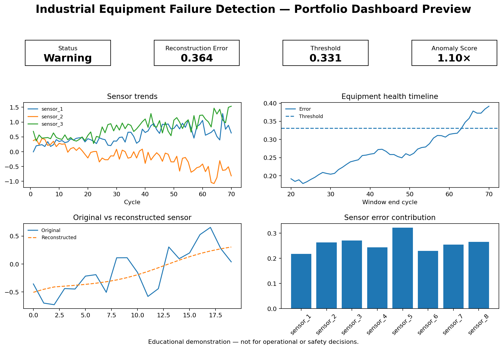

# Industrial Equipment Failure Detection using LSTM Autoencoder

[](#local-setup)
[](#interactive-streamlit-demo)
[](#model-architecture)
[](LICENSE)

> A portfolio-grade predictive-maintenance project that learns normal multivariate equipment behavior and identifies unusual sensor sequences through LSTM Autoencoder reconstruction error.

**Live demo:** `Add your Streamlit Community Cloud URL here`  
**Main portfolio:** `lstm-projects`



## Responsible-use and industrial-safety notice

This project is for **educational and portfolio demonstration purposes only**. It must not be used as the sole basis for real industrial maintenance, safety, production, or operational decisions. Equipment failure detection requires validated sensors, maintenance history, domain expertise, operational context, and qualified human review. The model can produce false positives and false negatives.

## Business problem

Unplanned equipment downtime can affect safety, production capacity, quality, maintenance cost, and customer delivery. This project asks:

> Given historical industrial equipment sensor readings, can an LSTM Autoencoder detect abnormal temporal behavior that may indicate degradation, fault, or failure risk?

The system returns an equipment health status, reconstruction error, anomaly threshold, normalized anomaly score, sensor contribution view, and a conservative risk interpretation.

## Project highlights

- Multivariate time-series processing across eight sensor signals.
- Unit-level train/validation/test split to prevent equipment leakage.
- StandardScaler fitted only on training units.
- Healthy-only LSTM Autoencoder training.
- 20-step sequence windows with chronological ordering preserved.
- Mean absolute reconstruction error and mean-plus-three-standard-deviations threshold.
- Labeled test evaluation plus statistical, PCA, and Isolation Forest baselines.
- Actual trained Keras artifact used by both TensorFlow and portable NumPy inference.
- Interactive Streamlit demo with sample/upload workflow and downloadable predictions.
- Tests, Docker support, local launch scripts, model card, audit, and hosting guide.

## Dataset

The original notebook generates a deterministic **synthetic turbofan-style dataset**:

- 120 equipment units
- 70 cycles per unit
- 8 sensor features
- 8,400 total rows
- failure-risk label during the simulated pre-failure period

A safe 420-row subset from six held-out equipment units is included for the demo. See [`data/README_data.md`](data/README_data.md). No proprietary equipment data is included.

## Workflow

```text
Generate/load sensor data
        ↓
Validate schema, sort by unit and cycle, resolve missing values
        ↓
Split by equipment ID (70% train / 15% validation / 15% test)
        ↓
Fit scaler on training units only
        ↓
Create 20-step multivariate windows
        ↓
Train LSTM Autoencoder on healthy windows only
        ↓
Reconstruct sequences and calculate MAE
        ↓
Select threshold from healthy training errors
        ↓
Classify normal / warning / high-risk anomaly
        ↓
Evaluate, interpret, visualize, and deploy
```

## Model architecture


```text
Input [20 time steps × 8 sensors]
→ LSTM(64, return_sequences=True)
→ LSTM(32) latent bottleneck
→ RepeatVector(20)
→ LSTM(32, return_sequences=True)
→ LSTM(64, return_sequences=True)
→ TimeDistributed Dense(8)
→ Reconstructed input sequence
```

The model has **64,776 trainable parameters**, uses Adam with a 0.001 learning rate, and trains with mean squared reconstruction loss. Detection uses sequence-level mean absolute reconstruction error.

## Threshold and health interpretation

The supplied threshold is:

```text
mean(healthy training MAE) + 3 × standard deviation = 0.330976
```

| Rule | Portfolio status |
|---|---|
| Error ≤ threshold | Normal Operation |
| Threshold < error ≤ 1.5 × threshold | Warning / Elevated Anomaly Score |
| Error > 1.5 × threshold | Potential Failure / High-Risk Anomaly |

The three-band wording is an interpretation layer for the demo. The verified notebook metrics use the binary threshold: error at or above the threshold is anomalous.

## Verified results from the supplied model artifact

| Metric | Result |
|---|---:|
| Validation accuracy | 84.10% |
| Validation ROC-AUC | 93.28% |
| Test accuracy | 79.85% |
| Test ROC-AUC | 88.67% |
| Test PR-AUC / average precision | 74.42% |
| Failure precision | 63.98% |
| Failure recall | 85.81% |
| Failure F1 | 73.30% |

Failure recall is comparatively strong, but precision is lower because the global threshold produces false-positive maintenance alarms. This trade-off is important in predictive maintenance: missed failures can be costly, while excessive alarms create unnecessary inspection and downtime.

### Baseline comparison

| Approach | Failure precision | Failure recall | Failure F1 | ROC-AUC |
|---|---:|---:|---:|---:|
| Statistical magnitude baseline | 0.740 | 0.125 | 0.214 | 0.675 |
| PCA reconstruction baseline | 0.990 | 0.699 | 0.820 | 0.988 |
| Isolation Forest | 0.773 | 0.287 | 0.419 | 0.819 |
| LSTM Autoencoder | 0.640 | 0.858 | 0.733 | 0.887 |


The PCA baseline performs strongly on this synthetic dataset, which is an important honest result: deep learning is not automatically the best approach. The LSTM Autoencoder remains valuable for demonstrating temporal representation learning and an end-to-end deployment pipeline, but model choice should be based on grouped validation, operational cost, and real equipment behavior.

## Portfolio outputs

| Artifact | Purpose |
|---|---|
| `outputs/training_curve.png` | Training and validation reconstruction loss |
| `outputs/reconstruction_error_distribution.png` | Healthy versus failure error separation |
| `outputs/threshold_selection.png` | Training-error threshold logic |
| `outputs/confusion_matrix.png` | Window-level classification errors |
| `outputs/precision_recall_curve.png` | Failure-detection precision/recall trade-off |
| `outputs/equipment_health_timeline.png` | Error over operating cycles |
| `outputs/normal_vs_anomaly_patterns.png` | Original versus reconstructed pattern examples |
| `outputs/baseline_comparison.csv` | Same-split baseline results |
| `outputs/test_predictions.csv` | Scored held-out windows |
| `outputs/model_metrics.json` | Machine-readable metrics and threshold details |

## Interactive Streamlit demo

The app supports:

- preloaded safe sample data or CSV upload,
- equipment/unit selection,
- sequence-window selection,
- raw sensor trends,
- original versus reconstructed signals,
- reconstruction error and threshold cards,
- normal/warning/high-risk interpretation,
- per-sensor reconstruction contribution,
- equipment health timeline,
- downloadable prediction results.

The hosted app uses a lightweight NumPy inference implementation that reads the **actual LSTM weights inside the supplied Keras v3 artifact**. TensorFlow remains available for retraining through `requirements-dev.txt`, but is not required for public demo startup.

## Local setup

### Fast Windows launch

```bat
run_local.bat
```

### Fast macOS/Linux launch

```bash
chmod +x run_local.sh
./run_local.sh
```

### Manual setup

```bash
python -m venv .venv
# Windows: .venv\Scripts\activate
# macOS/Linux: source .venv/bin/activate
python -m pip install --upgrade pip
pip install -r requirements.txt
streamlit run app/streamlit_app.py
```

Open the local Streamlit URL displayed in the terminal.

### Retrain the model

```bash
pip install -r requirements-dev.txt
python train_model.py --epochs 20
```

Training requires TensorFlow. The supplied app artifacts already work without retraining.

## Deployment

Streamlit Community Cloud is recommended for the portfolio demo. In the monorepo, use this entrypoint:

```text
07-industrial-equipment-failure-detection-lstm-autoencoder/app/streamlit_app.py
```

See [`README_HOSTING.md`](README_HOSTING.md) for complete GitHub, Community Cloud, and Docker/Hugging Face instructions.

## Project structure

```text
07-industrial-equipment-failure-detection-lstm-autoencoder/
├── .streamlit/
├── app/
├── archive/
├── data/
├── images/
├── models/
├── notebooks/
├── outputs/
├── scripts/
├── src/
├── tests/
├── .gitignore
├── __init__.py
├── Dockerfile
├── FILE_MANIFEST.xlsx
├── IMPROVEMENTS.md
├── LICENSE
├── MONOREPO_INTEGRATION.md
├── PROJECT_AUDIT.md
├── README.md
├── README_HOSTING.md
├── requirements.txt
├── requirements-dev.txt
├── run_local.bat
├── run_local.sh
└── train_model.py
```

`.pytest_cache/` and `__pycache__/` are generated automatically after testing or execution and are intentionally excluded from Git.

## Limitations

- Synthetic data cannot establish real-world safety or maintenance performance.
- A global model may interpret unit-specific operating baselines as anomalies.
- Window-level labels simplify real maintenance events and lead-time evaluation.
- Reconstruction error detects deviation but does not prove equipment failure or root cause.
- Thresholds require asset, operating-regime, and business-risk calibration.
- Production use requires drift monitoring, maintenance feedback, alarm persistence rules, sensor validation, and human escalation.

## Skills demonstrated

LSTM Autoencoders · multivariate time series · anomaly detection · predictive maintenance · industrial sensor analytics · leakage prevention · threshold calibration · baseline benchmarking · model evaluation · explainable reconstruction error · modular Python · testing · Streamlit · Docker · GitHub portfolio engineering.

## Portfolio positioning

**One-line description:** Built and deployed an LSTM Autoencoder pipeline that learns normal industrial sensor behavior and flags potential equipment failure risk using multivariate reconstruction error.

**Pinned-repository description:** End-to-end predictive-maintenance portfolio project with grouped time-series validation, healthy-only LSTM Autoencoder training, anomaly thresholding, baseline comparisons, explainability, and an interactive Streamlit demo.

This project connects naturally to a Quality Data Scientist background through equipment monitoring, quality-risk detection, preventive maintenance, process variation, false-alarm trade-offs, and data-driven investigation.

## License

MIT License. See [`LICENSE`](LICENSE).
