# Industrial Equipment Failure Detection using LSTM Autoencoder

[](https://www.python.org/)
[](https://www.tensorflow.org/)
[](https://lstm-projects-kcgnvnpblpu2fqjhw6tzln.streamlit.app/)
[](LICENSE)
[](https://github.com/unit-mole/lstm-projects/actions/workflows/07-industrial-equipment-failure-detection-lstm-autoencoder.yml)

An end-to-end predictive-maintenance and industrial anomaly-detection project that uses an
LSTM Autoencoder to learn normal multivariate equipment behavior and identify unusual sensor
sequences through reconstruction error. The repository includes leakage-aware preprocessing,
chronological sequence generation, healthy-only model training, threshold-based equipment
health classification, baseline benchmarking, reusable inference artifacts, automated tests,
and an interactive Streamlit application.

**Status:** Portfolio-ready  
**Live demo:** [Open the Streamlit application](https://lstm-projects-kcgnvnpblpu2fqjhw6tzln.streamlit.app/)  
[](https://lstm-projects-kcgnvnpblpu2fqjhw6tzln.streamlit.app/)  
**Primary stack:** Python · LSTM Autoencoder · Keras · TensorFlow · NumPy · scikit-learn · Plotly · Streamlit

---

## Business Problem

Unexpected industrial equipment failures can reduce production capacity, increase maintenance
cost, affect product quality, create delivery delays, and introduce operational or safety risk.
Traditional fixed-limit monitoring may miss complex temporal relationships across multiple
sensor signals.

This project answers:

> Given historical multivariate equipment sensor readings, can an LSTM Autoencoder detect
> abnormal temporal behavior that may indicate equipment degradation, fault, or failure risk?

The deployed pipeline returns:

- **Equipment health status**
- **Reconstruction error**
- **Anomaly threshold**
- **Normalized anomaly score**
- **Potential failure-risk interpretation**
- **Sensor-level reconstruction contribution**
- **Equipment health timeline**

## Project Objective

Build a portfolio-ready predictive-maintenance solution that can:

1. Validate and preprocess multivariate industrial sensor data.
2. Preserve chronological order and prevent leakage between equipment units.
3. Fit normalization parameters only on the training partition.
4. Convert continuous sensor readings into fixed-length time-series windows.
5. Train an LSTM Autoencoder using healthy operating sequences only.
6. Calculate sequence-level reconstruction error.
7. Convert reconstruction error into normal, warning, and high-risk health states.
8. Evaluate anomaly detection using labeled held-out equipment units.
9. Compare deep-learning performance with simpler anomaly-detection baselines.
10. Save and reload all artifacts required for reproducible inference.
11. Provide an interactive Streamlit application for portfolio demonstration.

## Portfolio Scope

This is an educational and portfolio demonstration built on deterministic **synthetic
industrial sensor data**. It is not a validated production maintenance or safety system and
must not be used as the sole basis for real maintenance, production, quality, or operational
decisions.

## Dataset

The project uses a deterministic synthetic turbofan-style equipment dataset designed to
represent normal operation followed by increasing pre-failure degradation.

| Dataset property | Value |
|---|---:|
| Equipment units | 120 |
| Cycles per unit | 70 |
| Sensor features | 8 |
| Total rows | 8,400 |
| Training units | 84 |
| Validation units | 18 |
| Test units | 18 |
| Healthy training windows | 2,854 |
| Validation windows | 918 |
| Test windows | 918 |

A safe **420-row sample** from six held-out equipment units is included for the Streamlit
demo. No proprietary equipment, maintenance, or production data is included in GitHub.

See [`data/README_data.md`](data/README_data.md) for the data schema and usage notes.

## Tools and Technologies

| Area | Technology |
|---|---|
| Language | Python 3.11 |
| Data processing | pandas, NumPy |
| Deep-learning model | TensorFlow / Keras LSTM Autoencoder |
| Preprocessing | scikit-learn `StandardScaler` |
| Reconstruction inference | Portable NumPy backend using saved Keras weights |
| Evaluation | scikit-learn, Matplotlib |
| Interactive visualization | Plotly |
| Demo application | Streamlit |
| Model persistence | Keras `.keras`, Joblib, JSON |
| Testing and quality | pytest, Ruff, compile checks, GitHub Actions |
| Hosting | Streamlit Community Cloud |

## Project Workflow

```text
Multivariate equipment sensor data
        │
        ▼
Schema validation and chronological sorting
        │
        ▼
Missing-value handling and sensor-quality checks
        │
        ▼
Equipment-level 70% / 15% / 15% split
        │
        ▼
Training-only sensor normalization
        │
        ▼
20-step multivariate sequence generation
        │
        ▼
Healthy-window LSTM Autoencoder training
        │
        ▼
Sequence reconstruction and MAE calculation
        │
        ▼
Training-error threshold selection
        │
        ▼
Normal / Warning / High-Risk classification
        │
        ▼
Held-out evaluation and baseline comparison
        │
        ▼
Saved model + scaler + metadata + Streamlit deployment
```

## Sensor Preprocessing

The preprocessing pipeline is designed to reduce leakage and preserve the time-series nature
of the problem.

- Validates `unit_id`, `cycle`, and all required sensor columns.
- Sorts records by equipment unit and operating cycle.
- Resolves duplicate equipment-cycle records.
- Converts sensor columns to numeric values.
- Handles missing values within each equipment sequence.
- Splits data by equipment ID rather than by randomly mixed rows.
- Fits the scaler using training equipment only.
- Applies the same saved scaling statistics during inference.
- Stores sensor names, sequence length, threshold, and schema in model metadata.
- Uses known labels for evaluation only—not as model input.

## Sequence Generation

Each LSTM input represents a continuous operating window from a single equipment unit.
Sequences are never allowed to cross equipment boundaries.

```text
Sequence length: 20 time steps
Step size: 1 time step
Input features: sensor_1 ... sensor_8
Input shape: [20, 8]
Autoencoder target: reconstructed copy of the same input sequence
```

For healthy-only autoencoder training:

```text
X_train = healthy_sensor_sequences
y_train = healthy_sensor_sequences
```

## LSTM Autoencoder Architecture

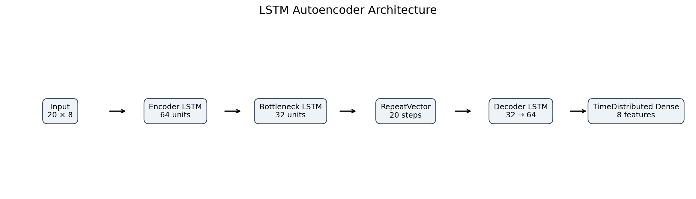

```text
Input: 20 time steps × 8 sensors
        ↓
LSTM(64, return_sequences=True)
        ↓
LSTM(32) latent bottleneck
        ↓
RepeatVector(20)
        ↓
LSTM(32, return_sequences=True)
        ↓
LSTM(64, return_sequences=True)
        ↓
TimeDistributed Dense(8)
        ↓
Reconstructed sensor sequence
```

| Model property | Value |
|---|---|
| Trainable parameters | 64,776 |
| Optimizer | Adam |
| Learning rate | 0.001 |
| Training loss | Mean squared error |
| Detection score | Sequence-level mean absolute reconstruction error |
| Training strategy | Healthy windows only |

## Reconstruction Error and Health Logic

The model learns to reconstruct healthy operating patterns. A sequence that differs from the
learned healthy behavior generally produces a larger reconstruction error.

```text
Reconstruction Error = mean absolute difference between the original and reconstructed
sensor sequence across all time steps and sensor features
```

The threshold is calculated from healthy training reconstruction errors:

```text
Threshold = mean(training healthy MAE) + 3 × standard deviation
Threshold value = 0.330976
```

| Reconstruction-error rule | Equipment health interpretation |
|---|---|
| Error ≤ threshold | Normal Operation |
| Threshold < error ≤ 1.5 × threshold | Warning / Elevated Anomaly Score |
| Error > 1.5 × threshold | Potential Failure / High-Risk Anomaly |

The three-level health status is a portfolio interpretation layer. Binary evaluation uses the
main threshold to separate healthy and anomalous windows.

## Model Results

| Metric | Validation result | Test result |
|---|---:|---:|
| Accuracy | 0.841 | 0.798 |
| ROC-AUC | 0.933 | 0.887 |
| PR-AUC / Average precision | — | 0.744 |
| Failure precision | — | 0.640 |
| Failure recall | — | 0.858 |
| Failure F1-score | — | 0.733 |

Confusion matrix on 918 held-out test windows:

| | Predicted healthy | Predicted failure/anomaly |
|---|---:|---:|
| **Actual healthy** | 479 | 143 |
| **Actual failure/anomaly** | 42 | 254 |

The model prioritizes comparatively strong failure recall. This reduces missed anomalies but
also generates false-positive maintenance alerts. In predictive maintenance, false negatives
can allow degradation to continue undetected, while false positives may increase inspection,
downtime, and maintenance cost.

## Baseline Comparison

| Model / approach | Accuracy | Failure precision | Failure recall | Failure F1 | ROC-AUC |
|---|---:|---:|---:|---:|---:|
| Statistical magnitude baseline | 0.704 | 0.740 | 0.125 | 0.214 | 0.675 |
| PCA reconstruction baseline | 0.901 | 0.990 | 0.699 | 0.820 | 0.988 |
| Isolation Forest | 0.743 | 0.773 | 0.287 | 0.419 | 0.819 |
| **LSTM Autoencoder** | **0.798** | **0.640** | **0.858** | **0.733** | **0.887** |

The PCA baseline performs strongly on this deterministic synthetic dataset. This is an
important technical result: deep learning is not automatically the best solution. The LSTM
Autoencoder provides the highest failure recall among the compared methods and demonstrates
temporal representation learning, sequence reconstruction, portable inference, and end-to-end
deployment.

## Visual Model Results

| Training curve | Reconstruction-error distribution |
|---|---|
| 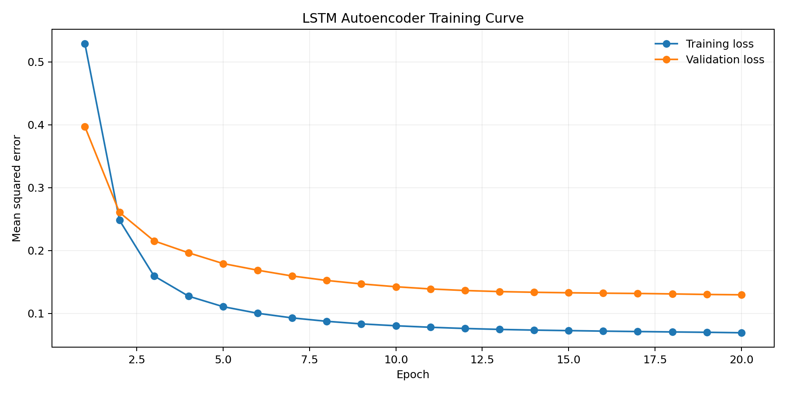 | 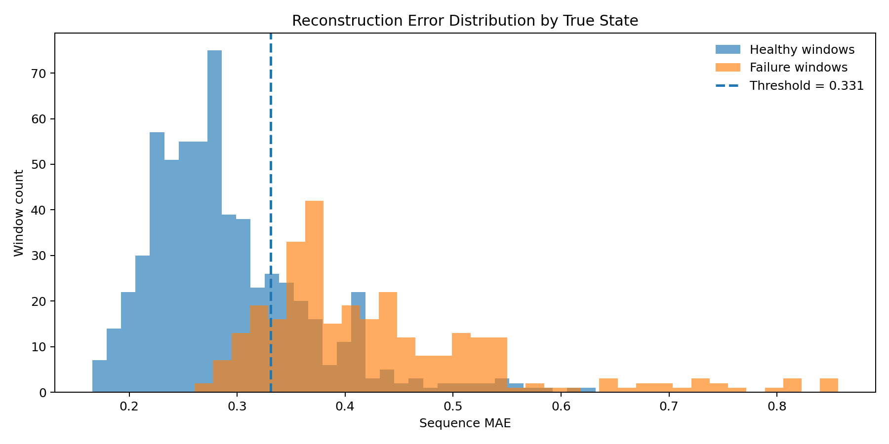 |

| Confusion matrix | Precision-recall curve |
|---|---|
| 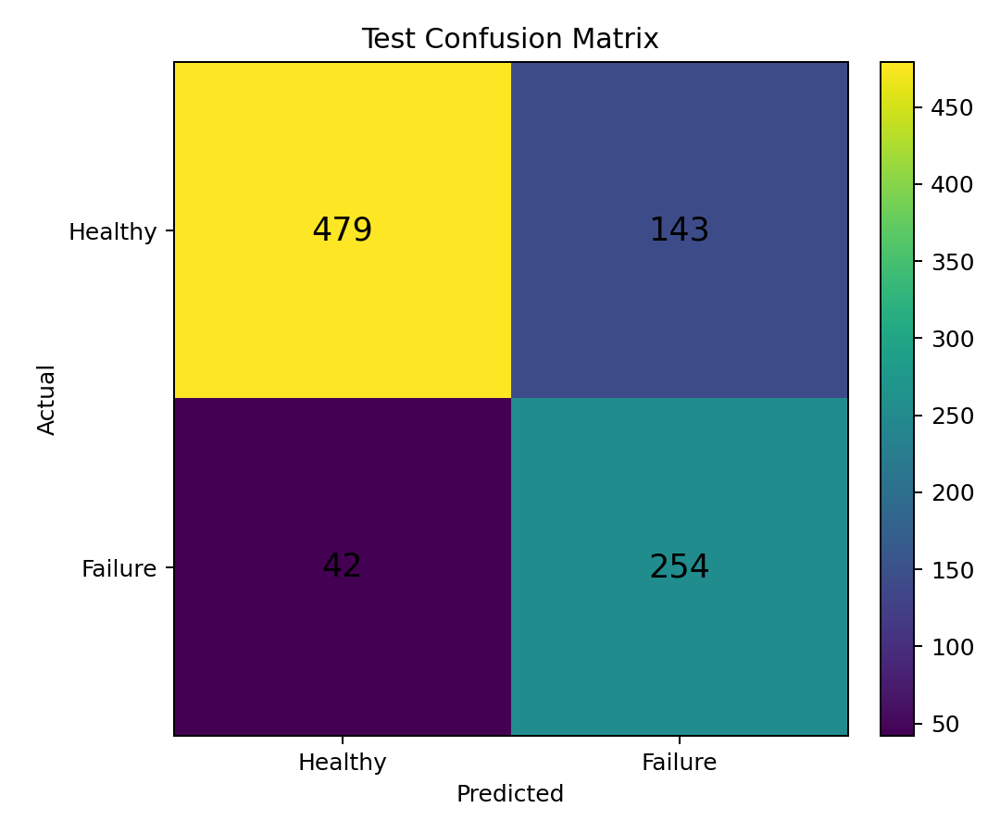 | 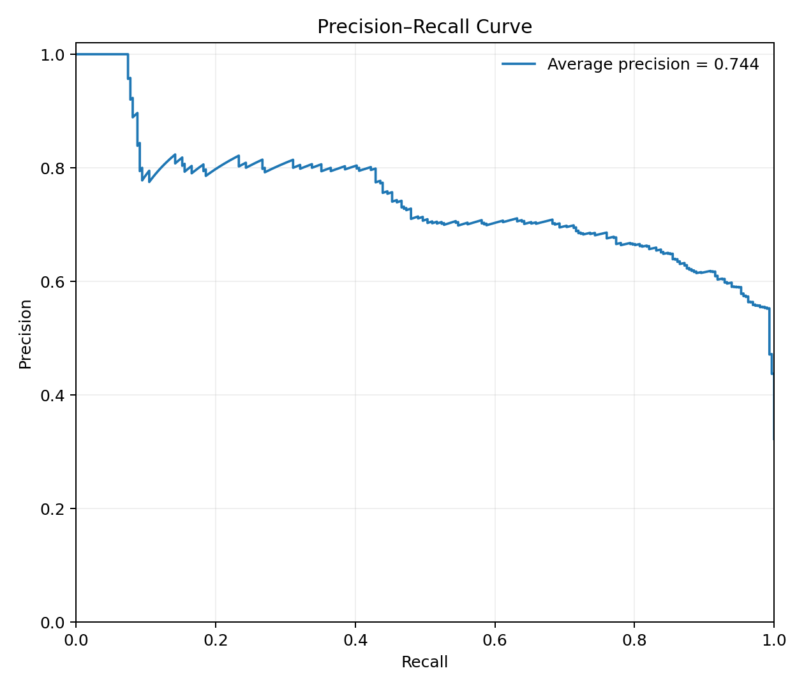 |

| Threshold selection | Equipment health timeline |
|---|---|
| 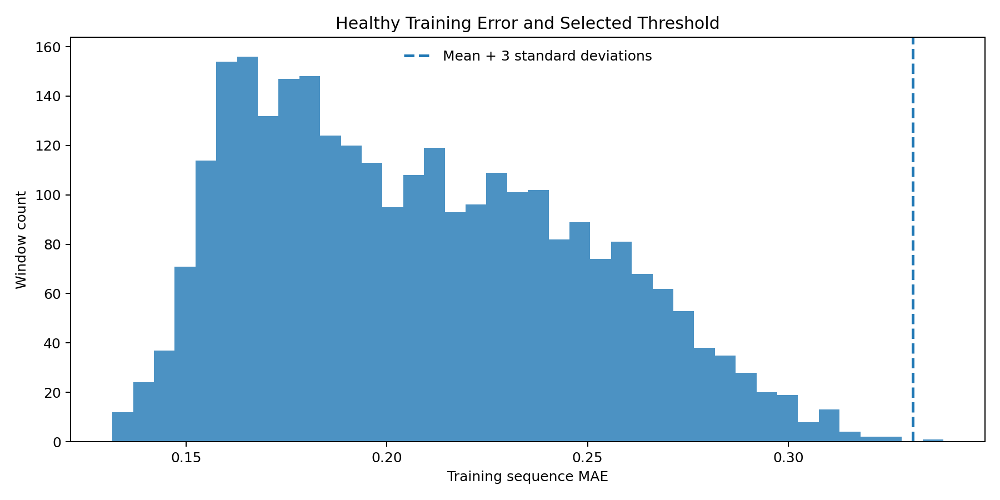 | 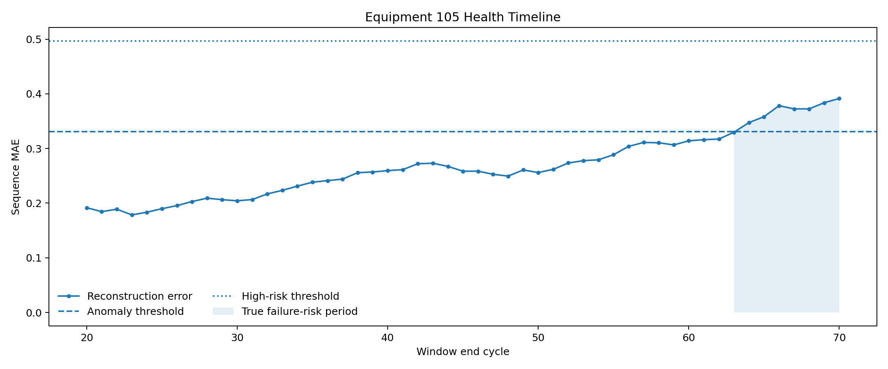 |

| Normal versus anomaly patterns | Baseline comparison |
|---|---|
| 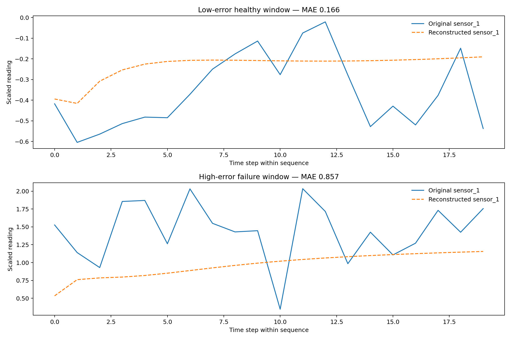 | 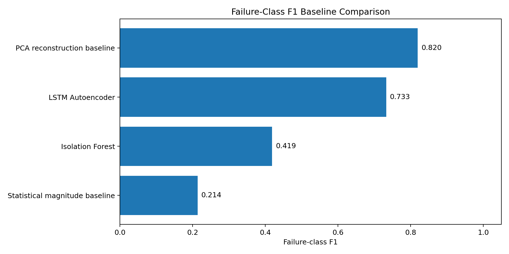 |

## Streamlit Demo

The deployed application supports:

- Preloaded safe sample data
- User-provided CSV upload
- Equipment/unit selection
- Time-window selection
- Multivariate sensor-trend visualization
- Original-versus-reconstructed sensor comparison
- Reconstruction error and anomaly threshold metrics
- Normal, warning, and potential-failure interpretation
- Sensor-level reconstruction-error contribution
- Equipment health timeline
- Data-quality and sensor-summary review
- Downloadable scored-window results

### Application Overview

The main application view introduces the predictive-maintenance objective, responsible-use
notice, data-source controls, equipment selector, and selected equipment assessment.

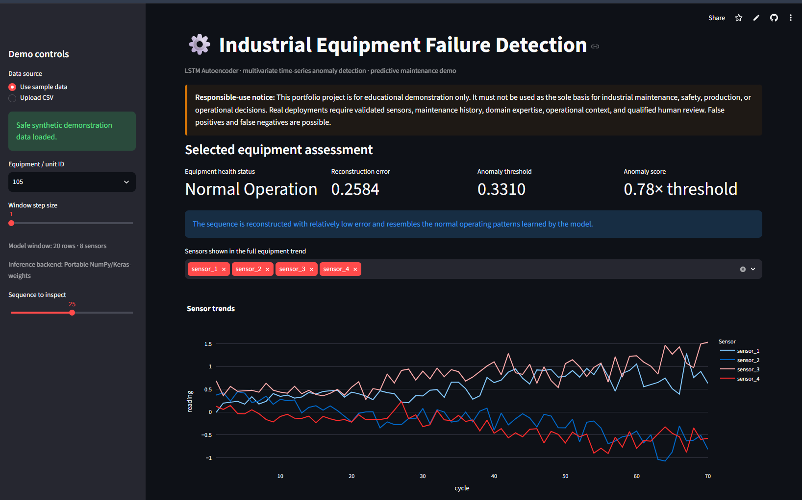

### Sensor Trends Dashboard

The sensor-monitoring dashboard displays multivariate equipment readings over time and helps
reviewers inspect operating behavior before analyzing an individual sequence.

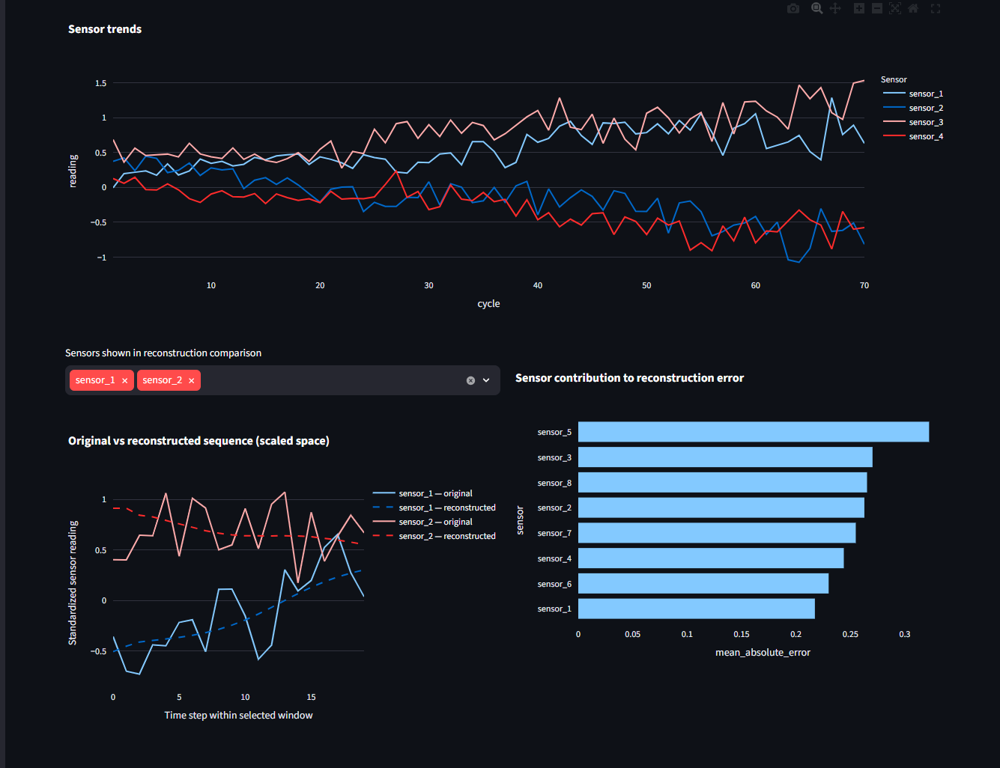

### Anomaly Detection Result

The model-assessment view presents equipment health status, reconstruction error, threshold,
anomaly score, reconstructed signals, and failure-risk interpretation.

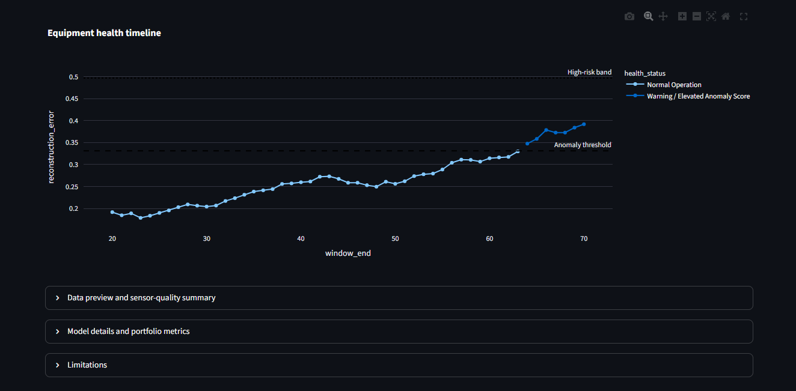

## Model Artifacts

| Artifact | Purpose |
|---|---|
| `models/lstm_autoencoder_predictive_maintenance.keras` | Trained LSTM Autoencoder model artifact |
| `models/scaler.pkl` | Serialized training-fitted sensor scaler |
| `models/scaler.json` | Portable scaler statistics for deployment |
| `models/model_metadata.json` | Sequence length, sensor order, threshold, architecture, and training details |
| `models/pm_meta.json` | Compact compatibility metadata |
| `outputs/model_metrics.json` | Validation and held-out test metrics |
| `outputs/test_predictions.csv` | Scored held-out time-series windows |
| `outputs/baseline_comparison.csv` | Same-split baseline results |

The Streamlit application loads saved artifacts directly and does not retrain the model during
startup. Its lightweight NumPy inference implementation reads the actual weights stored in the
Keras v3 model artifact, reducing deployment size while preserving the trained model logic.

## Run Locally

### 1. Open the project directory

```bash
cd lstm-projects/07-industrial-equipment-failure-detection-lstm-autoencoder
```

### 2. Create and activate a virtual environment

Windows Command Prompt:

```bat
py -3.11 -m venv .venv
.venv\Scripts\activate
```

Windows PowerShell:

```powershell
py -3.11 -m venv .venv
.\.venv\Scripts\Activate.ps1
```

macOS or Linux:

```bash
python3.11 -m venv .venv
source .venv/bin/activate
```

### 3. Install dependencies

```bash
python -m pip install --upgrade pip
python -m pip install -r requirements.txt
```

Install development and training dependencies when required:

```bash
python -m pip install -r requirements-dev.txt
```

### 4. Run tests and quality checks

```bash
python -m pytest tests -q
python -m compileall -q app scripts src tests train_model.py
ruff check app scripts src tests train_model.py
```

### 5. Launch the pretrained Streamlit demo

```bash
python -m streamlit run app/streamlit_app.py
```

Open the local address displayed in the terminal, normally:

```text
http://localhost:8501
```

### 6. Optional: retrain the model

```bash
python train_model.py --epochs 20
```

Retraining requires TensorFlow. The supplied model, scaler, metadata, sample data, and
Streamlit application already work without retraining.

## Deploy

The application is deployed through Streamlit Community Cloud directly from the LSTM
portfolio monorepo.

- **Repository:** `unit-mole/lstm-projects`
- **Branch:** `main`
- **Entrypoint:** `07-industrial-equipment-failure-detection-lstm-autoencoder/app/streamlit_app.py`
- **Python:** `3.11`
- **Live application:**  
  https://lstm-projects-kcgnvnpblpu2fqjhw6tzln.streamlit.app/

The deployment-specific `app/requirements.txt` file is located beside the Streamlit
entrypoint, allowing Community Cloud to resolve the project dependencies within the monorepo.

See [`README_HOSTING.md`](README_HOSTING.md) for deployment, troubleshooting, and maintenance
instructions.

## Project Structure

```text
lstm-projects/
├── .github/
│   └── workflows/
│       └── 07-industrial-equipment-failure-detection-lstm-autoencoder.yml
├── 01-airline-passenger-forecasting/
├── 02-bitcoin-price-prediction/
├── 03-conversational-chatbot-seq2seq-attention/
├── 04-ecg-anomaly-detection-lstm-autoencoder-attention/
├── 05-fake-news-detection/
├── 06-human-activity-recognition-lstm-attention/
├── 07-industrial-equipment-failure-detection-lstm-autoencoder/
│   ├── .streamlit/
│   │   └── config.toml
│   ├── app/
│   │   ├── requirements.txt
│   │   └── streamlit_app.py
│   ├── archive/
│   ├── data/
│   │   ├── README_data.md
│   │   └── sample_equipment_sensor_data.csv
│   ├── images/
│   │   ├── 01-application-overview.png
│   │   ├── 02-sensor-trends-dashboard.png
│   │   ├── 03-anomaly-detection-result.png
│   │   └── model_architecture.png
│   ├── models/
│   ├── notebooks/
│   ├── outputs/
│   ├── scripts/
│   ├── src/
│   ├── tests/
│   ├── .gitignore
│   ├── Dockerfile
│   ├── FILE_MANIFEST.xlsx
│   ├── IMPROVEMENTS.md
│   ├── LICENSE
│   ├── MONOREPO_INTEGRATION.md
│   ├── PROJECT_AUDIT.md
│   ├── README.md
│   ├── README_HOSTING.md
│   ├── requirements-dev.txt
│   ├── requirements.txt
│   ├── run_local.bat
│   ├── run_local.sh
│   └── train_model.py
├── .gitignore
├── LICENSE
└── README.md
```

Generated `.pytest_cache/`, `.ruff_cache/`, and `__pycache__/` folders are excluded from Git.

## Testing and CI

Run the lightweight automated tests with:

```bash
python -m pytest tests -q
```

The GitHub Actions workflow runs whenever Project 07 or its workflow file changes:

```text
.github/workflows/07-industrial-equipment-failure-detection-lstm-autoencoder.yml
```

The workflow performs:

- Required-file validation
- Python compilation checks
- Ruff code-quality checks
- Automated pytest execution
- Packaged model and inference-artifact validation

## Limitations

- The dataset is synthetic and cannot establish real-world maintenance or safety performance.
- A global model may interpret equipment-specific operating baselines as anomalies.
- Window-level labels simplify real failure events and maintenance lead-time evaluation.
- Reconstruction error identifies deviation but does not prove failure or determine root cause.
- A single global threshold may not suit different assets or operating regimes.
- Sensor failures, drift, calibration problems, and data-collection gaps require separate controls.
- Production use requires maintenance history, operating context, alarm-persistence rules,
  validated sensors, human escalation, and continuous performance monitoring.

## Future Improvements

- Validate the workflow on a documented public predictive-maintenance dataset.
- Compare unit-specific and operating-regime-specific thresholds.
- Add threshold optimization based on maintenance cost and missed-failure risk.
- Evaluate bidirectional, variational, and attention-based sequence autoencoders.
- Add early-warning lead-time and event-level failure metrics.
- Introduce sensor drift and data-quality monitoring.
- Add maintenance-feedback integration and alarm-persistence logic.
- Add SHAP-style or reconstruction-attribution explanations with conservative wording.
- Package inference behind an API and add automated deployment smoke tests.
- Track experiments and artifacts using MLflow or a model registry.

## Skills Demonstrated

- LSTM Autoencoder modeling
- Multivariate time-series analysis
- Industrial sensor analytics
- Predictive maintenance
- Unsupervised anomaly detection
- Healthy-only representation learning
- Chronological sequence generation
- Equipment-level leakage prevention
- Reconstruction-error scoring
- Threshold calibration
- Classification and ranking metrics
- Baseline benchmarking
- Model persistence and portable inference
- Modular Python project design
- Streamlit application development
- Interactive Plotly visualization
- Unit testing and linting
- GitHub Actions CI
- Streamlit Community Cloud deployment
- Responsible industrial-AI framing

## Portfolio Positioning

**One-line description:** LSTM Autoencoder predictive-maintenance system that detects unusual
multivariate equipment behavior using reconstruction error and presents equipment health risk
through an interactive Streamlit dashboard.

**Pinned repository description:** End-to-end industrial time-series anomaly-detection project
with leakage-aware preprocessing, healthy-only LSTM Autoencoder training, threshold-based
failure-risk scoring, baseline comparison, portable inference, automated testing, and a live
Streamlit demo.

This project supports a transition from Quality Data Scientist to broader Data Science,
Machine Learning, Applied AI, Analytics Engineering, and Quality Analytics roles. It connects
quality-focused skills—trend detection, abnormal-condition investigation, metric interpretation,
risk prioritization, process monitoring, and stakeholder communication—to a complete
predictive-modeling and deployment workflow.

## Responsible Use

This repository is an educational portfolio demonstration. It must not be used as the sole
basis for real industrial maintenance, safety, production, quality, or operational decisions.
The model may produce false positives and false negatives. Real deployment requires validated
sensors, asset-specific engineering knowledge, maintenance history, operating context,
threshold governance, continuous monitoring, and qualified human review.

## Author

**Anmol Tripathi**  
Quality Data Scientist transitioning toward Data Science, Machine Learning, Applied AI,
Analytics Engineering, Business Intelligence, and Quality Analytics roles.
