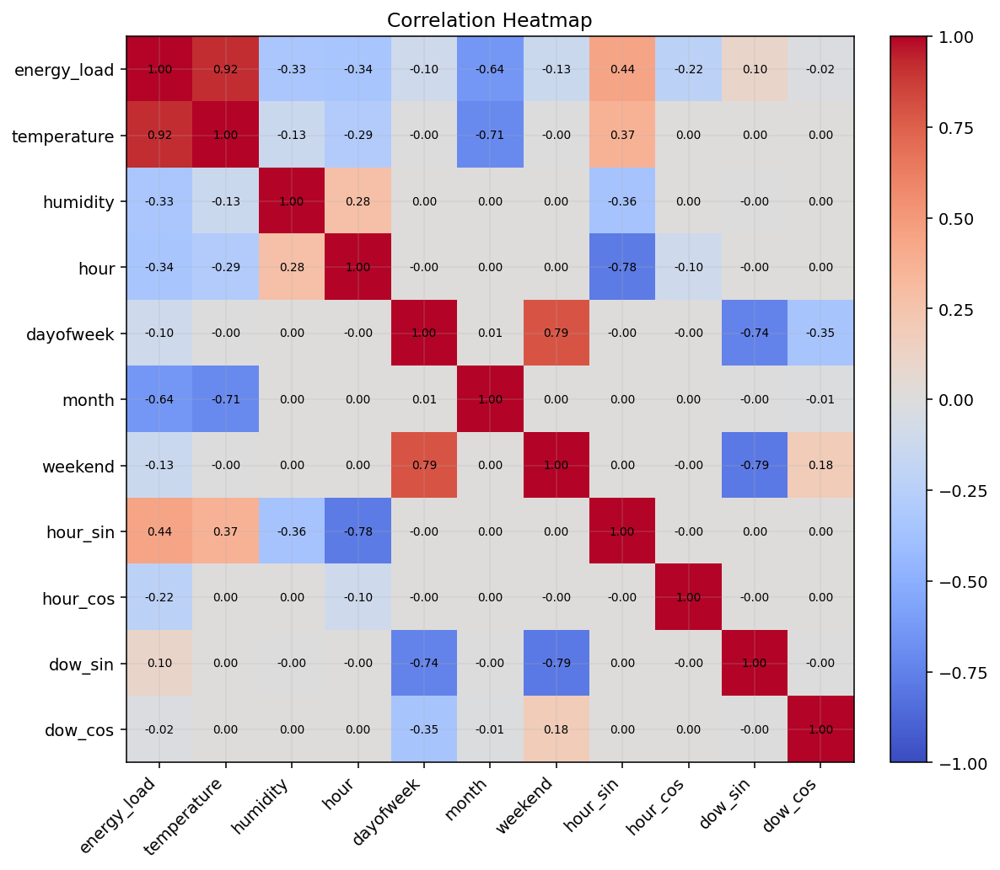
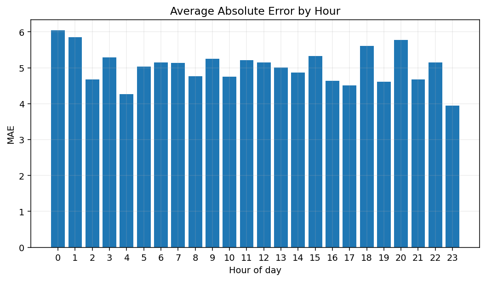
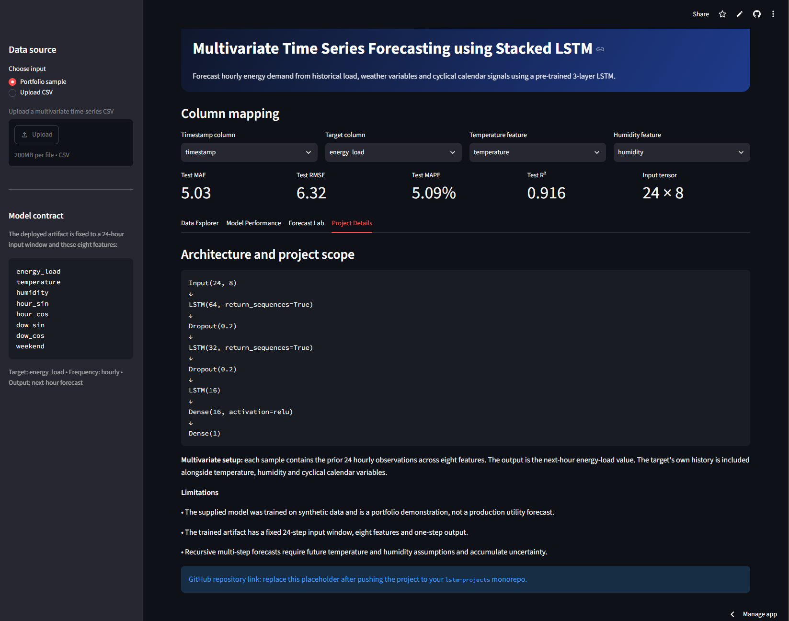
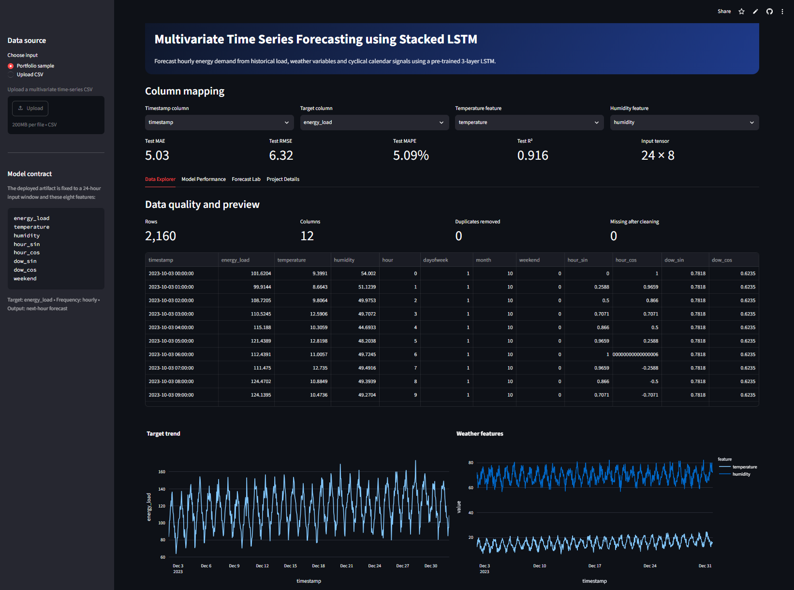
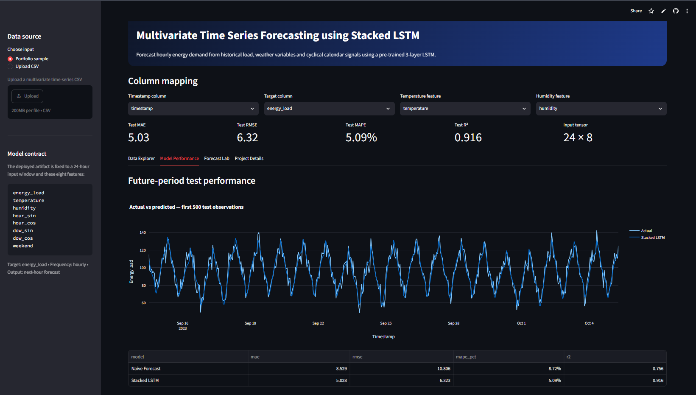

# Multivariate Time Series Forecasting using Stacked LSTM

[](https://www.python.org/)
[](https://www.tensorflow.org/)
[](https://lstm-projects-me6cghesgakawzytkkrrwp.streamlit.app/)
[](LICENSE)
[](https://github.com/unit-mole/lstm-projects/actions/workflows/08-multivariate-time-series-forecasting-stacked-lstm.yml)

An end-to-end multivariate time-series forecasting project that uses a three-layer
Stacked LSTM to predict next-hour energy demand from historical load, weather
variables, and cyclical calendar signals. The repository includes leakage-controlled
preprocessing, chronological evaluation, baseline comparison, saved model artifacts,
recursive multi-hour forecasting, automated tests, and an interactive Streamlit
decision-support application.

**Status:** Portfolio-ready  
**Live demo:** [Open the Streamlit application](https://lstm-projects-me6cghesgakawzytkkrrwp.streamlit.app/)  
[](https://lstm-projects-me6cghesgakawzytkkrrwp.streamlit.app/)  
**Primary stack:** Python · TensorFlow · Keras · scikit-learn · Plotly · Streamlit

---

## Business Problem

Operational teams often need reliable near-term demand forecasts for capacity
planning, staffing, resource allocation, inventory coordination, and production
scheduling. Using only the latest demand value can overlook the effect of weather,
hour-of-day, day-of-week, and weekend behavior.

This project answers:

> Given multiple historical time-series variables, can a Stacked LSTM forecast
> next-hour energy demand more accurately than a previous-value baseline?

The deployed pipeline provides:

- **Next-hour energy-load forecast**
- **User-selected 1–24 hour recursive forecast horizon**
- **Actual-versus-predicted performance analysis**
- **Naive baseline comparison**
- **Residual diagnostics and business interpretation**
- **Downloadable forecast results**

## Project Objective

Build a professional Stacked LSTM forecasting solution that can:

1. Validate and chronologically organize multivariate time-series data.
2. Handle timestamps, duplicate records, missing values, and numeric fields.
3. Engineer cyclical calendar features without using future information.
4. Create 24-hour multivariate input sequences for next-hour prediction.
5. Fit feature and target scalers using training data only.
6. Train and evaluate a multi-layer LSTM regression model.
7. Compare the model with a transparent previous-value baseline.
8. Save and reload all artifacts required for reproducible inference.
9. Generate interactive recursive forecasts through Streamlit.
10. Support sample data, CSV uploads, charts, and forecast downloads.

## Portfolio Scope

This is an educational portfolio demonstration based on a deterministic
**synthetic hourly energy-demand dataset**. It is designed to demonstrate
forecasting methodology and ML engineering—not to represent a validated utility,
financial, or production-demand forecasting system.

## Dataset

The project contains 17,520 hourly observations covering two complete years.
The data-generating process combines calendar patterns, weather relationships,
and demand behavior while remaining safe to publish on GitHub.

| Item | Value |
|---|---|
| Records | 17,520 hourly observations |
| Date range | 2022-01-01 to 2023-12-31 |
| Frequency | Hourly |
| Timestamp column | `timestamp` |
| Forecast target | `energy_load` |
| Exogenous variables | `temperature`, `humidity` |
| Engineered variables | `hour_sin`, `hour_cos`, `dow_sin`, `dow_cos`, `weekend` |
| Missing values | 0 in the generated training dataset |
| Duplicate timestamps | 0 |
| Input window | Previous 24 hours |
| Forecast output | Next-hour energy load |

### Chronological Split

| Split | Rows | Time range |
|---|---:|---|
| Training | 12,264 | 2022-01-01 00:00 to 2023-05-26 23:00 |
| Validation | 2,628 | 2023-05-27 00:00 to 2023-09-13 11:00 |
| Test | 2,628 | 2023-09-13 12:00 to 2023-12-31 23:00 |

No random shuffle is used. Feature and target scaling statistics are learned
from the training period only to reduce leakage risk.

See [`data/README_data.md`](data/README_data.md) for schema, generation, and
safe-use notes.

## Tools and Technologies

| Area | Technology |
|---|---|
| Language | Python 3.11 |
| Data processing | pandas, NumPy |
| Deep learning | TensorFlow / Keras |
| Scaling and metrics | scikit-learn |
| Interactive charts | Plotly |
| Static visualizations | Matplotlib |
| Demo application | Streamlit |
| Model persistence | Keras `.keras`, JSON |
| Testing and quality | pytest, Ruff, compile checks, GitHub Actions |
| Hosting | Streamlit Community Cloud |

## Project Workflow

```text
Hourly multivariate time-series data
                │
                ▼
Timestamp parsing and chronological sorting
                │
                ▼
Missing-value and duplicate-timestamp validation
                │
                ▼
Cyclical calendar feature engineering
                │
                ▼
Chronological 70% / 15% / 15% split
                │
                ▼
Training-only feature and target scaling
                │
                ▼
24-hour multivariate sequence generation
                │
                ▼
Three-layer Stacked LSTM training
                │
                ▼
Validation and future-period test evaluation
                │
                ▼
Naive baseline and residual comparison
                │
                ▼
Saved model + scaler statistics + metadata
                │
                ▼
Streamlit exploration and recursive forecasting
```

## Feature Engineering

| Feature | Method | Purpose |
|---|---|---|
| `hour_sin` | `sin(2π × hour / 24)` | Represents cyclical hour-of-day position |
| `hour_cos` | `cos(2π × hour / 24)` | Preserves circular distance between hours |
| `dow_sin` | `sin(2π × day_of_week / 7)` | Represents weekly seasonality |
| `dow_cos` | `cos(2π × day_of_week / 7)` | Preserves circular weekly relationships |
| `weekend` | Saturday/Sunday indicator | Captures weekend demand behavior |
| Historical `energy_load` | Previous observations in each sequence | Supplies autoregressive demand history |
| `temperature` | Historical exogenous variable | Captures weather-related demand variation |
| `humidity` | Historical exogenous variable | Adds environmental context |

All engineered features are based on the current or historical timestamp. No
future target values are used during feature preparation.

## Multivariate Sequence Design

Each supervised sample contains the previous 24 hourly observations across eight
features and predicts the energy-load value at the next timestamp.

```text
X shape = [samples, 24 time steps, 8 features]
y shape = [samples, 1 forecast value]
```

Feature order used by the saved model:

```text
energy_load
temperature
humidity
hour_sin
hour_cos
dow_sin
dow_cos
weekend
```

This is a **multiple-input, single-output regression forecasting** setup. It is
multivariate because the LSTM receives target history, weather variables, and
calendar signals together rather than relying on energy-load history alone.

## Stacked LSTM Architecture

```text
Input: 24 time steps × 8 features
              ↓
LSTM 64, return_sequences=True
              ↓
Dropout 0.20
              ↓
LSTM 32, return_sequences=True
              ↓
Dropout 0.20
              ↓
LSTM 16
              ↓
Dense 16 + ReLU
              ↓
Dense 1: next-hour energy-load forecast
```

The model contains **34,529 trainable parameters**. Training uses Adam with a
learning rate of `0.001`, mean-squared error loss, MAE monitoring, early stopping,
and learning-rate reduction.

## Forecasting Logic

The saved neural-network artifact is trained for one-step-ahead prediction. The
Streamlit application also supports a practical 1–24 hour forecast by applying
the model recursively:

1. Use the most recent 24 observations to predict the next hour.
2. Append the predicted load to the working history.
3. Combine it with the next temperature, humidity, and calendar values.
4. Rebuild the sequence and predict the following hour.
5. Repeat until the selected forecast horizon is reached.

Users may upload future temperature and humidity assumptions. When these are not
provided, the demo uses a transparent seasonal-naive exogenous assumption. Since
recursive predictions feed into later predictions, uncertainty can accumulate as
the horizon increases.

## Model Results

| Model | Test MAE | Test RMSE | Test MAPE | Test R² |
|---|---:|---:|---:|---:|
| Naive previous-value forecast | 8.529 | 10.806 | 8.72% | 0.756 |
| **Stacked LSTM** | **5.028** | **6.323** | **5.09%** | **0.916** |

The Stacked LSTM reduced:

- **MAE by 41.0%** compared with the previous-value baseline.
- **RMSE by 41.5%** compared with the previous-value baseline.

### Metric Interpretation

- **MAE** measures the average absolute forecast error.
- **RMSE** gives greater weight to large forecasting misses.
- **MAPE** expresses average error as a percentage of actual demand.
- **R²** summarizes how much variation is explained on the unseen future period.

The test period is chronologically later than all training and validation data,
which makes the reported results more representative of a real forecasting
workflow than a randomly shuffled split.

## Baseline Comparison

The previous-value forecast uses the latest observed load as the next prediction:

```text
forecast(t + 1) = energy_load(t)
```

This baseline is intentionally simple, transparent, and difficult to beat when
the target has strong short-term persistence. The improvement over this baseline
shows that the Stacked LSTM learns useful temporal and multivariate relationships.

## Interpretation and Diagnostics

LSTMs do not provide direct feature coefficients like linear regression. The
project therefore combines multiple interpretation methods:

- Target and weather trend visualization
- Feature-to-target correlation analysis
- Actual-versus-predicted comparison
- Residual behavior over time
- Residual distribution review
- Error analysis by hour of day
- Comparison with a transparent naive baseline

Correlation and diagnostic plots describe associations and model behavior; they
do not prove causal relationships.

## Visual Model Results

| Actual versus predicted | Baseline comparison |
|---|---|
|  |  |

| Residual behavior | Forecast example |
|---|---|
|  |  |

| Correlation heatmap | Error by hour |
|---|---|
|  |  |

## Streamlit Demo

The deployed application supports:

- Preloaded safe sample data
- User-uploaded multivariate CSV files
- Timestamp, target, temperature, and humidity column mapping
- Data preview and quality summary
- Target and feature trend charts
- Correlation heatmap
- Stored future-period evaluation metrics
- Actual-versus-predicted and residual analysis
- Naive baseline comparison
- User-selected 1–24 hour recursive forecast
- Optional future exogenous-variable upload
- Downloadable forecast CSV

### Application Overview

The main application view presents the model contract, input options, column
mapping controls, and headline future-period performance metrics.



### Data Exploration

The data-exploration view displays the prepared time series, data-quality summary,
target trend, weather trends, and correlation analysis.



### Model Performance

The model-performance view compares actual and predicted demand, displays the
baseline table, visualizes error metrics, and summarizes the LSTM improvement.



## Model Artifacts

| Artifact | Purpose |
|---|---|
| `models/stacked_lstm_energy.keras` | Pretrained Stacked LSTM used by the application |
| `models/scalers.json` | Feature/target scaling statistics and feature order |
| `models/model_metadata.json` | Model contract, architecture, split ranges, and limitations |
| `outputs/model_metrics.json` | Validation, test, baseline, and improvement metrics |
| `outputs/test_predictions.csv` | Timestamped actual values, predictions, and residuals |
| `outputs/future_24h_forecast.csv` | Reproducible example future forecast |

The Streamlit app loads these artifacts directly and does not retrain the model
when the application starts.

## Run Locally

### 1. Clone the portfolio repository

```bash
git clone https://github.com/unit-mole/lstm-projects.git
cd lstm-projects/08-multivariate-time-series-forecasting-stacked-lstm
```

### 2. Create and activate a virtual environment

Windows Command Prompt:

```bat
py -3.11 -m venv .venv
.venv\Scripts\activate
```

Windows PowerShell:

```powershell
py -3.11 -m venv .venv
.venv\Scripts\Activate.ps1
```

macOS or Linux:

```bash
python3.11 -m venv .venv
source .venv/bin/activate
```

### 3. Install dependencies

```bash
python -m pip install --upgrade pip
python -m pip install -r requirements.txt
```

Install development tools when needed:

```bash
python -m pip install -r requirements-dev.txt
```

### 4. Run tests and validation

```bash
python -m pytest -q
python -m compileall app src scripts tests train_model.py
python scripts/validate_project.py
```

### 5. Launch the pretrained Streamlit demo

```bash
python -m streamlit run app/streamlit_app.py
```

Open the local address shown in the terminal, normally:

```text
http://localhost:8501
```

### 6. Optional: retrain the model

```bash
python train_model.py --epochs 20 --batch-size 64
```

Training writes the model and metadata to `models/` and evaluation artifacts to
`outputs/`.

## Deploy

The application is deployed through Streamlit Community Cloud from the public
LSTM portfolio monorepo.

- **Repository:** `unit-mole/lstm-projects`
- **Branch:** `main`
- **Entrypoint:** `08-multivariate-time-series-forecasting-stacked-lstm/app/streamlit_app.py`
- **Python:** `3.11`
- **Live application:**  
  https://lstm-projects-me6cghesgakawzytkkrrwp.streamlit.app/

The project includes an `app/requirements.txt` file beside the Streamlit
entrypoint so Community Cloud can reliably resolve dependencies inside the
monorepo.

See [`README_HOSTING.md`](README_HOSTING.md) for deployment, troubleshooting, and
maintenance instructions.

## Project Structure

```text
lstm-projects/
├── .github/
│   └── workflows/
│       └── 08-multivariate-time-series-forecasting-stacked-lstm.yml
├── 01-airline-passenger-forecasting/
├── 02-bitcoin-price-prediction/
├── 03-conversational-chatbot-seq2seq-attention/
├── 04-ecg-anomaly-detection-lstm-autoencoder-attention/
├── 05-fake-news-detection/
├── 06-human-activity-recognition-lstm-attention/
├── 07-industrial-equipment-failure-detection-lstm-autoencoder/
├── 08-multivariate-time-series-forecasting-stacked-lstm/
│   ├── .streamlit/
│   │   └── config.toml
│   ├── app/
│   │   ├── requirements.txt
│   │   └── streamlit_app.py
│   ├── archive/
│   ├── data/
│   │   ├── README_data.md
│   │   ├── future_exogenous_sample.csv
│   │   ├── hourly_energy.csv
│   │   └── sample_multivariate_timeseries.csv
│   ├── images/
│   │   ├── 01_app_overview.png
│   │   ├── 02_data_exploration.png
│   │   ├── 03_model_performance.png
│   │   └── project_banner.png
│   ├── models/
│   │   ├── model_metadata.json
│   │   ├── scalers.json
│   │   └── stacked_lstm_energy.keras
│   ├── notebooks/
│   ├── outputs/
│   ├── scripts/
│   ├── src/
│   ├── tests/
│   ├── .gitignore
│   ├── Dockerfile
│   ├── FILE_MANIFEST.xlsx
│   ├── IMPROVEMENTS.md
│   ├── LICENSE
│   ├── MONOREPO_INTEGRATION.md
│   ├── PROJECT_AUDIT.md
│   ├── README.md
│   ├── README_HOSTING.md
│   ├── requirements-dev.txt
│   ├── requirements.txt
│   ├── run_local.bat
│   ├── run_local.sh
│   └── train_model.py
├── .gitignore
├── LICENSE
└── README.md
```

Generated `.pytest_cache/` and `__pycache__/` folders may appear locally after
running tests or Python files; they are excluded from Git.

## Testing and CI

Run the project checks locally:

```bash
python -m pytest -q
python -m compileall -q app src scripts tests train_model.py
python scripts/validate_project.py
```

The project-specific GitHub Actions workflow runs syntax checks, critical Ruff
checks, unit tests, artifact validation, and notebook validation for relevant
pushes and pull requests:

```text
.github/workflows/08-multivariate-time-series-forecasting-stacked-lstm.yml
```

## Limitations

- The model is trained on synthetic data rather than real utility demand.
- The saved artifact has a fixed 24-step, eight-feature input contract.
- The neural network is optimized for next-hour forecasting.
- Recursive multi-hour forecasts accumulate uncertainty.
- Future temperature and humidity must be supplied or estimated.
- Prediction intervals and uncertainty bands are not currently included.
- One chronological holdout period cannot represent every future regime.

## Future Improvements

- Validate on a licensed public or approved operational energy dataset.
- Add rolling-origin cross-validation and multiple seasonal holdout periods.
- Compare seasonal naive, linear, tree-based, and gradient-boosting baselines.
- Compare single-layer LSTM, GRU, attention, and encoder-decoder architectures.
- Train a direct multi-output model for multi-step forecasting.
- Add probabilistic forecasts or conformal prediction intervals.
- Track experiments and artifacts with MLflow.
- Add drift monitoring and scheduled retraining controls.
- Add model and deployment smoke tests that load the saved TensorFlow artifact.

## Skills Demonstrated

- Multivariate time-series forecasting
- Stacked LSTM architecture design
- Chronological train/validation/test splitting
- Leakage-controlled preprocessing
- Training-only feature and target scaling
- Cyclical time-feature engineering
- Supervised sequence generation
- Regression and forecasting metrics
- Naive baseline comparison
- Residual and error-pattern analysis
- Saved-model inference
- Recursive multi-step forecasting
- CSV upload and forecast download workflows
- Streamlit application development
- Unit testing and GitHub Actions
- Deployment-ready ML project engineering

## Portfolio Positioning

**One-line description:** Stacked LSTM forecasting system that predicts hourly
energy demand from historical load, weather, and calendar signals through an
interactive Streamlit application.

**Pinned repository description:** End-to-end multivariate forecasting project
with leakage-controlled sequence preparation, three-layer LSTM modeling,
baseline comparison, residual diagnostics, saved inference artifacts, and a
deployed Streamlit forecast lab.

This project supports a transition from **Quality Data Scientist** to broader
Data Science, Machine Learning, Applied AI, Analytics Engineering, and Quality
Analytics roles. It demonstrates how skills used in quality and operations
analytics—time-based trend analysis, sensor-data preparation, performance
measurement, process forecasting, automation, and decision support—can be
applied to a production-style ML workflow.

## Responsible Use

This repository is a portfolio demonstration. The dataset is synthetic, and the
model has not been validated for production utility forecasting, financial
planning, safety-critical capacity decisions, or other high-impact operational
use. Real deployment would require licensed data, monitoring, uncertainty
quantification, backtesting, governance, and domain validation.

## Author

**Anmol Tripathi**  
Quality Data Scientist transitioning toward Data Science, Machine Learning,
Applied AI, Analytics Engineering, and Quality Analytics roles.
