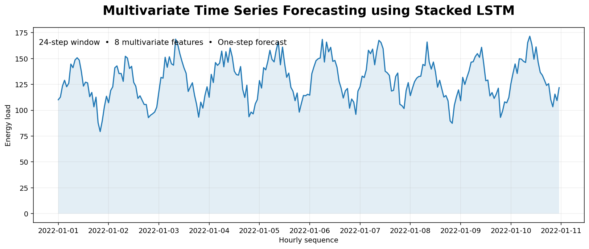
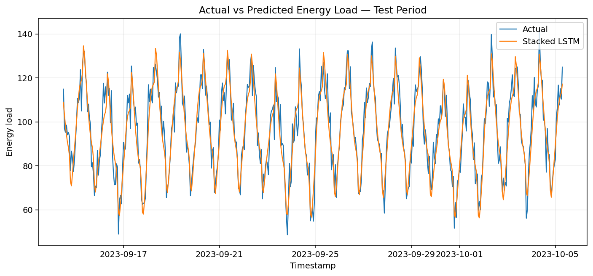
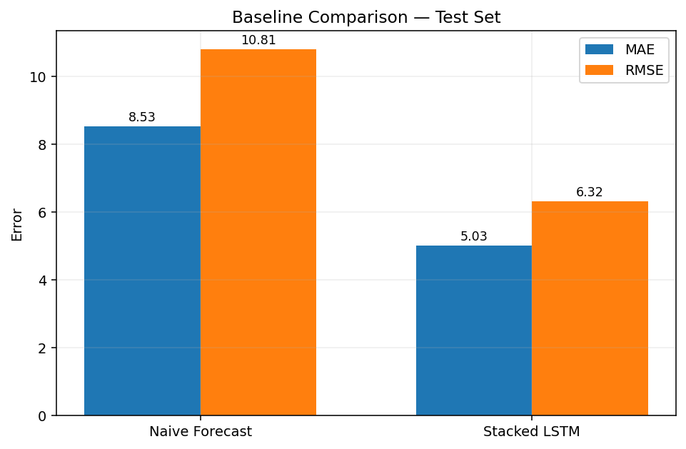
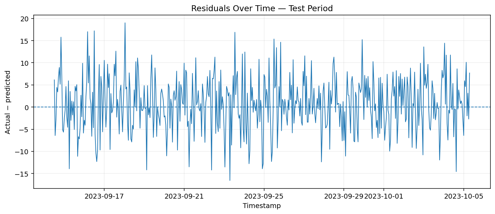
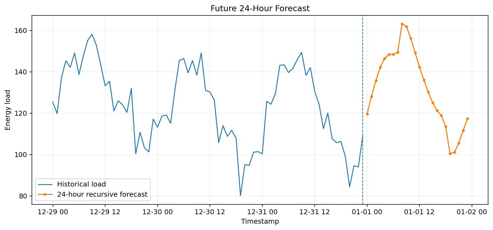

# Multivariate Time Series Forecasting using Stacked LSTM



A portfolio-ready forecasting and decision-support project that predicts **next-hour energy demand** from a 24-hour history of load, temperature, humidity and cyclical calendar signals.

> **One-line portfolio description:** Built a leakage-controlled multivariate Stacked LSTM that forecasts hourly energy load, outperforms a previous-value baseline and serves interactive forecasts through Streamlit.

## Project highlights

- True multivariate input tensor: **24 time steps × 8 features**.
- Chronological **70% train / 15% validation / 15% test** split.
- Training-only feature and target scaling.
- Three stacked LSTM layers with dropout and dense regression output.
- Pre-trained `.keras` model loaded directly by the Streamlit app.
- Naive baseline, MAE, RMSE, MAPE, R², residual analysis and error-by-hour diagnostics.
- Safe reproducible synthetic data and CSV-upload demo workflow.

## Business problem

Operational teams often need to estimate near-term demand using more than target history alone. Temperature, humidity, hour-of-day and day-of-week can change load behavior. This project asks:

> Given multiple historical time-series variables, can a Stacked LSTM forecast the next energy-load value more accurately than simply reusing the latest observed value?

A reliable short-horizon forecast can support capacity planning, staffing, resource allocation and operational decision-making. This framing also connects naturally to quality, sensor and production analytics work.

## Dataset

The supplied notebook used a reproducible synthetic fallback dataset rather than an external distributable dataset.

| Item | Value |
|---|---|
| Records | 17,520 hourly observations |
| Date range | 2022-01-01 to 2023-12-31 |
| Timestamp | `timestamp` |
| Target | `energy_load` |
| Exogenous variables | `temperature`, `humidity` |
| Engineered variables | `hour_sin`, `hour_cos`, `dow_sin`, `dow_cos`, `weekend` |
| Missing values | 0 in the generated dataset |
| Forecast setup | Previous 24 hours → next hour |

See [`data/README_data.md`](data/README_data.md) for data-safety and schema details.

## Multivariate sequence design

```text
X shape = [samples, 24 time steps, 8 features]
y shape = [samples]
```

Feature order used by the saved model:

```text
energy_load, temperature, humidity, hour_sin,
hour_cos, dow_sin, dow_cos, weekend
```

Including historical `energy_load` makes the model autoregressive, while temperature, humidity and calendar signals supply additional context unavailable to a purely univariate model.

## Model architecture

```text
Input: 24 × 8
↓
LSTM(64, return_sequences=True)
↓
Dropout(0.20)
↓
LSTM(32, return_sequences=True)
↓
Dropout(0.20)
↓
LSTM(16)
↓
Dense(16, ReLU)
↓
Dense(1): next-hour energy-load forecast
```

The model has **34,529 trainable parameters**, uses Adam with a 0.001 learning rate, optimizes mean-squared error and tracks MAE. Early stopping and learning-rate reduction control training.

## Results

| Model | Test MAE | Test RMSE | Test MAPE | Test R² |
|---|---:|---:|---:|---:|
| Naive previous value | 8.529 | 10.806 | 8.72% | 0.756 |
| Stacked LSTM | **5.028** | **6.323** | **5.09%** | **0.916** |

The model reduced test MAE by **41.0%** and RMSE by **41.5%** relative to the previous-value baseline.

- **MAE** is the average absolute forecast error.
- **RMSE** gives extra weight to large misses.
- **MAPE** expresses average error as a percentage of actual demand.
- **R²** summarizes explained variance on the future test period.

### Evaluation visuals

| Actual vs predicted | Baseline comparison |
|---|---|
|  |  |

| Residuals | Future forecast example |
|---|---|
|  |  |

## Streamlit demo

The app supports:

- preloaded sample data or uploaded CSV,
- timestamp/target/temperature/humidity column mapping,
- missing-value and duplicate-timestamp summary,
- trend and correlation exploration,
- stored future-period performance diagnostics,
- 1–24 hour recursive forecasts,
- optional future temperature/humidity upload,
- downloadable forecast CSV.

**Live demo:** `Add Streamlit Community Cloud URL after deployment`

```bash
streamlit run app/streamlit_app.py
```

## Local setup

```bash
git clone <your-lstm-projects-repository-url>
cd lstm-projects/08-multivariate-time-series-forecasting-stacked-lstm
python -m venv .venv
```

Windows:

```bash
.venv\Scriptsctivate
pip install -r requirements.txt
streamlit run app/streamlit_app.py
```

macOS/Linux:

```bash
source .venv/bin/activate
pip install -r requirements.txt
streamlit run app/streamlit_app.py
```

The pre-trained model is ready for inference. Retraining is optional:

```bash
python train_model.py --epochs 20 --batch-size 64
```

## Project structure

```text
08-multivariate-time-series-forecasting-stacked-lstm/
├── .streamlit/
├── app/
├── archive/
├── data/
├── images/
├── models/
├── notebooks/
├── outputs/
├── scripts/
├── src/
├── tests/
├── .gitignore
├── __init__.py
├── Dockerfile
├── FILE_MANIFEST.xlsx
├── IMPROVEMENTS.md
├── LICENSE
├── MONOREPO_INTEGRATION.md
├── PROJECT_AUDIT.md
├── README.md
├── README_HOSTING.md
├── requirements.txt
├── requirements-dev.txt
├── run_local.bat
├── run_local.sh
└── train_model.py
```

`.pytest_cache/` and `__pycache__/` may appear after running tests and Python files; they are intentionally ignored by Git.

## Tests and validation

```bash
pytest -q
python scripts/validate_project.py
```

## Limitations

- Results are based on synthetic data and do not establish production forecasting accuracy.
- The saved model has a fixed feature contract and 24-hour window.
- Recursive multi-step inference accumulates uncertainty.
- Future exogenous variables must be supplied or estimated.
- Prediction intervals and rolling-origin backtesting are not yet included.

## Future improvements

1. Train on a real public or approved operational dataset.
2. Add rolling-origin cross-validation and seasonal baselines.
3. Compare direct multi-output, encoder-decoder and attention-based LSTMs.
4. Add probabilistic forecasts or conformal prediction intervals.
5. Track experiments and model versions with MLflow.
6. Add drift monitoring and scheduled retraining for production use.

## Skills demonstrated

`Python` · `TensorFlow/Keras` · `Stacked LSTM` · `Multivariate Time Series` · `Feature Engineering` · `Leakage Control` · `Model Evaluation` · `Residual Analysis` · `Streamlit` · `Deployment` · `GitHub Project Engineering`

## Portfolio positioning

This project supports a transition from **Quality Data Scientist** to broader Data Science, ML and Applied AI roles by demonstrating forecasting, sensor-style multivariate modeling, evaluation against a business baseline and deployment of a reusable decision-support interface.
