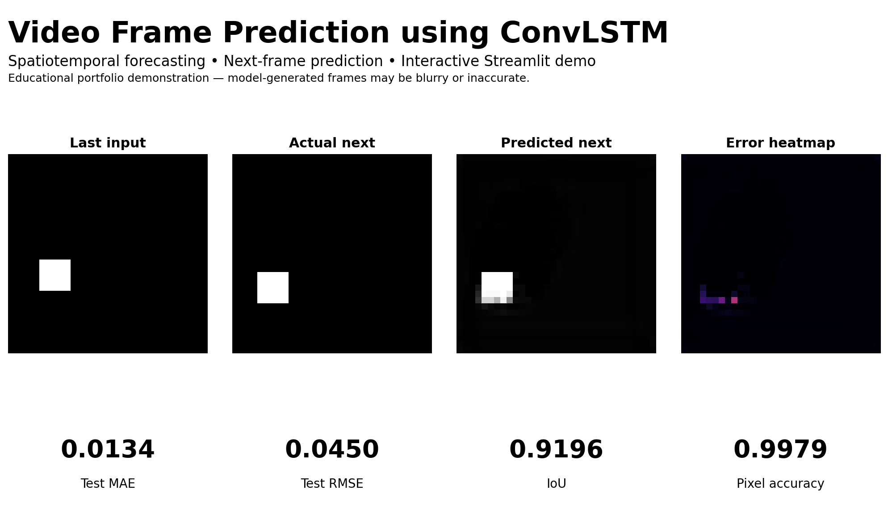

# Video Frame Prediction using Convolutional LSTM

[](https://www.python.org/)
[](https://keras.io/)
[](https://streamlit.io/)
[](LICENSE)

A recruiter-friendly computer vision portfolio project that predicts the next video frame from six previous frames using a two-layer **Convolutional LSTM (ConvLSTM)** model. The repository includes reproducible synthetic data, image-quality evaluation, baseline comparisons, recursive multi-step forecasting, a saved model, tests, Docker support, and a deployable Streamlit application.

> **Responsible use:** This project is for educational and portfolio demonstration purposes only. Predicted frames are model-generated estimates and may be blurry, inaccurate, or unrealistic. Do not use the model for surveillance, safety-critical monitoring, medical imaging, autonomous driving, legal decisions, or production video analytics without rigorous validation. Do not upload private, sensitive, copyrighted, or personally identifiable video content.

## Live Demo

**Streamlit:** `YOUR_STREAMLIT_DEMO_URL`



## Problem Statement

Given an ordered sequence of previous video frames, can a model forecast the next frame by learning both the spatial appearance of the object and its temporal motion?

The project uses six grayscale frames as input and predicts frame seven:

```text
Input shape:  (samples, 6, 32, 32, 1)
Target shape: (samples, 32, 32, 1)
```

## What the Attached Project Actually Does

The original notebook generates **2,500 synthetic moving-square sequences**. A 5 × 5 white square moves across a 32 × 32 black canvas with constant horizontal and vertical velocity and reflects at the boundaries. The task is single-step next-frame prediction. No external video dataset is used for training.

| Dataset property | Value |
|---|---:|
| Total sequences | 2,500 |
| Training | 1,750 |
| Validation | 375 |
| Test | 375 |
| Input frames | 6 |
| Forecast horizon | 1 frame |
| Resolution | 32 × 32 |
| Channels | 1, grayscale |
| Normalization | `[0, 1]` |
| Seed | 42 |

## Why ConvLSTM

A normal LSTM learns temporal patterns from vectors. A CNN learns spatial patterns from images. ConvLSTM combines LSTM-style memory with convolution operations, allowing hidden states to retain image layout while learning motion across time. This makes it useful for video frame prediction, radar nowcasting, traffic-map forecasting, and other spatiotemporal problems.

## Model Architecture

```text
Six input frames
    ↓
ConvLSTM2D — 32 filters, 3×3, return_sequences=True
    ↓
Batch Normalization
    ↓
ConvLSTM2D — 32 filters, 3×3, return_sequences=False
    ↓
Batch Normalization
    ↓
Conv2D — 16 filters, 3×3, ReLU
    ↓
Conv2D — 1 filter, 3×3, Sigmoid
    ↓
Predicted next frame
```

- Parameters: **117,025**
- Loss: Mean Squared Error
- Optimizer: Adam, learning rate 0.001
- Batch size: 32
- Maximum epochs used: 15

## Results

The supplied model was reloaded and evaluated on the exact 375-sequence test split reproduced from the original seed and split logic.

| Model / approach | MSE | MAE | RMSE | SSIM | PSNR (dB) | Foreground IoU | Pixel accuracy |
|---|---:|---:|---:|---:|---:|---:|---:|
| Persistence — last frame | 0.023896 | 0.023896 | 0.154583 | **0.878204** | 16.3512 | 0.350772 | 0.976104 |
| Frame average | 0.026641 | 0.042238 | 0.163222 | 0.710887 | 15.7646 | 0.038070 | 0.964557 |
| **ConvLSTM** | **0.002021** | **0.013383** | **0.044957** | 0.546353 | **31.2984** | **0.919600** | **0.997896** |

### Metric interpretation

- **MSE, MAE, and RMSE** quantify pixel-level error; lower is better.
- **PSNR** summarizes reconstruction fidelity from pixel error; higher is better.
- **SSIM** measures broad structural similarity. Here it favors persistence because the images are sparse and mostly black, so it should not be interpreted alone.
- **Foreground IoU** measures overlap between the thresholded predicted and actual square; it is more sensitive to motion localization.
- **Pixel accuracy** is high for all methods because most pixels are background; it is included but not treated as the primary result.


## Visual Outputs

### Input sequence


### Actual versus predicted next frame


### Error heatmap


### Recursive multi-step forecasting


Recursive forecasting feeds each generated frame back into the rolling six-frame input window. This enables longer horizons, but error and blur can accumulate because the model was trained for one-step prediction.

## End-to-End Workflow

1. Generate synthetic moving-object sequences.
2. Preserve temporal order within every sequence.
3. Normalize frames to float32 values in `[0, 1]`.
4. Split independent sequences into train, validation, and test sets.
5. Train the ConvLSTM next-frame predictor.
6. Compare against persistence and frame-average baselines.
7. Evaluate pixel error, structural quality, foreground overlap, and visual residuals.
8. Save the trained model and metadata.
9. Load the saved model in Streamlit without retraining.
10. Support safe samples, short-video uploads, ordered frame ZIPs, PNG export, and GIF export.

## Streamlit Demo Features

- Preloaded synthetic samples for immediate recruiter testing.
- Optional short-video upload with preserved frame order.
- Optional ZIP upload of ordered image frames.
- Six-frame input preview.
- Single-step next-frame prediction.
- Recursive future-frame prediction.
- Actual/predicted/error comparison when a target is available.
- MAE, RMSE, SSIM, IoU, PSNR, and pixel accuracy.
- Predicted PNG and GIF downloads.
- Model explanation, limitations, and responsible-use warning.

## Project Structure

```text
09-video-frame-prediction-convlstm/
├── .streamlit/
│   └── config.toml
├── app/
│   ├── __init__.py
│   ├── requirements.txt
│   └── streamlit_app.py
├── archive/
│   ├── README.md
│   └── original/
├── data/
│   ├── sample_video_frames/
│   ├── README_data.md
│   ├── sample_frame_sequence.zip
│   ├── sample_multistep_sequence.npz
│   └── sample_sequences.npz
├── images/
│   └── demo_screenshot.png
├── models/
│   ├── convlstm_video_prediction.keras
│   ├── model_metadata.json
│   ├── model_metrics.json
│   └── README.md
├── notebooks/
│   └── video_frame_prediction_convlstm.ipynb
├── outputs/
├── scripts/
├── src/
├── tests/
├── Dockerfile
├── FILE_MANIFEST.xlsx
├── IMPROVEMENTS.md
├── MONOREPO_INTEGRATION.md
├── PROJECT_AUDIT.md
├── README.md
├── README_HOSTING.md
├── requirements.txt
├── requirements-dev.txt
├── run_local.bat
├── run_local.sh
└── train_model.py
```

## Run Locally

### Windows

```bash
cd 09-video-frame-prediction-convlstm
py -3.12 -m venv .venv
.venv\Scriptsctivate
python -m pip install --upgrade pip
pip install -r requirements.txt
run_local.bat
```

### macOS or Linux

```bash
cd 09-video-frame-prediction-convlstm
python3.12 -m venv .venv
source .venv/bin/activate
python -m pip install --upgrade pip
pip install -r requirements.txt
chmod +x run_local.sh
./run_local.sh
```

Direct command:

```bash
python -m streamlit run app/streamlit_app.py
```

## Run Tests

```bash
pip install -r requirements-dev.txt
pytest -q
python scripts/validate_project.py
```

## Optional Retraining

The deployed app uses the supplied trained artifact and does not retrain. To reproduce the synthetic experiment:

```bash
python train_model.py --samples 2500 --epochs 15 --batch-size 32
```

Retraining can produce slightly different floating-point results across backends and hardware even with a fixed seed.

## Deployment

The recommended platform is **Streamlit Community Cloud**. Deploy the monorepo entrypoint:

```text
09-video-frame-prediction-convlstm/app/streamlit_app.py
```

See [README_HOSTING.md](README_HOSTING.md) for the complete deployment checklist and monorepo path rules.

## Continuous Integration

The monorepo stores the Project 09 GitHub Actions workflow at:

```text
.github/workflows/09-video-frame-prediction-convlstm.yml
```

The workflow validates project artifacts, compiles the Python source, runs all automated tests, and loads the saved ConvLSTM model for a real inference smoke test. It is path-filtered so that it runs when this project or its workflow file changes.

## Limitations

- Synthetic single-object training data is much simpler than real video.
- The model does not learn texture, complex backgrounds, camera motion, occlusion, or multiple interacting objects.
- Uploaded real videos are out-of-distribution and are included only to demonstrate preprocessing and inference.
- Recursive rollout accumulates errors over time.
- 32 × 32 grayscale resolution prioritizes speed over detail.
- SSIM and pixel accuracy can be misleading on sparse data.
- ConvLSTM is a strong educational baseline but modern video prediction may use transformers, diffusion, latent-state models, or probabilistic forecasting.

## Future Improvements

- Train on Moving MNIST or a clearly licensed real-world dataset.
- Add multi-frame sequence-to-sequence training rather than recursive one-step rollout.
- Compare with CNN-LSTM, PredRNN, SimVP, transformer, and diffusion baselines.
- Add foreground-weighted loss or combined MSE/SSIM loss.
- Evaluate object centroid displacement and temporal consistency.
- Support RGB and higher-resolution frames.
- Add experiment tracking and automated CI tests.

## Skills Demonstrated

`ConvLSTM2D` · computer vision · spatiotemporal forecasting · video preprocessing · sequence generation · baseline design · image-quality metrics · error analysis · artifact management · Streamlit · Docker · testing · responsible AI communication

## Portfolio Positioning

**One-line description:** Built and deployed a ConvLSTM video frame forecasting system that predicts the next frame from ordered image sequences and evaluates performance against persistence baselines using pixel, structural, and foreground metrics.

**Pinned-repository description:** End-to-end ConvLSTM computer vision project with reproducible synthetic motion data, next-frame and recursive forecasting, model evaluation, downloadable visual outputs, and a Streamlit demo.

For a Quality Data Scientist, this project demonstrates transferable skills in temporal pattern modeling, visual inspection, error localization, automated quality-monitoring foundations, and converting an experiment into a controlled inference application.

## License

MIT License. See [LICENSE](LICENSE).
