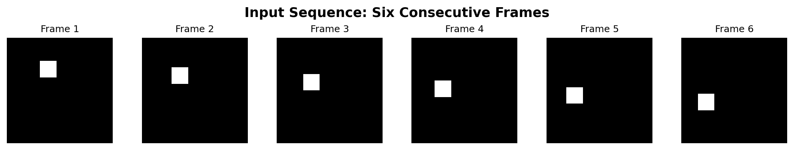
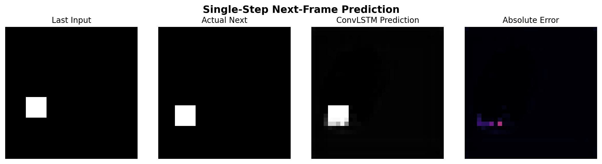
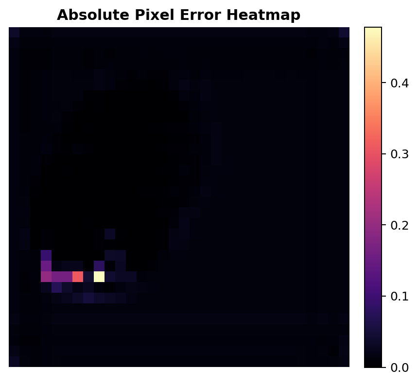
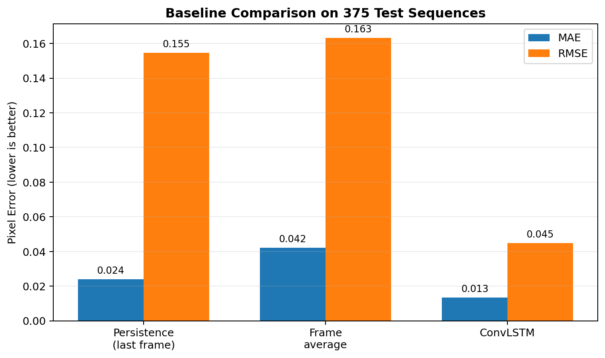
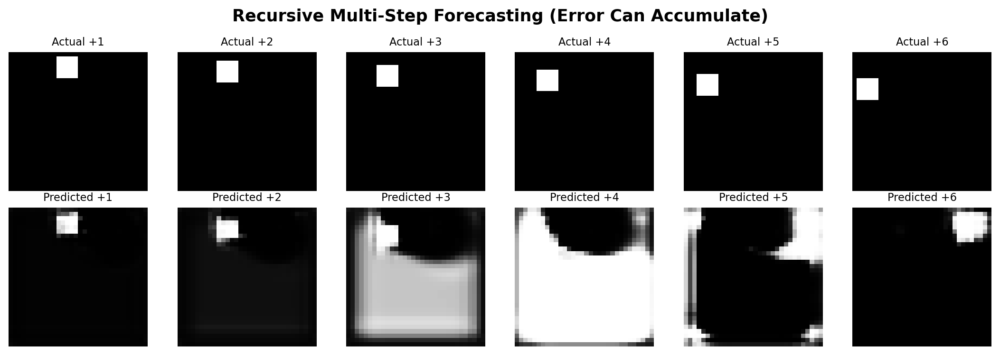
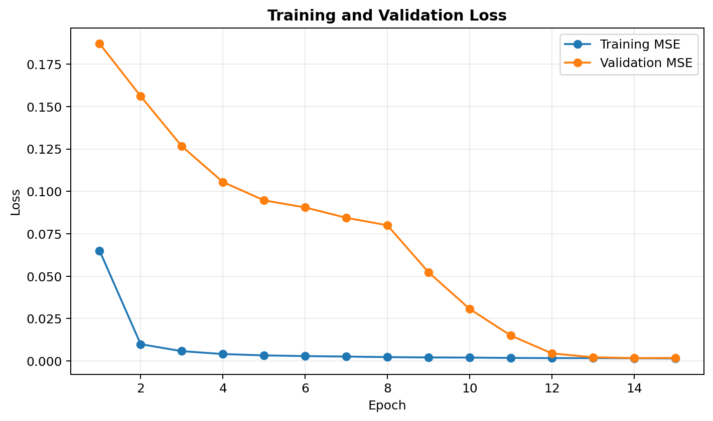
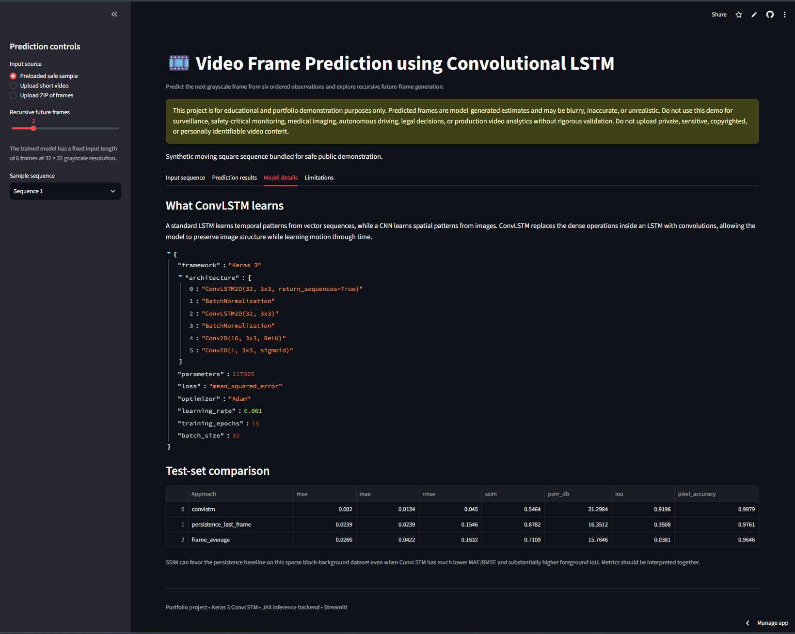
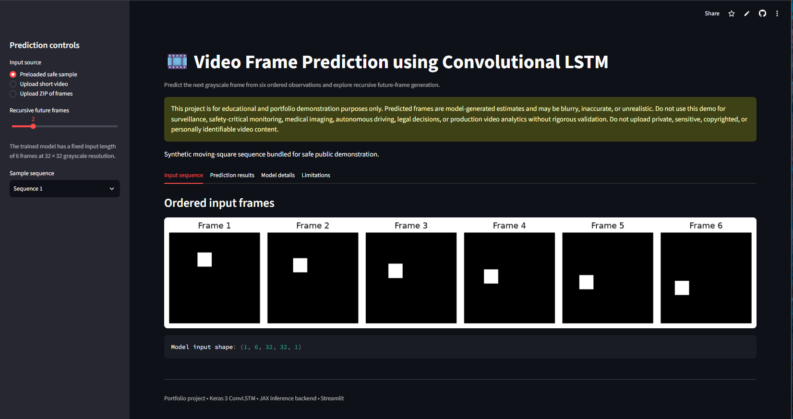

# Video Frame Prediction using Convolutional LSTM

[](https://www.python.org/)

[](https://keras.io/)

[](https://docs.jax.dev/)

[](https://lstm-projects-efpoyil7h98xqzmxe9r9pt.streamlit.app/)

[](LICENSE)

[](https://github.com/unit-mole/lstm-projects/actions/workflows/09-video-frame-prediction-convlstm.yml)

An end-to-end computer-vision and spatiotemporal forecasting project that uses a
Convolutional LSTM network to predict the next video frame from six ordered
input frames. The repository includes reproducible synthetic motion data,
sequence preprocessing, baseline comparisons, image-quality evaluation,
recursive future-frame forecasting, saved model artifacts, automated tests, and
a deployed Streamlit application.

**Status:** Portfolio-ready  
**Live demo:** [Open the Streamlit application](https://lstm-projects-efpoyil7h98xqzmxe9r9pt.streamlit.app/)  
[](https://lstm-projects-efpoyil7h98xqzmxe9r9pt.streamlit.app/)  
**Primary stack:** Python · Keras 3 · JAX · NumPy · OpenCV · scikit-image · Streamlit

---

## Applied AI Problem

Video-frame prediction is a spatiotemporal forecasting problem. The model must
understand both **where an object is located in an image** and **how that object
moves across time**.

This project answers:

> Given six previous grayscale frames, can a ConvLSTM model predict the next
> frame while preserving the position and motion of the moving object?

The deployed pipeline returns:

- **Ordered input-frame sequence**
- **Predicted next frame**
- **Actual next frame**, when available
- **Absolute prediction-error heatmap**
- **Image-quality and motion-localization metrics**
- **Recursive multi-step future-frame sequence**

## Project Objective

Build a portfolio-ready ConvLSTM solution that can:

1. Generate or load ordered video-frame sequences.
2. Resize and normalize frames consistently.
3. Convert image data into five-dimensional spatiotemporal tensors.
4. Preserve frame order while preventing train-test sequence leakage.
5. Learn spatial and temporal motion patterns using `ConvLSTM2D` layers.
6. Predict the next frame from six previous frames.
7. Generate multiple future frames using recursive inference.
8. Compare the model with simple persistence and frame-average baselines.
9. Evaluate predictions using pixel, structural, and foreground metrics.
10. Load saved artifacts in a Streamlit application without retraining.

## Portfolio Scope

This is an educational and portfolio demonstration built on a deterministic
**synthetic moving-object dataset**. It is not a production video-generation,
surveillance, autonomous-driving, medical-imaging, or safety-monitoring system.

Predicted frames are model-generated estimates and may be blurry, inaccurate,
or unrealistic. Do not upload private, sensitive, copyrighted, or personally
identifiable video content to the demonstration application.

## Dataset

The supplied project generates 2,500 synthetic sequences. Each sequence contains
a 5 × 5 white square moving across a 32 × 32 black canvas with constant
horizontal and vertical velocity. The object reflects when it reaches a frame
boundary.

| Dataset property | Value |
|---|---:|
| Total sequences | 2,500 |
| Training sequences | 1,750 |
| Validation sequences | 375 |
| Test sequences | 375 |
| Input frames | 6 |
| Forecast horizon | 1 frame |
| Frame resolution | 32 × 32 |
| Channels | 1, grayscale |
| Pixel normalization | `[0, 1]` |
| Random seed | 42 |

The supervised tensor shapes are:

```text
X shape = [samples, 6, 32, 32, 1]
y shape = [samples, 32, 32, 1]
```

Independent sequences are split into training, validation, and test sets. Frames
inside a sequence are never randomly shuffled.

## Tools and Technologies

| Area | Technology |
|---|---|
| Language | Python 3.12 |
| Deep-learning API | Keras 3.13 |
| Execution backend | JAX CPU |
| Numerical processing | NumPy, pandas |
| Image and video processing | OpenCV, Pillow, ImageIO |
| Image-quality metrics | scikit-image |
| General evaluation | scikit-learn |
| Visualization | Matplotlib |
| Demo application | Streamlit |
| Model persistence | Keras `.keras`, JSON, NumPy `.npz` |
| Testing and quality | pytest, compile checks, GitHub Actions |
| Hosting | Streamlit Community Cloud |

## Project Workflow

```text
Synthetic moving-object sequences or uploaded frames
                         │
                         ▼
Frame validation and temporal ordering
                         │
                         ▼
Grayscale conversion and 32 × 32 resizing
                         │
                         ▼
Pixel normalization to [0, 1]
                         │
                         ▼
Six-frame input-window generation
                         │
                         ▼
Independent train / validation / test split
                         │
                         ▼
Two-layer ConvLSTM training
                         │
                         ▼
Persistence and frame-average baselines
                         │
                         ▼
Held-out test evaluation and visual error analysis
                         │
                         ▼
Saved model + metadata + safe sample sequences
                         │
                         ▼
Streamlit next-frame and recursive forecasting demo
```

## Frame Preprocessing and Sequence Design

The training and inference pipelines use the same core preprocessing rules:

1. Preserve the original temporal order of frames.
2. Convert input data to grayscale when required.
3. Resize every frame to 32 × 32 pixels.
4. Convert arrays to `float32`.
5. Scale pixel values to the `[0, 1]` range.
6. Create six-frame rolling input windows.
7. Use the immediately following frame as the target.
8. Add a channel dimension to produce ConvLSTM-compatible tensors.

The model metadata stores the input-frame count, frame dimensions, channel
count, color mode, normalization rule, dataset seed, training configuration,
and reproduced evaluation metrics.

## Why ConvLSTM

A normal LSTM learns temporal patterns from vector sequences. A CNN learns
spatial patterns from images. A ConvLSTM combines convolution operations with
LSTM-style memory, allowing its hidden state to retain image layout while
learning how visual patterns change over time.

This makes ConvLSTM useful for educational applications such as video-frame
prediction, precipitation nowcasting, traffic-map forecasting, satellite-image
forecasting, and other spatiotemporal sequence problems.

## ConvLSTM Architecture

```text
6 input frames × 32 × 32 × 1
              ↓
ConvLSTM2D — 32 filters, 3 × 3, return_sequences=True
              ↓
Batch Normalization
              ↓
ConvLSTM2D — 32 filters, 3 × 3, return_sequences=False
              ↓
Batch Normalization
              ↓
Conv2D — 16 filters, 3 × 3, ReLU
              ↓
Conv2D — 1 filter, 3 × 3, Sigmoid
              ↓
Predicted next frame × 32 × 32 × 1
```

| Training property | Value |
|---|---:|
| Trainable parameters | 117,025 |
| Loss function | Mean Squared Error |
| Optimizer | Adam |
| Learning rate | 0.001 |
| Batch size | 32 |
| Maximum epochs | 15 |

## Prediction Logic

### Single-step prediction

The model receives the previous six frames and directly predicts frame seven.
This is the task used during training and held-out test evaluation.

### Recursive multi-step forecasting

For longer horizons, the predicted frame is appended to the sequence while the
oldest frame is removed. The updated six-frame window is then passed back to the
model.

```text
Frames 1–6 → predict frame 7
Frames 2–7 → predict frame 8
Frames 3–8 → predict frame 9
```

This enables future-frame generation, but prediction error and blur can
accumulate because the model was trained for one-step forecasting.

## Model Results

The saved model was reloaded and evaluated on the exact 375-sequence test split
reproduced from the original seed and split logic.

| Model / approach | MSE | MAE | RMSE | SSIM | PSNR (dB) | Foreground IoU | Pixel accuracy |
|---|---:|---:|---:|---:|---:|---:|---:|
| Persistence — last frame | 0.023896 | 0.023896 | 0.154583 | **0.878204** | 16.3512 | 0.350772 | 0.976104 |
| Frame average | 0.026641 | 0.042238 | 0.163222 | 0.710887 | 15.7646 | 0.038070 | 0.964557 |
| **ConvLSTM** | **0.002021** | **0.013383** | **0.044957** | 0.546353 | **31.2984** | **0.919600** | **0.997896** |

### Metric interpretation

- **MSE, MAE, and RMSE** measure pixel-level prediction error; lower is better.
- **PSNR** summarizes reconstruction quality from pixel error; higher is better.
- **SSIM** measures broad structural similarity. On this sparse black-background
  dataset, persistence receives a high SSIM because most pixels remain unchanged.
- **Foreground IoU** measures overlap between the predicted and actual moving
  square and is more sensitive to correct motion localization.
- **Pixel accuracy** is high for all approaches because most pixels belong to the
  background, so it should not be interpreted alone.

The model substantially improves pixel-level error, PSNR, foreground overlap,
and overall localization compared with the two simple baselines.

## Visual Model Results

| Input sequence | Actual versus predicted frame |
|---|---|
|  |  |

| Error heatmap | Baseline comparison |
|---|---|
|  |  |

| Recursive future frames | Training curve |
|---|---|
|  |  |

The repository also includes an animated recursive forecast:

[`outputs/prediction_sequence.gif`](outputs/prediction_sequence.gif)

## Streamlit Demo

The deployed application supports:

- Preloaded synthetic sequences for immediate testing
- Optional short-video upload
- Optional ZIP upload of ordered image frames
- Six-frame input preview
- Single-step next-frame prediction
- Actual, predicted, and absolute-error comparison
- MSE, MAE, RMSE, SSIM, PSNR, foreground IoU, and pixel accuracy
- Recursive future-frame generation
- Predicted PNG and GIF downloads
- Model details, limitations, and responsible-use guidance

### Application Overview

The main application view introduces the project, provides the prediction
controls, explains the responsible-use boundaries, and allows reviewers to use
the bundled safe sample sequence.



### Input Sequence and Next-Frame Prediction

The prediction view displays the six ordered input frames together with the
actual next frame, the ConvLSTM prediction, and the visual error analysis.



## Model Artifacts

| Artifact | Purpose |
|---|---|
| `models/convlstm_video_prediction.keras` | Trained ConvLSTM model loaded by the application |
| `models/model_metadata.json` | Input shape, preprocessing rules, architecture, training configuration, and metrics |
| `models/model_metrics.json` | Reproduced model and baseline evaluation metrics |
| `data/sample_sequences.npz` | Safe preloaded samples, targets, and predictions for the demo |
| `data/sample_multistep_sequence.npz` | Safe recursive forecasting example |
| `data/sample_frame_sequence.zip` | Ordered image-frame ZIP for testing the upload workflow |

The deployed application loads the saved artifacts directly and does not retrain
the model during startup.

## Run Locally

### 1. Open the project directory

```bash
cd lstm-projects/09-video-frame-prediction-convlstm
```

### 2. Create and activate a virtual environment

Windows Command Prompt:

```bat
py -3.12 -m venv .venv
.venv\Scripts\activate
```

Windows PowerShell:

```powershell
py -3.12 -m venv .venv
.\.venv\Scripts\Activate.ps1
```

macOS or Linux:

```bash
python3.12 -m venv .venv
source .venv/bin/activate
```

### 3. Install dependencies

```bash
python -m pip install --upgrade pip
python -m pip install -r requirements.txt
```

Install development tools when required:

```bash
python -m pip install -r requirements-dev.txt
```

### 4. Run tests and validation

```bash
python -m pytest -q
python -m compileall app src tests
python scripts/validate_project.py
```

### 5. Launch the pretrained Streamlit demo

```bash
python -m streamlit run app/streamlit_app.py
```

Open the local address shown in the terminal, normally:

```text
http://localhost:8501
```

### 6. Optional: retrain the model

```bash
python train_model.py --samples 2500 --epochs 15 --batch-size 32
```

The deployed application uses the supplied trained artifact. Retraining is
optional and can produce small floating-point differences across hardware and
execution backends.

## Deploy

The application is deployed through Streamlit Community Cloud directly from the
public LSTM portfolio monorepo.

- **Repository:** `unit-mole/lstm-projects`
- **Branch:** `main`
- **Entrypoint:** `09-video-frame-prediction-convlstm/app/streamlit_app.py`
- **Python:** `3.12`
- **Live application:**  
  https://lstm-projects-efpoyil7h98xqzmxe9r9pt.streamlit.app/

The `app/requirements.txt` file contains the deployment dependencies beside the
Streamlit entrypoint so that Community Cloud can resolve the application
environment within the monorepo.

See [`README_HOSTING.md`](README_HOSTING.md) for deployment and maintenance
instructions.

## Project Structure

```text
lstm-projects/
├── .github/
│   └── workflows/
│       └── 09-video-frame-prediction-convlstm.yml
├── 01-airline-passenger-forecasting/
├── 02-bitcoin-price-prediction/
├── ...
├── 09-video-frame-prediction-convlstm/
│   ├── .streamlit/
│   │   └── config.toml
│   ├── app/
│   │   ├── requirements.txt
│   │   └── streamlit_app.py
│   ├── archive/
│   │   └── original/
│   ├── data/
│   │   ├── README_data.md
│   │   ├── sample_frame_sequence.zip
│   │   ├── sample_multistep_sequence.npz
│   │   ├── sample_sequences.npz
│   │   └── sample_video_frames/
│   ├── images/
│   │   ├── 01_app_overview.png
│   │   └── 02_input_and_prediction.png
│   ├── models/
│   │   ├── convlstm_video_prediction.keras
│   │   ├── model_metadata.json
│   │   └── model_metrics.json
│   ├── notebooks/
│   │   └── video_frame_prediction_convlstm.ipynb
│   ├── outputs/
│   ├── scripts/
│   ├── src/
│   ├── tests/
│   ├── Dockerfile
│   ├── FILE_MANIFEST.xlsx
│   ├── IMPROVEMENTS.md
│   ├── LICENSE
│   ├── MONOREPO_INTEGRATION.md
│   ├── PROJECT_AUDIT.md
│   ├── README.md
│   ├── README_HOSTING.md
│   ├── requirements-dev.txt
│   ├── requirements.txt
│   ├── run_local.bat
│   ├── run_local.sh
│   └── train_model.py
├── .gitignore
├── LICENSE
└── README.md
```

## Testing and CI

Run the lightweight project tests:

```bash
python -m pytest -q
```

Check Python files for syntax errors:

```bash
python -m compileall app src tests
```

Validate the required model, metadata, sample data, and project artifacts:

```bash
python scripts/validate_project.py
```

The monorepo CI workflow runs on relevant pushes and pull requests:

```text
.github/workflows/09-video-frame-prediction-convlstm.yml
```

The workflow installs development dependencies, compiles the source files, runs
the automated tests, validates required artifacts, loads the saved ConvLSTM
model, and performs an inference smoke test.

## Limitations

- The synthetic single-object dataset is much simpler than real-world video.
- The model does not learn complex texture, backgrounds, camera motion,
  occlusion, or multiple interacting objects.
- Uploaded real videos are out-of-distribution and are supported mainly to
  demonstrate preprocessing and inference.
- Recursive forecasting can accumulate location error and blur over time.
- The 32 × 32 grayscale resolution favors speed and portability over detail.
- SSIM and pixel accuracy can be misleading on sparse background-heavy data.
- ConvLSTM is a strong educational baseline, but modern video prediction can use
  transformers, latent-state models, diffusion models, or probabilistic methods.

## Future Improvements

- Train on Moving MNIST or another clearly licensed sequence dataset.
- Add direct sequence-to-sequence multi-frame training.
- Compare with CNN-LSTM, PredRNN, SimVP, transformer, and diffusion baselines.
- Add foreground-weighted or combined pixel-and-structure loss functions.
- Evaluate object-centroid displacement and temporal consistency.
- Support RGB frames and higher resolutions.
- Add experiment tracking and model-version management.
- Add deployment smoke tests and scheduled dependency checks.

## Skills Demonstrated

- Convolutional LSTM modeling
- Computer vision and image-sequence processing
- Spatiotemporal forecasting
- Frame extraction, resizing, normalization, and ordering
- Supervised sequence generation
- Next-frame and recursive future-frame prediction
- Baseline design and comparative evaluation
- MSE, MAE, RMSE, SSIM, PSNR, IoU, and error analysis
- Model persistence and reusable inference pipelines
- Streamlit application development
- PNG and GIF generation
- Unit testing and GitHub Actions
- Deployment-ready ML engineering
- Responsible AI and limitation communication

## Portfolio Positioning

**One-line description:** ConvLSTM-based video frame forecasting system that
predicts the next frame from six ordered images and evaluates motion quality
using pixel, structural, and foreground-overlap metrics.

**Pinned repository description:** End-to-end spatiotemporal computer-vision
project with reproducible synthetic motion data, ConvLSTM next-frame prediction,
recursive forecasting, baseline comparison, visual error analysis, and a live
Streamlit application.

This project supports a transition from Quality Data Scientist to broader Data
Science, Machine Learning, and Applied AI roles by showing how visual process
signals can be converted into ordered sequences, modeled over time, evaluated
through multiple quality metrics, and delivered as a controlled interactive
application. The same capabilities are relevant to automated visual inspection,
quality monitoring, anomaly-oriented analysis, and predictive process systems.

## Responsible Use

This repository is a portfolio demonstration. The model is not validated for
surveillance, safety-critical monitoring, autonomous driving, medical imaging,
legal decisions, or production video analytics. Predictions should be treated as
experimental estimates rather than factual reconstructions of future events.

Do not upload private, sensitive, copyrighted, or personally identifiable video
content to the deployed application.

## Author

**Anmol Tripathi**  
Quality Data Scientist transitioning toward Data Science, Machine Learning,
Applied AI, Analytics Engineering, and Quality Analytics roles.

## License

MIT License. See [LICENSE](LICENSE).
