# Traffic Flow Prediction using Stacked LSTM

[](https://www.python.org/)
[](https://www.tensorflow.org/)
[](https://lstm-projects-gutyrjww4ouvee3rfurrnu.streamlit.app/)
[](LICENSE)
[](https://github.com/unit-mole/lstm-projects/actions/workflows/10-traffic-flow-prediction-stacked-lstm.yml)

An end-to-end transportation analytics project that uses a deep Stacked LSTM
to forecast the next hourly traffic-congestion index from the previous 24
multivariate observations. The repository includes chronological
preprocessing, leakage-safe scaling, cyclical time features, sequence
generation, persistence-baseline comparison, residual analysis, packaged
Keras artifacts, portable NumPy inference, and a Streamlit forecasting
application.

**Status:** Portfolio-ready  
**Live demo:** [Open the Streamlit application](https://lstm-projects-gutyrjww4ouvee3rfurrnu.streamlit.app/)  
[](https://lstm-projects-gutyrjww4ouvee3rfurrnu.streamlit.app/)  
**Primary stack:** Python · Keras · TensorFlow · NumPy · pandas · scikit-learn · Plotly · Streamlit

---

## Business Problem

Transportation teams need advance visibility into recurring traffic pressure
so they can support congestion monitoring, signal planning, traveler
information, staffing, and capacity analysis. This project answers:

> Given the previous 24 hours of traffic, speed, occupancy, weather, and
> time-pattern information, can a Stacked LSTM forecast the next hourly
> congestion index?

The deployed pipeline returns:

- **Next-step congestion forecast**
- **1–24 hour recursive scenario forecast**
- **Low / moderate / high traffic-band interpretation**
- **Actual vs predicted backtest**
- **MAE, RMSE, MAPE, and R²**
- **Persistence-baseline comparison**
- **Downloadable prediction and forecast CSV files**

## Project Objective

Build a portfolio-ready traffic forecasting solution that can:

1. Validate and clean hourly traffic time-series data.
2. Preserve chronological order and remove duplicate timestamps.
3. Generate hour-of-day, day-of-week, weekend, and cyclical features.
4. Fit and apply scaling without future-period leakage.
5. Convert the time series into 24-hour supervised sequences.
6. Forecast next-hour congestion using a deep Stacked LSTM.
7. Compare the model with a persistence baseline.
8. Evaluate performance on a future unseen test period.
9. Provide recursive scenario forecasts for up to 24 hours.
10. Serve packaged artifacts through a recruiter-friendly Streamlit app.

## Portfolio Scope

This is an educational demonstration built on a deterministic **synthetic
hourly traffic dataset**. It is not a production traffic-management model
and must not be used as the sole basis for public-safety, emergency-response,
infrastructure-control, or transportation-policy decisions.

## Dataset

The supplied notebook generated **8,760 hourly observations** covering
calendar year 2023.

| Split | Rows | Date range |
|---|---:|---|
| Training | 6,132 | 2023-01-01 00:00 to 2023-09-13 11:00 |
| Validation | 1,314 | 2023-09-13 12:00 to 2023-11-07 05:00 |
| Test | 1,314 | 2023-11-07 06:00 to 2023-12-31 23:00 |

| Field | Role |
|---|---|
| `timestamp` | Hourly chronological index |
| `vehicle_count` | Simulated traffic volume |
| `avg_speed` | Simulated average speed |
| `occupancy` | Simulated roadway/sensor occupancy |
| `weather_severity` | Simulated weather-condition intensity |
| `congestion_index` | Continuous forecasting target |

The GitHub-safe sample contains 2,160 rows representing the
final 90 days. No private road, vehicle, sensor, or infrastructure data is
included.

## Tools and Technologies

| Area | Technology |
|---|---|
| Language | Python 3.11 |
| Data processing | pandas, NumPy |
| Modeling | TensorFlow / Keras Stacked LSTM |
| Portable inference | NumPy + h5py |
| Preprocessing | scikit-learn training scalers + JSON statistics |
| Evaluation | scikit-learn |
| Static visualization | Matplotlib |
| Interactive visualization | Plotly |
| Demo application | Streamlit |
| Testing / quality | pytest, Ruff, compile checks, GitHub Actions |
| Hosting | Streamlit Community Cloud |
| Containerization | Docker |

## Project Workflow

```text
Hourly traffic observations
        │
        ▼
Timestamp parsing, sorting, duplicate removal
        │
        ▼
Numeric interpolation and schema validation
        │
        ▼
Hour / day / weekend + cyclical time features
        │
        ▼
Chronological 70% / 15% / 15% split
        │
        ▼
Training-only feature and target scaling
        │
        ▼
Previous 24 hours → next-hour supervised sequences
        │
        ▼
Deep Stacked LSTM training
        │
        ▼
Validation monitoring and learning-rate reduction
        │
        ▼
Future unseen test evaluation
        │
        ▼
Saved Keras model + JSON scalers + metadata
        │
        ▼
Streamlit backtesting and recursive scenario forecasting
```

## Time-Series Preprocessing

- Timestamps are parsed, sorted, and deduplicated.
- Time-series rows are never randomly shuffled.
- Numeric gaps are interpolated in timestamp order and then forward/backward
  filled when necessary.
- Feature and target scalers are fitted only on the training partition.
- Validation and test periods use the saved training statistics.
- The model target is never used from a future row inside the input window.
- Final forecasts are inverse-transformed to the original congestion scale.

## Traffic Feature Engineering

| Feature | Purpose |
|---|---|
| Current historical congestion index | Autoregressive traffic state |
| Vehicle count | Traffic-demand signal |
| Average speed | Mobility and congestion signal |
| Occupancy | Roadway-utilization signal |
| Weather severity | External-condition proxy |
| Hour sine / cosine | Circular 24-hour pattern |
| Day-of-week sine / cosine | Circular weekly pattern |
| Weekend flag | Weekday-versus-weekend behavior |

These features are calculated from each historical row only. No future
traffic value is used during sequence construction.

## Sequence Generation

```text
Input window: previous 24 hourly observations
Input shape: 24 time steps × 10 features
Direct forecast horizon: next 1 hour
Target: congestion_index at the next timestamp
```

For each valid time index `t`:

```text
X(t) = rows t-24 through t-1
y(t) = congestion_index at row t
```

## Stacked LSTM Architecture

```text
24 × 10 traffic sequence
      ↓
LSTM 64, return_sequences=True
      ↓
Dropout 0.20
      ↓
LSTM 32, return_sequences=True
      ↓
Dropout 0.20
      ↓
LSTM 16
      ↓
Dense 16 + ReLU
      ↓
Dense 1 linear traffic forecast
```

The model contains **35,041 trainable parameters** and was trained using
Adam, mean squared error, mean absolute error monitoring, early stopping,
and learning-rate reduction.

## Forecasting Logic

The packaged model directly predicts one hour ahead.

The Streamlit application additionally supports a **1–24 hour recursive
scenario forecast**:

1. Predict the next congestion index.
2. Feed that prediction into the next input window.
3. Estimate unknown external traffic inputs using recent hour-of-week
   seasonal profiles.
4. Repeat until the selected horizon is reached.

Recursive forecasts accumulate uncertainty and should be interpreted as
planning scenarios rather than validated operational forecasts.

## Model Results

### Validation results

| Metric | Result |
|---|---:|
| MAE | 2.732 |
| RMSE | 3.439 |
| R² | 0.949 |

### Held-out test results

| Metric | Persistence baseline | Stacked LSTM |
|---|---:|---:|
| MAE | 7.597 | 2.692 |
| RMSE | 9.184 | 3.379 |
| MAPE | 18.22% | 7.00% |
| R² | 0.637 | 0.951 |

The Stacked LSTM reduced test MAE by approximately
**64.6%**
compared with the persistence baseline.

- **MAE** is the average absolute congestion-index forecast error.
- **RMSE** penalizes larger forecast misses more strongly.
- **MAPE** expresses average error as a percentage of the actual value.
- **R²** measures explained variance on the future unseen period.

## Residual Interpretation

The held-out residual mean is close to zero, indicating limited overall
directional bias. Error analysis should still examine commute peaks,
incidents, weather changes, and unusual operating conditions because an
average metric can hide time-specific misses.

A false low forecast may understate congestion and reduce planning
readiness. A false high forecast may trigger unnecessary operational
attention. Real deployments therefore need interval forecasts, drift
monitoring, incident data, and business-cost-based evaluation.

## Visual Model Results

| Actual vs predicted | Forecast residuals |
|---|---|
| 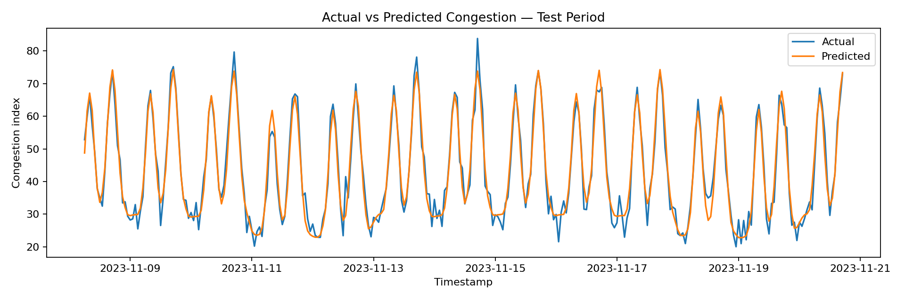 | 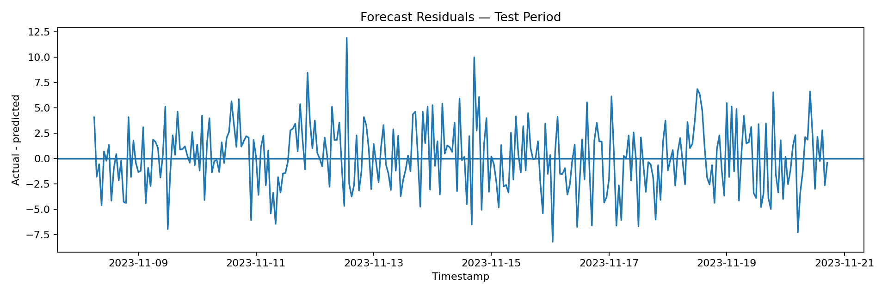 |

| Hourly pattern | Baseline comparison |
|---|---|
| 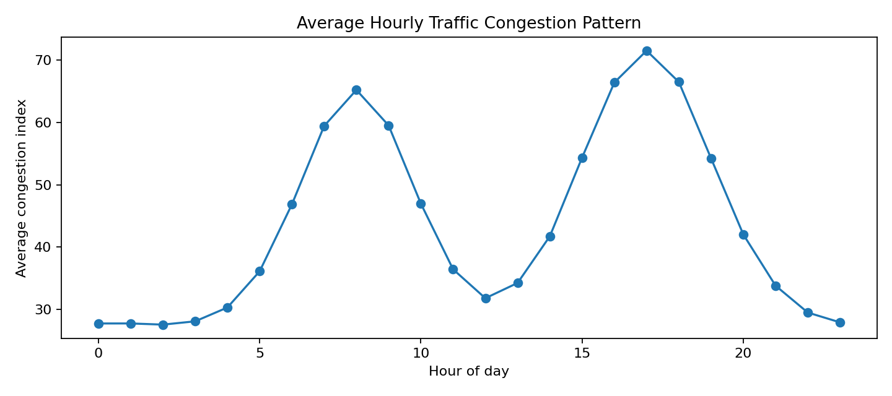 | 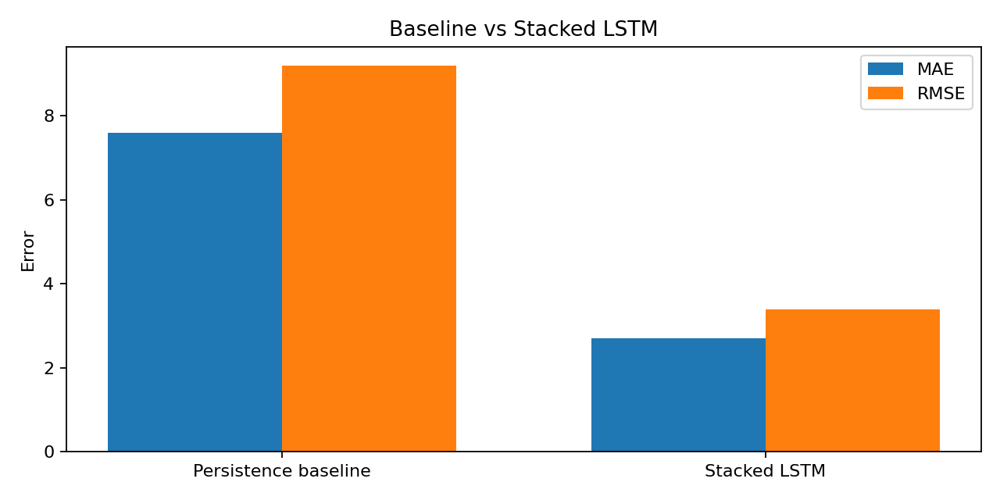 |

| Training curve | 24-hour scenario forecast |
|---|---|
| 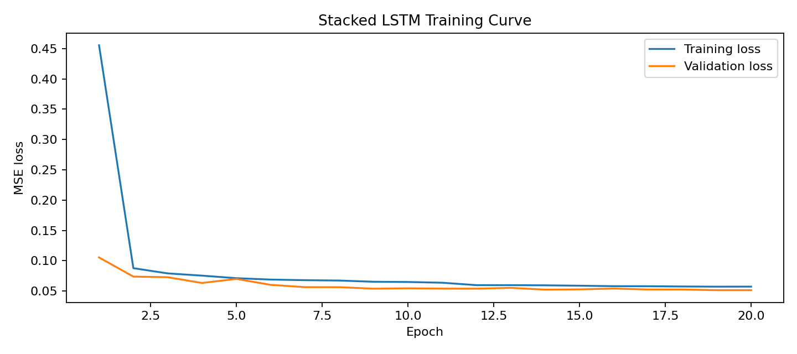 | 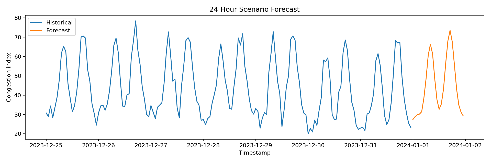 |

<details>
<summary><strong>View additional analysis visuals</strong></summary>

### Traffic Trend

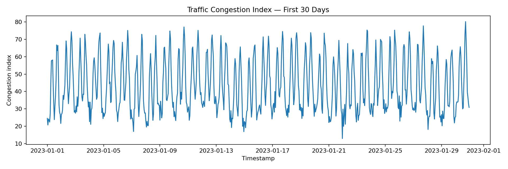

### Weekly Pattern

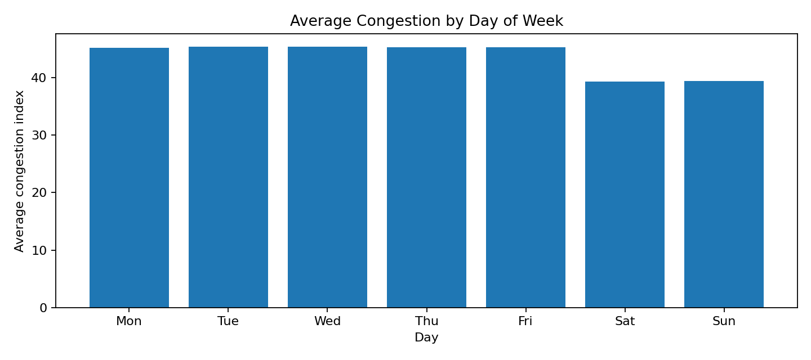

### Correlation Analysis

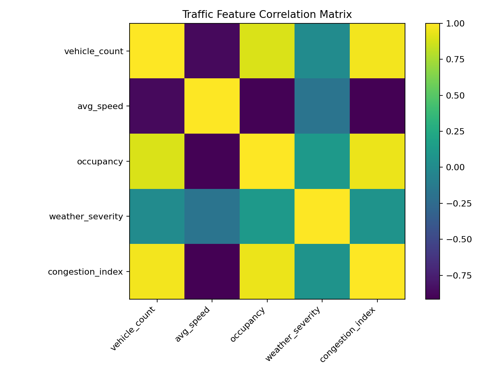

</details>

## Streamlit Demo

The deployed application supports:

- Safe preloaded synthetic traffic data
- Compatible traffic CSV upload
- Data preview and missing-value summary
- Congestion, vehicle-count, speed, occupancy, and weather trends
- Hourly and day-of-week traffic-pattern analysis
- Artifact-backed one-step backtesting
- MAE, RMSE, MAPE, and R² metric cards
- Persistence-baseline comparison
- Actual-versus-predicted and residual charts
- 1–24 hour recursive traffic scenario forecasting
- Traffic-band and expected-peak interpretation
- Downloadable backtest and future-forecast CSV files

### Application Overview

The application overview introduces the forecasting objective, responsible-use
boundary, selected data source, dataset coverage, and high-level traffic
summary metrics.

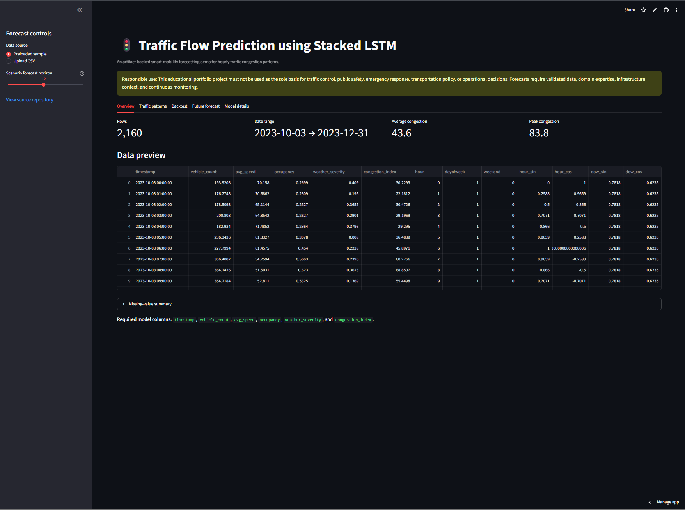

### Traffic Patterns Dashboard

The traffic-pattern dashboard presents historical congestion trends, recurring
hourly peaks, and weekday-versus-weekend traffic behavior.

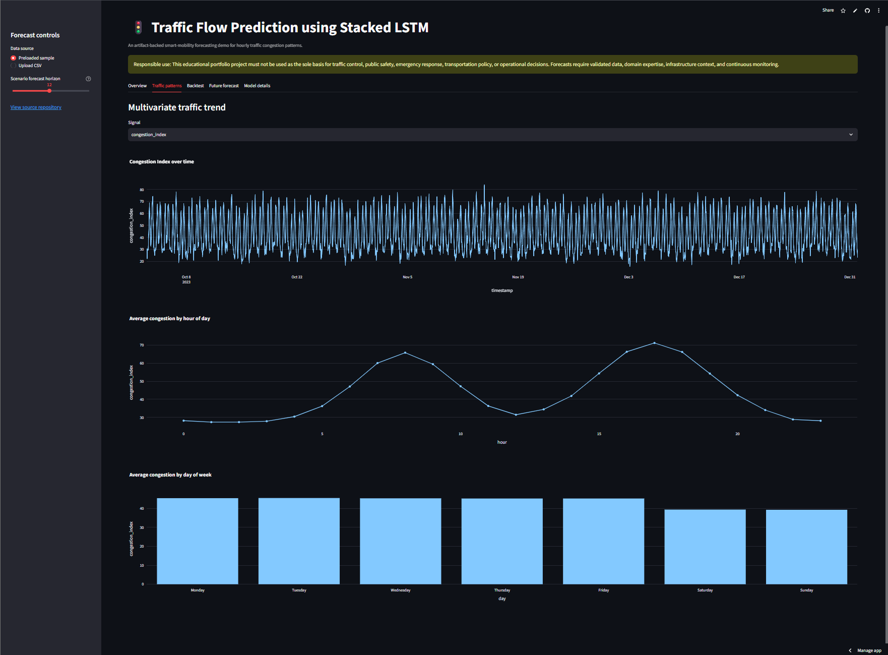

### Traffic Forecast Results

The forecast view presents the next-step congestion estimate, highest forecast,
expected peak period, historical-versus-forecast chart, traffic-band
interpretation, and downloadable forecast table.

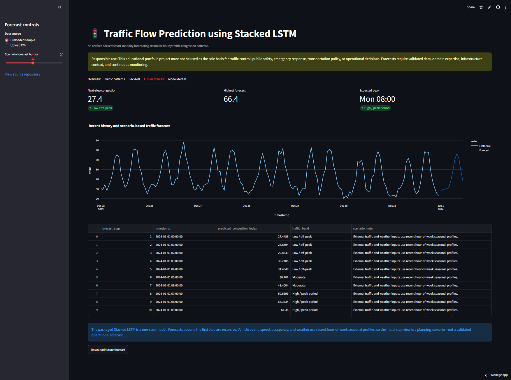

## Model Artifacts

| Artifact | Purpose |
|---|---|
| `models/stacked_lstm_traffic.keras` | Supplied trained Stacked LSTM model |
| `models/scalers.json` | Training feature/target means, scales, columns, and sequence length |
| `models/model_metadata.json` | Architecture, split ranges, metrics, hashes, and responsible-use details |

The deployed app uses a lightweight NumPy implementation that reads the
actual LSTM and Dense weights from the Keras artifact. TensorFlow is not
required during Streamlit startup. TensorFlow remains available through
`requirements-dev.txt` for optional retraining.

## Run Locally

### 1. Open the project directory

```bash
cd lstm-projects/10-traffic-flow-prediction-stacked-lstm
```

### 2. Create and activate a virtual environment

Windows Command Prompt:

```bat
py -3.11 -m venv .venv
.venv\Scripts\activate
```

macOS or Linux:

```bash
python3.11 -m venv .venv
source .venv/bin/activate
```

### 3. Install dependencies

```bash
python -m pip install --upgrade pip
python -m pip install -r requirements.txt
```

For retraining and development tools:

```bash
python -m pip install -r requirements-dev.txt
```

### 4. Run tests

```bash
python -m pytest -q
python -m compileall src app scripts tests train_model.py
python scripts/validate_model_artifacts.py
```

### 5. Launch the pretrained demo

```bash
python -m streamlit run app/streamlit_app.py
```

Open the local address displayed in the terminal, normally:

```text
http://localhost:8501
```

### 6. Optional: retrain

```bash
python train_model.py --epochs 20
```

To train on a compatible CSV:

```bash
python train_model.py --data path/to/traffic_data.csv --epochs 20
```

## Deploy

Recommended hosting: **Streamlit Community Cloud**

- **Repository:** `unit-mole/lstm-projects`
- **Branch:** `main`
- **Entrypoint:** `10-traffic-flow-prediction-stacked-lstm/app/streamlit_app.py`
- **Python:** `3.11`
- **Dependency file:** `10-traffic-flow-prediction-stacked-lstm/app/requirements.txt`
- **Live application:**  
  https://lstm-projects-gutyrjww4ouvee3rfurrnu.streamlit.app/

The app loads pretrained artifacts and does not retrain during startup.

See [`README_HOSTING.md`](README_HOSTING.md) for complete deployment and
maintenance instructions.

## Project Structure

```text
lstm-projects/
├── .github/
│   └── workflows/
│       └── 10-traffic-flow-prediction-stacked-lstm.yml
├── 10-traffic-flow-prediction-stacked-lstm/
│   ├── .streamlit/
│   │   └── config.toml
│   ├── app/
│   │   ├── requirements.txt
│   │   └── streamlit_app.py
│   ├── archive/
│   ├── data/
│   │   ├── README_data.md
│   │   └── sample_traffic_flow_data.csv
│   ├── images/
│   │   ├── 01-application-overview.png
│   │   ├── 02-traffic-patterns-dashboard.png
│   │   └── 03-traffic-forecast-results.png
│   ├── models/
│   │   ├── model_metadata.json
│   │   ├── scalers.json
│   │   └── stacked_lstm_traffic.keras
│   ├── notebooks/
│   │   └── traffic_flow_prediction_stacked_lstm.ipynb
│   ├── outputs/
│   ├── scripts/
│   ├── src/
│   ├── tests/
│   ├── .gitignore
│   ├── Dockerfile
│   ├── FILE_MANIFEST.xlsx
│   ├── IMPROVEMENTS.md
│   ├── LICENSE
│   ├── MONOREPO_INTEGRATION.md
│   ├── PROJECT_AUDIT.md
│   ├── README.md
│   ├── README_HOSTING.md
│   ├── requirements-dev.txt
│   ├── requirements.txt
│   ├── run_local.bat
│   ├── run_local.sh
│   └── train_model.py
├── .gitignore
├── LICENSE
└── README.md
```

Generated folders such as `.pytest_cache/` and `__pycache__/` appear only
after local execution and are excluded from Git.

## Testing and CI

The root-level GitHub Actions workflow is:

```text
.github/workflows/10-traffic-flow-prediction-stacked-lstm.yml
```

It performs:

- Required-file validation
- Python compilation
- Ruff code-quality checks
- pytest execution
- Packaged-model smoke validation

## Future Improvements

- Validate performance on a licensed public traffic dataset such as METR-LA,
  PEMS-BAY, or another documented transportation dataset.
- Add direct multi-horizon forecasting instead of recursive forecasts.
- Add prediction intervals or quantile forecasting.
- Integrate incident, event, holiday, roadwork, and real weather data.
- Compare with seasonal naive, moving average, linear regression,
  gradient-boosted trees, and temporal convolution models.
- Add location or sensor-level models for multi-road forecasting.
- Add drift monitoring and rolling retraining.
- Add experiment tracking, model registry, and API serving.
- Evaluate rush-hour and incident-specific costs separately.
- Add explainability using perturbation analysis or interpretable baselines.

## Skills Demonstrated

- Deep Stacked LSTM modeling
- Multivariate time-series forecasting
- Traffic and transportation analytics
- Chronological train/validation/test design
- Leakage-safe scaling
- Cyclical temporal feature engineering
- Supervised sequence generation
- Regression metric interpretation
- Persistence-baseline comparison
- Residual and peak-period analysis
- Keras model persistence
- Portable NumPy inference
- Streamlit application development
- CSV upload and downloadable forecasts
- Unit testing and GitHub Actions
- Docker and deployment-ready ML engineering
- Responsible-use and limitations framing

## Portfolio Positioning

**One-line description:** Deep Stacked LSTM traffic forecasting system that
converts 24 hours of multivariate traffic history into next-hour congestion
predictions and interactive planning scenarios.

**Pinned repository description:** End-to-end transportation time-series
project with chronological preprocessing, cyclical features, Stacked LSTM
forecasting, baseline comparison, residual analysis, portable inference,
and a deployment-ready Streamlit dashboard.

This project supports a transition from Quality Data Scientist to broader
Data Science / ML / AI roles by demonstrating transferable strengths in
monitoring systems, temporal pattern analysis, forecasting, operational
decision support, model evaluation, and production-oriented analytics
engineering.

## Responsible Use

This repository is a portfolio demonstration. It is not validated for live
traffic control, emergency response, public safety, navigation routing,
infrastructure investment, or transportation policy. Real deployment
requires licensed and validated data, domain experts, uncertainty
quantification, continuous monitoring, human review, and integration with
operational context.

## Author

**Anmol Tripathi**  
Quality Data Scientist transitioning toward Data Science, Machine Learning,
Applied AI, Analytics Engineering, Transportation Analytics, and Quality
Analytics roles.
