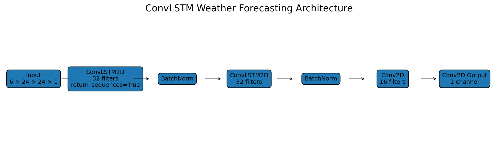
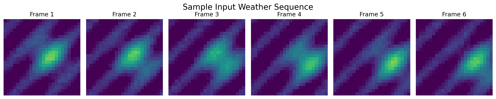
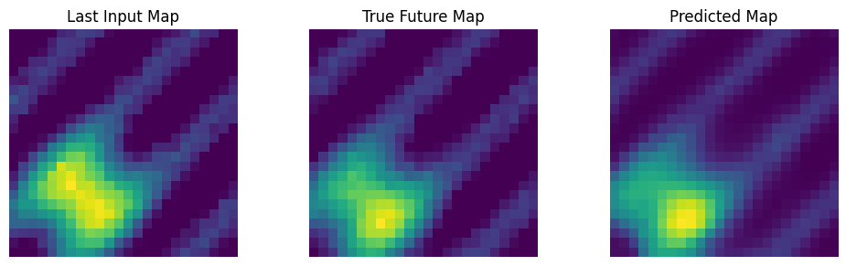
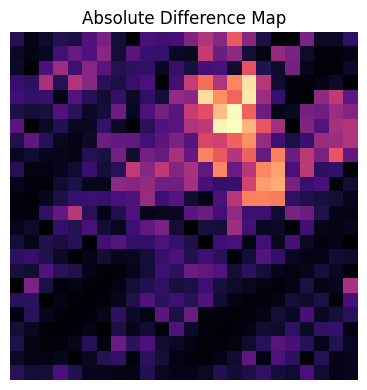
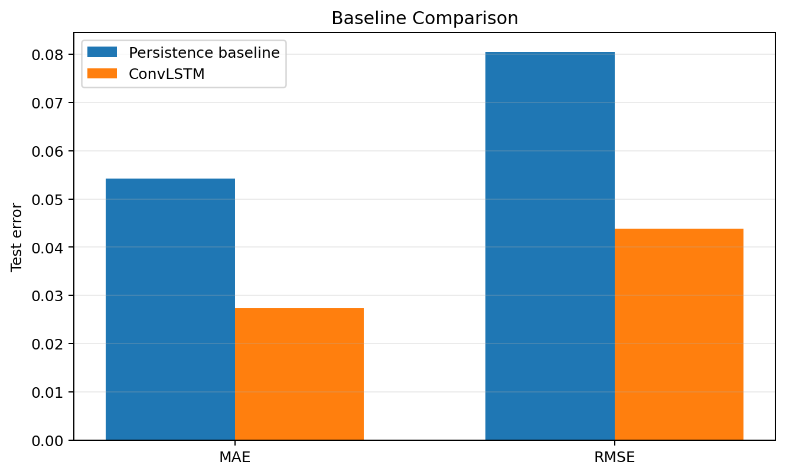
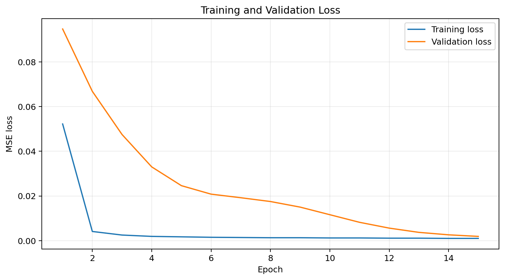
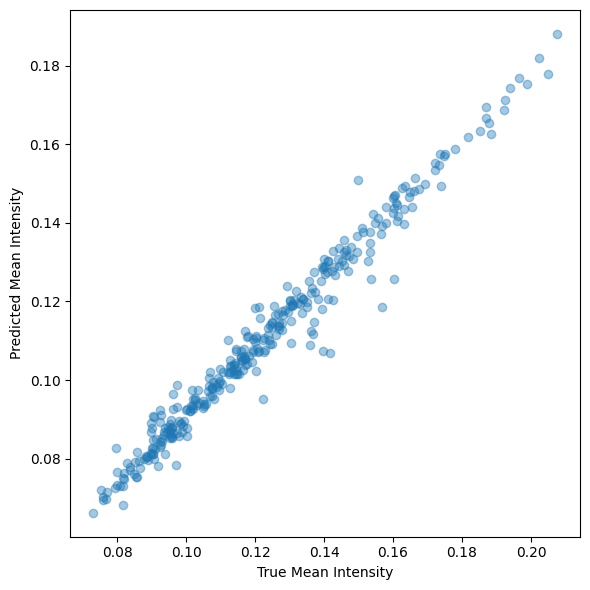
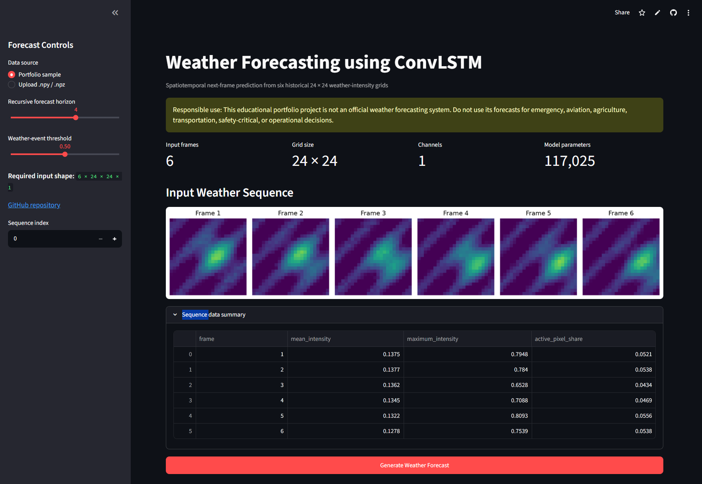
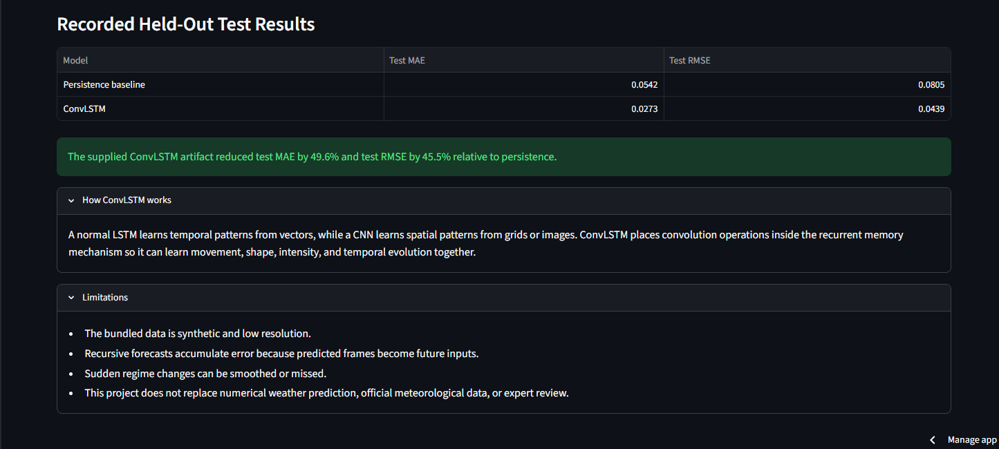

# Weather Forecasting using ConvLSTM

[](https://www.python.org/)
[](https://www.tensorflow.org/)
[](https://lstm-projects-mivsjcuhxgq2szsnou7jdc.streamlit.app/)
[](LICENSE)
[](https://github.com/unit-mole/lstm-projects/actions/workflows/11-weather-forecasting-convlstm.yml)

An end-to-end spatiotemporal forecasting project that uses a Convolutional LSTM
(ConvLSTM) to predict the next weather-intensity map from six historical weather
grids. The repository includes deterministic synthetic data, reusable weather
preprocessing and inference modules, persistence-baseline comparison, spatial
error analysis, recursive multi-step forecasting, saved model artifacts, tests,
GitHub Actions, and an interactive Streamlit application.

**Status:** Portfolio-ready  
**Live demo:** [Open the Streamlit application](https://lstm-projects-mivsjcuhxgq2szsnou7jdc.streamlit.app/)  
[](https://lstm-projects-mivsjcuhxgq2szsnou7jdc.streamlit.app/)  
**Primary stack:** Python · TensorFlow · Keras · ConvLSTM2D · NumPy · scikit-image · Streamlit

---

## Business Problem

Weather, radar, satellite, and environmental-monitoring systems frequently
produce sequences of spatial grids rather than ordinary tabular records. A
useful forecasting model must learn both **where** a weather pattern is located
and **how** it changes over time.

This project answers:

> Given six previous weather-intensity grids, can a ConvLSTM forecast the next
> spatial weather state more accurately than simply repeating the last observed
> frame?

The deployed pipeline returns:

- **Predicted next weather-intensity map**
- **Actual-versus-predicted spatial comparison**
- **Forecast horizon and recursive future sequence**
- **MAE, RMSE, SSIM, IoU/CSI, POD, and FAR where applicable**
- **Absolute prediction-error heatmap**
- **Downloadable NPY, CSV, and GIF outputs**

## Project Objective

Build a portfolio-ready ConvLSTM solution that can:

1. Generate or load weather grids in a validated five-dimensional sequence format.
2. Preserve spatial structure and temporal ordering.
3. Repair invalid values and normalize weather intensities consistently.
4. Convert historical weather frames into supervised input-output sequences.
5. Learn joint spatial and temporal dynamics using `ConvLSTM2D`.
6. Compare ConvLSTM performance with a persistence baseline.
7. Evaluate forecasts using numerical, spatial, and visual diagnostics.
8. Support recursive multi-step weather-map forecasting.
9. Save and reload the model and metadata required for reproducible inference.
10. Serve forecasts through a deployment-ready Streamlit application without retraining at startup.

## Portfolio Scope

This is an educational and portfolio demonstration built on a deterministic
**synthetic weather-grid dataset**. The grids represent moving and changing
weather-intensity systems on a low-resolution spatial domain. Values are
normalized between 0 and 1 and do not represent validated meteorological units.

No private, restricted, or operational weather data is included in GitHub.

## Responsible Use

This project is not an official weather forecasting system. Its predictions may
be inaccurate and must not be used for safety-critical, emergency, aviation,
agriculture, transportation, infrastructure, or operational decisions.
Production weather forecasting requires validated meteorological observations,
physical models, domain expertise, uncertainty quantification, and official
weather services.

## Dataset

| Property | Value |
|---|---|
| Data format | Five-dimensional NumPy arrays |
| Dataset type | Deterministic synthetic weather-intensity grids |
| Full notebook dataset | 2,200 independent sequences |
| Input frames | 6 historical frames |
| Forecast target | Next weather frame |
| Grid dimensions | 24 × 24 |
| Channels | 1 |
| Normalized range | 0 to 1 |
| Training split | 1,540 sequences |
| Validation split | 330 sequences |
| Test split | 330 sequences |
| GitHub demo sample | 24 sequences with reference future frames |

The supplied synthetic sequences are independently generated using a fixed seed,
so the notebook uses a reproducible sample-level split. A real radar, satellite,
or gridded meteorological dataset should instead use strictly chronological,
non-overlapping train, validation, and test periods.

## Tools and Technologies

| Area | Technology |
|---|---|
| Language | Python |
| Deep learning | TensorFlow / Keras |
| Spatiotemporal modeling | ConvLSTM2D |
| Data processing | NumPy, pandas |
| Weather-grid preprocessing | NumPy-based validation and normalization |
| Evaluation | NumPy, scikit-image |
| Visualization and animation | Matplotlib, imageio, Pillow |
| Demo application | Streamlit |
| Model persistence | Keras `.keras`, JSON |
| Testing and quality | pytest, Ruff, compile checks, GitHub Actions |
| Hosting | Streamlit Community Cloud |

## Project Workflow

```text
Weather-grid sequences
        │
        ▼
Shape validation and finite-value repair
        │
        ▼
Normalization to the [0, 1] range
        │
        ▼
Six historical frames per input sequence
        │
        ▼
ConvLSTM2D spatial-temporal feature learning
        │
        ▼
Single-channel Conv2D next-frame output
        │
        ▼
Persistence baseline and held-out evaluation
        │
        ▼
Actual vs predicted maps and error heatmaps
        │
        ▼
Recursive multi-step forecast and GIF generation
        │
        ▼
Streamlit inference and downloadable outputs
```

## Weather Data Preprocessing

The reusable preprocessing pipeline:

- Converts weather grids to `float32`.
- Verifies the required frame and channel dimensions.
- Replaces non-finite values using the finite-array median.
- Clips normalized intensities to the `[0, 1]` range.
- Preserves frame order within every weather sequence.
- Validates the fixed model input shape of `6 × 24 × 24 × 1`.
- Uses the same transformations during training and inference.
- Supports chronological rolling-window creation for real ordered frame streams.

## Sequence Generation

The model uses six historical weather frames to predict the next frame:

```text
X shape = [samples, 6, 24, 24, 1]
y shape = [samples, 24, 24, 1]
```

For each sample:

```text
Input  = frames t-5, t-4, t-3, t-2, t-1, t
Target = frame t+1
```

Frames are never shuffled within a sequence. For real weather data, all dataset
splits should preserve time order and avoid overlapping future periods.

## What ConvLSTM Does

A standard LSTM learns temporal patterns from vector sequences. A CNN learns
spatial patterns from images or grids. A ConvLSTM combines convolution operations
with LSTM-style memory, allowing the network to learn spatial shapes, movement,
intensity changes, and temporal evolution together.

This makes ConvLSTM useful for:

- Weather nowcasting
- Precipitation and radar sequence forecasting
- Satellite image prediction
- Environmental grid forecasting
- Video-frame prediction
- Other spatiotemporal sequence problems

## ConvLSTM Architecture

```text
Input: 6 × 24 × 24 × 1
        ↓
ConvLSTM2D: 32 filters, 3 × 3 kernel,
same padding, return_sequences=True
        ↓
Batch Normalization
        ↓
ConvLSTM2D: 32 filters, 3 × 3 kernel,
same padding, return_sequences=False
        ↓
Batch Normalization
        ↓
Conv2D: 16 filters, 3 × 3 kernel, ReLU
        ↓
Conv2D: 1 filter, 3 × 3 kernel, Sigmoid
        ↓
Predicted 24 × 24 weather-intensity map
```

The supplied model contains **117,025 trainable and non-trainable parameters in
total**. Training uses Adam with a learning rate of `0.001`, mean-squared error
loss, MAE monitoring, early stopping, and learning-rate reduction.



## Forecasting Logic

### One-step forecasting

The primary model output is the next weather-intensity frame based on the six
most recent input frames.

### Recursive multi-step forecasting

For a multi-step forecast, the predicted frame is appended to the rolling
six-frame input window and used to predict the following frame:

```text
Six observed frames
        ↓
Predict future frame 1
        ↓
Append prediction and remove oldest frame
        ↓
Predict future frame 2
        ↓
Repeat for the selected horizon
```

This enables future-sequence generation but can accumulate error because later
predictions depend on earlier predicted frames rather than fully observed data.

## Model Results

| Model | Validation MAE | Validation RMSE | Test MAE | Test RMSE |
|---|---:|---:|---:|---:|
| Persistence baseline | 0.054187 | 0.080521 | 0.054178 | 0.080493 |
| **ConvLSTM** | **0.027313** | **0.044109** | **0.027281** | **0.043898** |

Compared with the persistence baseline, the ConvLSTM achieved:

- **49.6% lower test MAE**
- **45.5% lower test RMSE**
- **0.6623 thresholded IoU / CSI** at an intensity threshold of 0.50
- **0.9816 pixel accuracy** at the same threshold

The comparison shows that the trained ConvLSTM captured useful spatial-temporal
movement beyond simply copying the last observed weather frame.

## Evaluation Metrics

| Metric | Interpretation |
|---|---|
| MAE | Average absolute grid-cell forecast error |
| RMSE | Penalizes larger spatial errors more strongly |
| SSIM | Measures structural similarity between actual and predicted maps |
| IoU / CSI | Measures overlap between thresholded actual and predicted event regions |
| POD | Measures the proportion of actual event pixels detected |
| FAR | Measures the proportion of predicted event pixels that were false alarms |
| Pixel accuracy | Measures correctly classified event and non-event grid cells |
| Error heatmap | Shows where the predicted map differs most from the actual map |

SSIM, POD, and FAR are calculated interactively for selected labeled sequences
inside the Streamlit application.

## Visual Model Results

| Input weather sequence | Actual vs predicted weather map |
|---|---|
|  |  |

| Prediction-error heatmap | Baseline comparison |
|---|---|
|  |  |

| Training curve | Forecast intensity comparison |
|---|---|
|  |  |

## Streamlit Demo

The deployed application supports:

- Preloaded safe weather-sequence samples
- `.npy` and `.npz` weather-sequence uploads
- Sample-sequence selection
- Six-frame input visualization
- Next-frame weather-map forecasting
- Actual-versus-predicted comparison when labels are available
- Absolute prediction-error heatmaps
- MAE, RMSE, SSIM, IoU/CSI, POD, and FAR
- Recursive one-to-six-step forecasting
- Forecast-sequence animation
- NPY, CSV, and GIF downloads
- Model details, limitations, and responsible-use guidance

### Application Overview

The application home presents the forecasting objective, responsible-use note,
sample and upload controls, sequence selection, forecast-horizon control, and
forecast-generation workflow.



### Forecast Metrics and Multi-Step Sequence

The forecast-results view displays numerical performance metrics, predicted
weather frames, recursive multi-step forecasting, visual analysis, and
forecast-download controls.



## Model Artifacts

| Artifact | Purpose |
|---|---|
| `models/convlstm_weather_forecast.keras` | Pretrained ConvLSTM model used by the deployed app |
| `models/model_metadata.json` | Input shape, architecture, training configuration, split notes, metrics, and responsible-use metadata |
| `models/weather_meta_original.json` | Original supplied minimal model metadata |
| `data/sample_weather_sequences.npz` | Safe preloaded sample sequences and reference future frames |
| `outputs/model_metrics.json` | Recorded baseline and ConvLSTM evaluation results |

The Streamlit app loads the pretrained model and metadata directly and does not
retrain the network during application startup.

## Run Locally

### 1. Open the project directory

```bash
cd lstm-projects/11-weather-forecasting-convlstm
```

### 2. Create and activate a virtual environment

Windows Command Prompt:

```bat
py -3.11 -m venv .venv
.venv\Scripts\activate
```

macOS or Linux:

```bash
python3.11 -m venv .venv
source .venv/bin/activate
```

### 3. Install dependencies

```bash
python -m pip install --upgrade pip
python -m pip install -r requirements.txt
```

Install development dependencies when running tests and quality checks:

```bash
python -m pip install -r requirements-dev.txt
```

### 4. Run tests and validation

```bash
python -m pytest -q
python -m compileall app src tests scripts train_model.py
python scripts/validate_project.py
```

### 5. Launch the pretrained Streamlit demo

```bash
python -m streamlit run app/streamlit_app.py
```

Open the local address displayed in the terminal, normally:

```text
http://localhost:8501
```

### 6. Optional: retrain the model

```bash
python train_model.py --samples 2200 --epochs 15 --batch-size 32
```

Training writes the updated model to `models/` and evaluation outputs to
`outputs/`.

## Deploy

The application is deployed through Streamlit Community Cloud from the public
LSTM portfolio monorepo.

- **Repository:** `unit-mole/lstm-projects`
- **Branch:** `main`
- **Entrypoint:** `11-weather-forecasting-convlstm/app/streamlit_app.py`
- **Python:** `3.11`
- **Dependency file:** `11-weather-forecasting-convlstm/app/requirements.txt`
- **Live application:**  
  https://lstm-projects-mivsjcuhxgq2szsnou7jdc.streamlit.app/

The deployment-specific dependency file is stored beside the Streamlit
entrypoint. This allows Streamlit Community Cloud to resolve the correct
environment reliably inside the monorepo.

See [`README_HOSTING.md`](README_HOSTING.md) for detailed deployment and
maintenance instructions.

## Project Structure

```text
lstm-projects/
├── .github/
│   └── workflows/
│       └── 11-weather-forecasting-convlstm.yml
│
├── 01-airline-passenger-forecasting/
├── 02-bitcoin-price-prediction/
├── 03-conversational-chatbot-seq2seq-attention/
├── 04-ecg-anomaly-detection-lstm-autoencoder-attention/
├── 05-fake-news-detection/
├── 06-human-activity-recognition-lstm-attention/
├── 07-industrial-equipment-failure-detection-lstm-autoencoder/
├── 08-multivariate-time-series-forecasting-stacked-lstm/
├── 09-video-frame-prediction-convlstm/
├── 10-traffic-flow-prediction-stacked-lstm/
└── 11-weather-forecasting-convlstm/
    ├── .pytest_cache/
    ├── .streamlit/
    │   └── config.toml
    ├── __pycache__/
    ├── app/
    │   ├── __init__.py
    │   ├── requirements.txt
    │   └── streamlit_app.py
    ├── archive/
    ├── data/
    ├── images/
    ├── models/
    ├── notebooks/
    ├── outputs/
    ├── scripts/
    ├── src/
    ├── tests/
    ├── .gitignore
    ├── __init__.py
    ├── Dockerfile
    ├── FILE_MANIFEST.xlsx
    ├── IMPROVEMENTS.md
    ├── LICENSE
    ├── MONOREPO_INTEGRATION.md
    ├── PROJECT_AUDIT.md
    ├── README.md
    ├── README_HOSTING.md
    ├── requirements-dev.txt
    ├── requirements.txt
    ├── run_local.bat
    ├── run_local.sh
    └── train_model.py
```

## Testing and CI

Run lightweight unit tests:

```bash
python -m pytest -q
```

Check Python files for syntax errors:

```bash
python -m compileall app src tests scripts train_model.py
```

Validate all required project artifacts:

```bash
python scripts/validate_project.py
```

The project-specific GitHub Actions workflow is stored at the monorepo root:

```text
.github/workflows/11-weather-forecasting-convlstm.yml
```

It runs Python compilation, critical Ruff checks, unit tests, artifact
validation, and notebook JSON validation whenever Project 11 or its workflow
changes.

## Limitations

- Synthetic data does not reproduce full atmospheric physics.
- Normalized intensity values are not validated meteorological measurements.
- Low-resolution maps simplify complex weather structures.
- MSE-trained sequence models may smooth sharp boundaries and extreme values.
- Sudden changes outside the learned motion patterns can be missed.
- Recursive forecasts accumulate error over longer horizons.
- ConvLSTM is more computationally expensive than persistence or simple CNN baselines.
- The current model predicts one variable and one frame directly.
- Modern numerical-weather-prediction and transformer systems can use richer observations, physical constraints, and larger spatial domains.

## Future Improvements

- Validate on a licensed public radar or gridded precipitation dataset.
- Use strictly chronological evaluation and rolling-origin backtesting.
- Add probabilistic forecasts and calibrated uncertainty intervals.
- Train a direct multi-output model for several future frames.
- Compare against optical flow, CNN, U-Net, PredRNN, and transformer baselines.
- Add intensity-weighted or focal-style losses for rare extreme-event regions.
- Evaluate CSI, POD, FAR, and FSS across multiple intensity thresholds.
- Add multi-variable weather channels such as precipitation, temperature, humidity, and pressure.
- Add drift monitoring and automated data-quality checks for live observations.
- Add model-registry, API-serving, and deployment smoke tests.

## Skills Demonstrated

- ConvLSTM2D architecture design
- Spatiotemporal weather-grid forecasting
- Image and grid-sequence preprocessing
- Sequence generation and temporal-order preservation
- Persistence-baseline comparison
- Spatial regression evaluation
- Weather-event detection metrics
- SSIM and prediction-error heatmap analysis
- Recursive multi-step forecasting
- GIF and forecast-output generation
- Keras model persistence and reusable inference
- Streamlit application development
- NumPy upload and download workflows
- Unit testing and GitHub Actions
- Deployment-ready ML engineering
- Responsible AI and limitation framing

## Portfolio Positioning

**One-line description:** ConvLSTM-based spatiotemporal forecasting system that
predicts future weather-intensity maps from historical grids and serves
interactive forecasts through Streamlit.

**Pinned repository description:** End-to-end ConvLSTM weather forecasting
project with synthetic grid generation, next-frame and recursive forecasting,
persistence-baseline comparison, spatial error analysis, weather-event metrics,
saved model artifacts, GitHub Actions, and a live Streamlit application.

This project supports a transition from Quality Data Scientist to broader Data
Science, Machine Learning, and Applied AI roles by demonstrating monitoring,
pattern detection, forecasting, spatial analytics, quantitative validation,
operational decision-support thinking, automation, and end-to-end deployment.

## Responsible Use Summary

This repository is a portfolio demonstration. It is not validated for official
meteorological forecasting or real-world safety-critical decision-making. The
outputs should be interpreted only as synthetic spatiotemporal predictions used
to demonstrate ConvLSTM modeling and deployment skills.

## Author

**Anmol Tripathi**  
Quality Data Scientist transitioning toward Data Science, Machine Learning,
Applied AI, Analytics Engineering, and Quality Analytics roles.
