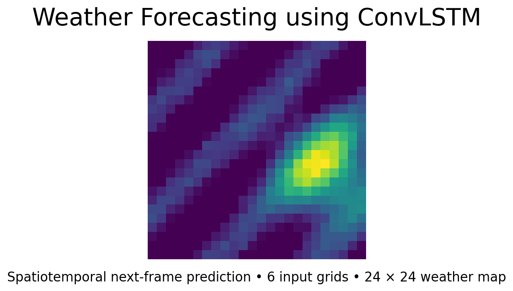
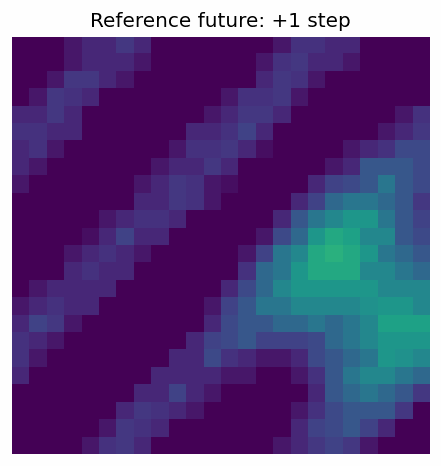

# Weather Forecasting using ConvLSTM

[](https://www.python.org/)
[](https://www.tensorflow.org/)
[](README_HOSTING.md)
[](LICENSE)
[](https://github.com/unit-mole/lstm-projects/actions/workflows/11-weather-forecasting-convlstm.yml)

An end-to-end spatiotemporal forecasting project that uses a Convolutional LSTM to predict the next weather-intensity map from six historical grids. The repository includes deterministic synthetic data, reusable preprocessing and inference modules, persistence-baseline comparison, spatial error analysis, recursive multi-step forecasting, saved model artifacts, tests, CI, and a Streamlit application.

**Status:** Portfolio-ready  
**Live demo:** Add the Streamlit URL after deployment  
**Primary stack:** Python · TensorFlow/Keras · ConvLSTM2D · NumPy · scikit-image · Streamlit



---

## Responsible Use

This project is for educational and portfolio demonstration purposes only. It is not an official weather forecasting system. Forecasts may be inaccurate and must not be used for safety-critical, emergency, aviation, agriculture, transportation, or operational decisions. Real forecasting requires validated meteorological observations, physical models, domain expertise, uncertainty quantification, and official weather services.

## Business Problem

Weather and environmental monitoring systems produce sequences of spatial grids rather than simple tabular rows. A useful model must learn both where a pattern is located and how it changes over time. This project answers:

> Given six previous weather-intensity grids, can a ConvLSTM forecast the next spatial weather state more accurately than simply repeating the last observed frame?

The pipeline returns a predicted next frame, forecast horizon, numerical error metrics, event-detection metrics, visual comparison, error heatmap, recursive future sequence, and downloadable outputs.

## Project Objective

1. Generate or load weather grids in a validated five-dimensional sequence format.
2. Preserve spatial structure and temporal ordering.
3. Learn joint spatial-temporal dynamics using ConvLSTM2D.
4. Compare performance with a persistence baseline.
5. Evaluate forecasts numerically and visually.
6. Support recursive multi-step forecasting while documenting error accumulation.
7. Persist model metadata and provide repeatable inference.
8. Deploy an interactive Streamlit demonstration without retraining at startup.

## Portfolio Scope

The bundled dataset is deterministic and synthetic. It represents moving, changing weather-intensity systems on low-resolution grids and does not use physical weather units. No private, restricted, or operational meteorological data is published.

## Dataset

| Property | Value |
|---|---|
| Data format | Five-dimensional NumPy arrays |
| Full notebook dataset | 2,200 independent sequences |
| Input sequence | 6 frames |
| Target | Next weather frame |
| Grid | 24 × 24 |
| Channels | 1 |
| Value range | 0 to 1 |
| Supplied split | 1,540 train / 330 validation / 330 test |
| GitHub sample | 24 sequences with six future reference frames |

The supplied notebook uses a fixed seeded sample-level split. Because every synthetic storm sequence is independently generated, there is no shared global timestamp axis. Real radar, satellite, or weather-grid data must use chronological, non-overlapping periods.

## Tools and Technologies

| Area | Technology |
|---|---|
| Language | Python |
| Deep learning | TensorFlow / Keras |
| Spatiotemporal modeling | ConvLSTM2D |
| Data processing | NumPy, pandas |
| Numerical evaluation | NumPy, scikit-image |
| Visualization | Matplotlib, imageio |
| Demo application | Streamlit |
| Testing / quality | pytest, Ruff, compile checks, GitHub Actions |
| Hosting | Streamlit Community Cloud |

## Project Workflow

```text
Weather grid sequences
        │
        ▼
Shape validation and finite-value repair
        │
        ▼
Normalization to [0, 1]
        │
        ▼
Six historical frames per input sequence
        │
        ▼
ConvLSTM2D spatial-temporal feature learning
        │
        ▼
Single-channel Conv2D next-frame output
        │
        ▼
Persistence baseline and held-out evaluation
        │
        ▼
Actual vs predicted maps + error heatmaps
        │
        ▼
Recursive multi-step forecast and GIF
        │
        ▼
Streamlit inference and downloads
```

## Weather Data Preprocessing

- Cast grids to `float32`.
- Replace non-finite values using the finite-array median.
- Clip normalized intensities to `[0, 1]`.
- Validate the fixed model input shape `6 × 24 × 24 × 1`.
- Preserve frame order inside every sequence.
- Use contiguous chronological splits for real ordered datasets.
- Apply the same preprocessing at training and inference time.

## Sequence Design

```text
X shape = [samples, 6, 24, 24, 1]
y shape = [samples, 24, 24, 1]
```

Six previous grids are used to predict the next grid. The reusable sequence generator can also convert a continuous ordered frame stream into non-shuffled rolling windows.

## What ConvLSTM Does

A normal LSTM learns temporal patterns from vectors. A CNN learns spatial patterns from images or grids. ConvLSTM combines convolution operations with LSTM-style memory so it can learn shape, location, movement, intensity, and temporal evolution together. This makes it useful for weather nowcasting, radar sequences, satellite imagery, video prediction, and other spatiotemporal problems.

## Model Architecture

```text
Input: 6 × 24 × 24 × 1
        ↓
ConvLSTM2D: 32 filters, 3 × 3, same padding, return_sequences=True
        ↓
Batch Normalization
        ↓
ConvLSTM2D: 32 filters, 3 × 3, same padding
        ↓
Batch Normalization
        ↓
Conv2D: 16 filters, ReLU
        ↓
Conv2D: 1 filter, sigmoid
        ↓
Predicted 24 × 24 weather map
```


Training uses Adam, mean-squared error, MAE monitoring, early stopping, and learning-rate reduction. The supplied model contains **117,025 parameters**.

## Forecasting Approach

The primary output is a one-step forecast. For multi-step forecasting, the predicted frame is appended to the rolling six-frame window and fed back into the model. This produces a future sequence but introduces compounding error because later inputs contain prior predictions.



## Model Results

| Model | Validation MAE | Validation RMSE | Test MAE | Test RMSE |
|---|---:|---:|---:|---:|
| Persistence baseline | 0.054187 | 0.080521 | 0.054178 | 0.080493 |
| **ConvLSTM** | **0.027313** | **0.044109** | **0.027281** | **0.043898** |

The supplied ConvLSTM reduced test MAE by **49.6%** and test RMSE by **45.5%** relative to persistence. At a normalized intensity threshold of 0.50, recorded test IoU was **0.6623** and pixel accuracy was **0.9816**.

## Evaluation Metrics

- **MAE:** average pixel or grid-cell forecast error.
- **RMSE:** penalizes larger spatial errors more strongly.
- **SSIM:** measures structural similarity for a selected actual/predicted pair in the app.
- **IoU / CSI:** overlap between thresholded actual and predicted weather-event regions.
- **POD:** share of actual event pixels detected.
- **FAR:** share of predicted event pixels that were false alarms.
- **Error heatmap:** shows where spatial predictions deviate most.

## Visual Model Results

| Input sequence | Actual vs predicted |
|---|---|
|  |  |

| Error heatmap | Baseline comparison |
|---|---|
|  |  |


## Streamlit Demo

The application supports:

- Preloaded safe sample sequences
- `.npy` and `.npz` upload
- Sequence selection
- Input-frame visualization
- Next-frame forecasting
- Actual-versus-predicted comparison when labels are available
- MAE, RMSE, SSIM, IoU/CSI, POD, and FAR
- Recursive one-to-six-step forecasting
- Error heatmap and forecast animation
- NPY, CSV, and GIF downloads
- Model explanation, limitations, and responsible-use warning

After deployment, store the essential screenshots in `images/` as `01_app_overview.png`, `02_weather_sequence_and_forecast.png`, and `03_model_performance.png`.

## Model Artifacts

| Artifact | Purpose |
|---|---|
| `models/convlstm_weather_forecast.keras` | Pretrained ConvLSTM used by the app |
| `models/model_metadata.json` | Shapes, architecture, metrics, split notes, and responsible-use metadata |
| `models/weather_meta_original.json` | Original supplied minimal metadata |
| `data/sample_weather_sequences.npz` | Safe preloaded demo data |

## Run Locally

```bash
cd lstm-projects/11-weather-forecasting-convlstm
python3.11 -m venv .venv
```

Windows Command Prompt:

```bat
.venv\Scripts\activate
```

macOS or Linux:

```bash
source .venv/bin/activate
```

Install and run:

```bash
python -m pip install --upgrade pip
python -m pip install -r requirements.txt
python -m pytest -q
python -m streamlit run app/streamlit_app.py
```

Optional retraining:

```bash
python train_model.py --samples 2200 --epochs 15 --batch-size 32
```

## Deploy

- Repository: `unit-mole/lstm-projects`
- Branch: `main`
- Entrypoint: `11-weather-forecasting-convlstm/app/streamlit_app.py`
- Python: `3.11`
- Dependency file: `11-weather-forecasting-convlstm/app/requirements.txt`

See [`README_HOSTING.md`](README_HOSTING.md) for detailed deployment and troubleshooting instructions.

## Project Structure

```text
lstm-projects/
├── .github/
│   └── workflows/
│       └── 11-weather-forecasting-convlstm.yml
└── 11-weather-forecasting-convlstm/
    ├── .streamlit/
    ├── app/
    ├── archive/
    ├── data/
    ├── images/
    ├── models/
    ├── notebooks/
    ├── outputs/
    ├── scripts/
    ├── src/
    ├── tests/
    ├── .gitignore
    ├── Dockerfile
    ├── FILE_MANIFEST.xlsx
    ├── IMPROVEMENTS.md
    ├── LICENSE
    ├── MONOREPO_INTEGRATION.md
    ├── PROJECT_AUDIT.md
    ├── README.md
    ├── README_HOSTING.md
    ├── requirements-dev.txt
    ├── requirements.txt
    └── train_model.py
```

## Testing and CI

```bash
python -m pytest -q
python -m compileall app src tests scripts train_model.py
python scripts/validate_project.py
```

The root workflow is:

```text
.github/workflows/11-weather-forecasting-convlstm.yml
```

## Limitations

- Synthetic data does not reproduce the full physics of the atmosphere.
- Low-resolution maps simplify complex weather structures.
- MSE-trained sequence models may smooth sharp boundaries or extreme values.
- Recursive forecasts accumulate error.
- Sudden changes outside learned motion patterns can be missed.
- ConvLSTM is computationally heavier than persistence or simple CNN baselines.
- Modern numerical-weather-prediction systems and transformer-based models can use far richer observations and physical constraints.

## Future Improvements

- Validate on a licensed public radar or gridded precipitation dataset.
- Use strictly chronological evaluation and rolling-origin backtesting.
- Add uncertainty intervals or probabilistic forecasts.
- Add multi-output training rather than only recursive prediction.
- Compare against optical flow, CNN, U-Net, PredRNN, and transformer baselines.
- Add intensity-weighted losses for extreme-event regions.
- Evaluate CSI, POD, FAR, and FSS across multiple thresholds.
- Add drift monitoring and data-quality checks for live observations.

## Skills Demonstrated

- ConvLSTM2D architecture design
- Spatiotemporal grid forecasting
- Weather-map and image-sequence preprocessing
- Sequence generation and temporal-order preservation
- Persistence baseline comparison
- Spatial regression and weather-event metrics
- Recursive forecasting and GIF generation
- Model persistence and reusable inference
- Streamlit application development
- NumPy upload and output-download workflows
- Unit testing and GitHub Actions
- Deployment-ready ML engineering
- Responsible AI and limitations framing

## Portfolio Positioning

**One-line description:** ConvLSTM-based spatiotemporal forecasting system that predicts future weather-intensity maps from historical grids and serves interactive forecasts through Streamlit.

**Pinned repository description:** End-to-end ConvLSTM project with synthetic weather-grid generation, next-frame and recursive forecasting, persistence-baseline comparison, spatial error analysis, event metrics, saved artifacts, CI, and a deployable Streamlit demo.

This project supports a transition from Quality Data Scientist to broader Data Science, ML, and Applied AI roles by demonstrating monitoring, pattern detection, forecasting, spatial analytics, quantitative validation, operational decision-support thinking, and end-to-end deployment.

## Author

**Anmol Tripathi**  
Quality Data Scientist transitioning toward Data Science, Machine Learning, Applied AI, Analytics Engineering, and Quality Analytics roles.
