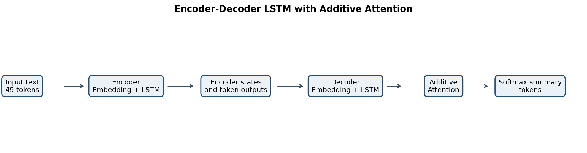
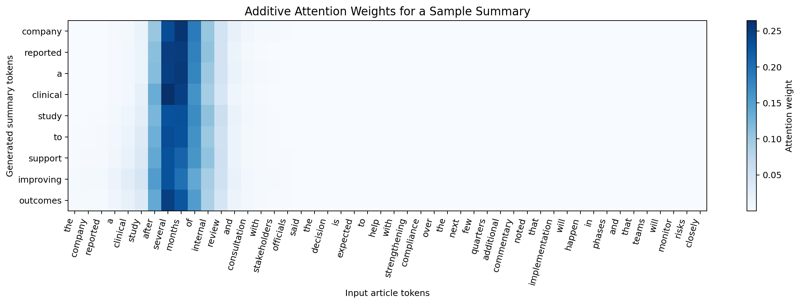
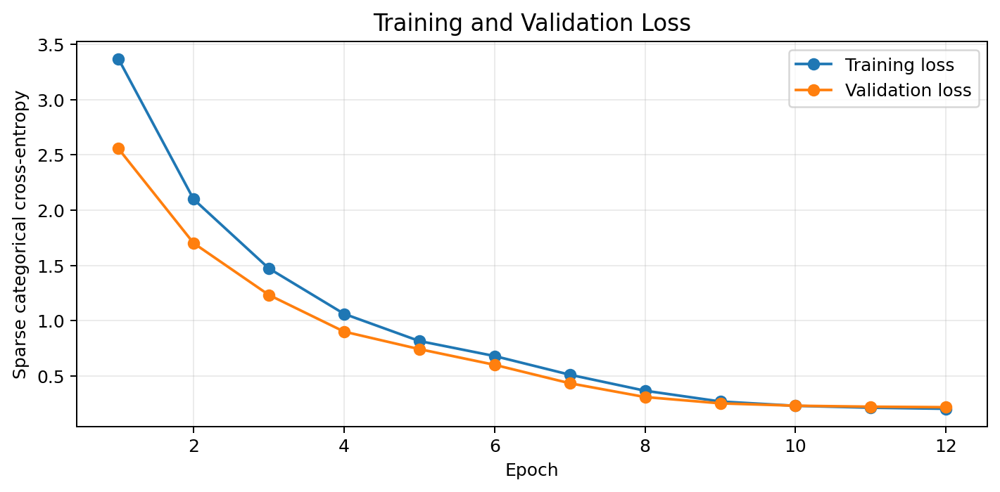
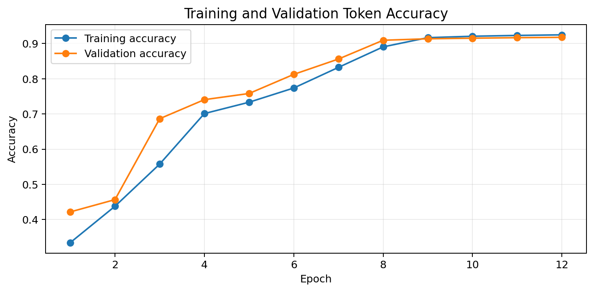
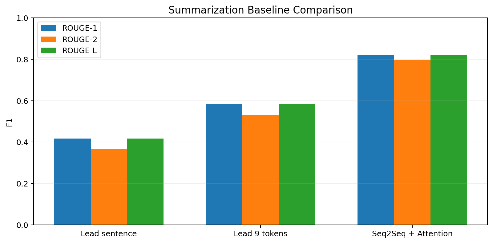
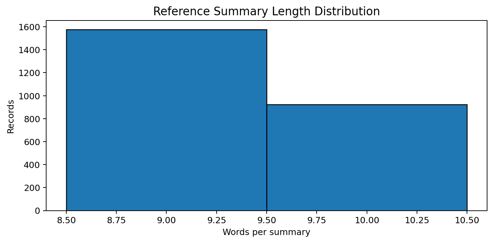
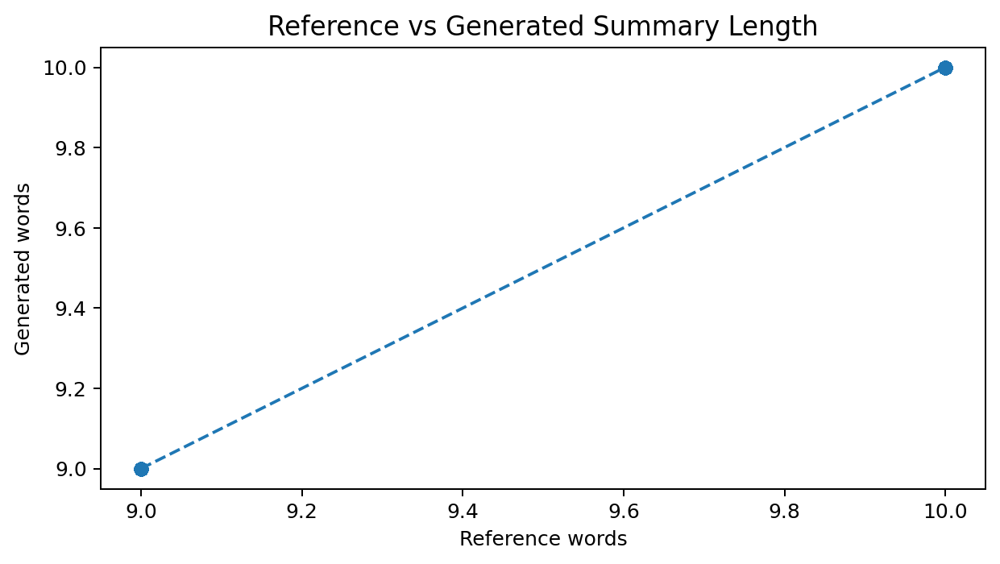
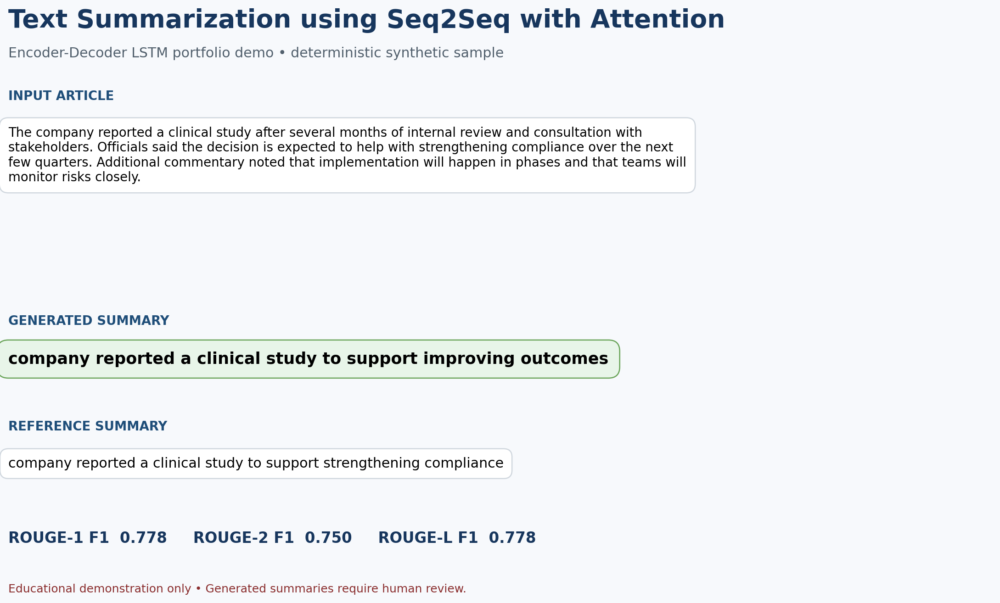

# Text Summarization using Seq2Seq with Attention

[](https://www.python.org/)
[](https://keras.io/)
[](README_HOSTING.md)
[](LICENSE)
[](https://github.com/unit-mole/lstm-projects/actions/workflows/12-text-summarization-seq2seq-attention.yml)

An end-to-end abstractive text-summarization project that uses an Encoder-Decoder LSTM with additive attention to transform a longer input passage into a concise generated summary. The project includes deterministic data reconstruction, portable tokenizer artifacts, greedy and beam-search inference, ROUGE evaluation, extractive baselines, attention visualization, batch CSV processing, tests, GitHub Actions, and a deployment-ready Streamlit application.

**Status:** Portfolio-ready and deployment-ready  
**Live demo:** Deployment pending — follow [`README_HOSTING.md`](README_HOSTING.md)  
[](README_HOSTING.md)  
**Primary stack:** Python · Keras · JAX · LSTM · Additive Attention · ROUGE · Streamlit

---

## NLP Problem

Organizations frequently need to convert lengthy notes, reports, complaints, case descriptions, and operational updates into concise summaries. Manual summarization can be inconsistent and time-consuming. This project asks:

> Given a longer text passage, can an LSTM Seq2Seq model generate a shorter abstractive summary that preserves the central subject, action, topic, and expected impact?

The deployed pipeline returns:

- **Generated abstractive summary**
- **Input and summary word counts**
- **Compression ratio**
- **Out-of-vocabulary rate**
- **Reference ROUGE scores for labeled samples**
- **Optional additive-attention alignment**
- **Warnings for short, truncated, or out-of-domain inputs**

## Project Objective

Build a professional LSTM/NLP portfolio project that can:

1. Load or reproduce article-summary pairs.
2. Clean text consistently for training and inference.
3. Create separate source and target vocabularies.
4. Add start/end tokens and prepare teacher-forced decoder targets.
5. Train an Encoder-Decoder LSTM with additive attention.
6. Save the training model and separate inference models.
7. Generate summaries with greedy decoding and optional beam search.
8. Evaluate output with ROUGE, a transparent BLEU-like score, and qualitative examples.
9. Compare the neural model with simple extractive baselines.
10. Support sample, manual, and CSV batch summarization through Streamlit.
11. Expose limitations and responsible-use requirements clearly.

## Portfolio Scope

This is an educational demonstration trained on a deterministic **synthetic summarization corpus**. It is not a general-purpose news summarizer, production document-intelligence system, or replacement for modern Transformer/LLM summarizers.

Generated text may be incomplete, generic, repetitive, or factually incorrect. Human review is required.

## Dataset

The executed notebook used its built-in synthetic fallback rather than an external corpus.

| Property | Value |
|---|---:|
| Article-summary pairs | 2,500 |
| Training records | 1,750 |
| Validation records | 375 |
| Test records | 375 |
| Input columns | `article`, `summary` |
| Mean article length | 48.37 cleaned words |
| Mean summary length | 9.37 cleaned words |
| Random seed | 42 |

Each example combines:

- An organization, such as a company, hospital, university, or government
- An action, such as announced, launched, approved, or investigated
- A theme, such as a policy, clinical study, safety update, or technology roadmap
- An operational impact, such as improving outcomes or reducing costs
- Additional implementation and risk-monitoring context

The complete corpus is reproducible from `src/data_preprocessing.py`. GitHub contains only safe sample files; no private or copyrighted documents are included.

See [`data/README_data.md`](data/README_data.md).

## Tools and Technologies

| Area | Technology |
|---|---|
| Language | Python |
| Data processing | pandas, NumPy |
| Modeling | Keras 3 |
| Deployment backend | JAX CPU |
| Sequence architecture | Encoder-Decoder LSTM |
| Context mechanism | Keras `AdditiveAttention` |
| Data splitting | scikit-learn |
| Evaluation | ROUGE-1, ROUGE-2, ROUGE-L, BLEU-like overlap |
| Visualization | Matplotlib |
| Demo application | Streamlit |
| Model persistence | Keras `.keras`, portable tokenizer JSON, metadata JSON |
| Testing / quality | pytest, compile checks, artifact validation, GitHub Actions |
| Hosting | Streamlit Community Cloud |

## Project Workflow

```text
Article-summary pairs
        │
        ▼
Missing-value and duplicate handling
        │
        ▼
Conservative text cleaning
        │
        ▼
Add sostok / eostok to target summaries
        │
        ▼
Deterministic 70% / 15% / 15% split
        │
        ▼
Fit source and target tokenizers on training data
        │
        ▼
Post-pad source and target sequences
        │
        ▼
Shift decoder inputs and decoder targets
        │
        ▼
Encoder LSTM + Decoder LSTM + Additive Attention
        │
        ▼
Teacher-forced training with validation monitoring
        │
        ▼
Separate encoder and decoder inference models
        │
        ▼
Greedy or beam-search token generation
        │
        ▼
ROUGE, baselines, examples, attention inspection
        │
        ▼
Streamlit sample, manual, and CSV workflows
```

## Text Preprocessing

The model uses the same preprocessing during training and inference:

1. Convert text to lowercase.
2. Remove HTML tags.
3. Retain ASCII letters, digits, and whitespace.
4. Replace punctuation and unsupported characters with spaces.
5. Collapse repeated whitespace.
6. Add `sostok` and `eostok` only to target summaries.
7. Map unseen source words to `<unk>`.
8. Post-pad source sequences to 49 tokens.
9. Post-pad target sequences to 12 tokens.

The cleaning policy is intentionally conservative and matches the supplied model. A broader production system would preserve more punctuation, named entities, Unicode, and document structure.

## Seq2Seq Data Preparation

Example target:

```text
sostok company approved a sustainability plan to support reducing costs eostok
```

Teacher-forcing preparation:

```text
Decoder input:
sostok company approved a sustainability plan to support reducing costs

Decoder target:
company approved a sustainability plan to support reducing costs eostok
```

Verified sequence configuration:

| Item | Value |
|---|---:|
| Source vocabulary | 88 including padding |
| Target vocabulary | 57 including padding |
| Maximum source length | 49 |
| Maximum target length | 12 |
| Decoder training length | 11 |
| Source OOV token | `<unk>` |
| Start token | `sostok` |
| End token | `eostok` |

## Tokenizer Recovery and Portability

The supplied model files included vocabulary dimensions but not serialized tokenizer objects. Inference cannot reliably map text to the saved embedding indices from dimensions alone.

This refactor reconstructed both vocabularies from the exact:

- Deterministic data generator
- Cleaning function
- 70/15/15 split
- Seed `42`
- Stable frequency ordering used by the original Keras tokenizer

The recovered JSON tokenizers reproduce the notebook's vocabulary sizes, boundary-token IDs, first-150 BLEU-like mean, and first-150 exact-match ratio. They are stored as portable JSON instead of framework-dependent pickle files.

See [`PROJECT_AUDIT.md`](PROJECT_AUDIT.md) for verification details.

## Encoder-Decoder LSTM Architecture

```text
Source tokens: [batch, 49]
        ↓
Encoder Embedding: 88 × 128
        ↓
Encoder LSTM: 128 units
(return sequences + hidden state + cell state)
        ↓
Encoder token representations and final states
        │
        ├──────────────────────────────┐
        ▼                              │
Target tokens: [batch, 11]             │
        ↓                              │
Decoder Embedding: 57 × 128            │
        ↓                              │
Decoder LSTM: 128 units ◄──────────────┘
        ↓
Additive Attention over encoder outputs
        ↓
Concatenate decoder output + context vector
        ↓
TimeDistributed Dense(57, softmax)
        ↓
Next-token probabilities
```



| Model artifact | Parameters |
|---|---:|
| Training Seq2Seq model | 296,505 |
| Encoder inference model | 142,848 |
| Decoder inference model | 153,657 |

Training uses Adam with learning rate `0.001`, sparse categorical cross-entropy, token accuracy, early stopping, and learning-rate reduction.

## What Attention Does

A basic encoder-decoder model can depend heavily on the final encoder state. Additive attention instead lets each decoder step compare its current representation with all encoder token representations.

For every generated token, the model:

1. Computes alignment scores across the input sequence.
2. Normalizes them into attention weights.
3. Builds a weighted context vector.
4. Combines the context with the decoder output.
5. Predicts the next summary token.

This helps the decoder use token-level source information rather than only one compressed final state.

Attention weights are useful for inspection but are not causal explanations or proof of factual reasoning.



## Training History

The supplied notebook trained for 12 epochs.

| Final recorded metric | Value |
|---|---:|
| Training loss | 0.2046 |
| Validation loss | 0.2189 |
| Training token accuracy | 0.9247 |
| Validation token accuracy | 0.9176 |

| Training and validation loss | Training and validation accuracy |
|---|---|
|  |  |

Token accuracy is not enough to evaluate summarization quality because padding and common tokens can dominate. The project therefore reports sequence-level overlap metrics and generated examples.

## Inference Pipeline

During inference:

1. Clean and tokenize the input.
2. Post-pad or truncate it to 49 source tokens.
3. Run the encoder once to obtain token outputs and LSTM states.
4. Initialize the decoder with `sostok`.
5. Generate one token at a time.
6. Feed the generated token and updated states back into the decoder.
7. Stop at `eostok`, padding, or the 11-token generation limit.
8. Remove boundary and unknown tokens from the displayed summary.

### Greedy decoding

Selects the highest-probability next token at every step. It is fast and is the default for batch deployment.

### Beam search

Retains several candidate token sequences and ranks them with length-normalized log probability. Beam width is limited to 2–5 because the project is designed for lightweight interactive inference.

## Verified Model Results

The saved model was evaluated on the complete 375-record held-out test split.

| Metric | Test result |
|---|---:|
| ROUGE-1 F1 | 0.8189 |
| ROUGE-2 F1 | 0.7972 |
| ROUGE-L F1 | 0.8189 |
| BLEU-like mean | 0.8080 |
| Exact match ratio | 0.1253 |
| Reference mean length | 9.36 words |
| Generated mean length | 9.36 words |

These results reflect a small, narrow, templated synthetic domain. They must not be interpreted as real-world news, legal, quality-case, or enterprise-document performance.

### Metric interpretation

- **ROUGE-1:** unigram overlap between generated and reference summaries.
- **ROUGE-2:** bigram overlap and local phrase consistency.
- **ROUGE-L:** longest-common-subsequence overlap and sequence structure.
- **BLEU-like score:** transparent one- and two-gram precision with brevity penalty, retained for notebook traceability.
- **Exact match:** percentage of generated summaries identical to their references after cleaning.

## Baseline Comparison

| Approach | ROUGE-1 F1 | ROUGE-2 F1 | ROUGE-L F1 |
|---|---:|---:|---:|
| Lead sentence | 0.4160 | 0.3666 | 0.4160 |
| Lead 9 tokens | 0.5829 | 0.5318 | 0.5829 |
| Seq2Seq with Attention | **0.8189** | **0.7972** | **0.8189** |



The comparison shows that the trained model learned the synthetic summary pattern more effectively than simply copying the beginning of the article. It does not establish general superiority on natural documents.

## Generated Summary Example

**Input article**

> The company reported a clinical study after several months of internal review and consultation with stakeholders. Officials said the decision is expected to help with strengthening compliance over the next few quarters. Additional commentary noted that implementation will happen in phases and that teams will monitor risks closely.

**Reference summary**

> Company reported a clinical study to support strengthening compliance.

**Generated summary**

> company reported a clinical study to support improving outcomes

The generated output captures the organization, action, and study theme, but predicts the wrong expected impact. This is a representative limitation: the model often reconstructs the template correctly while confusing semantically related impact phrases.

Additional examples are stored in:

```text
outputs/sample_generated_summaries.csv
```

## Visual Analysis

| Article lengths | Summary lengths |
|---|---|
|  |  |

| Summary-length comparison | Attention alignment |
|---|---|
|  |  |

## Streamlit Demo

The Streamlit application supports:

- Preloaded safe article-summary examples
- Manual text input
- Greedy or beam-search decoding
- Generated-summary card
- Input and output word counts
- Compression ratio
- Out-of-vocabulary rate
- Truncation and domain warnings
- Reference ROUGE metrics for sample data
- Optional attention heatmap for greedy decoding
- CSV upload for batch summarization
- Optional reference column for batch ROUGE scoring
- Downloadable summarized CSV
- Model details, limitations, and responsible-use guidance

### Model Output Preview

`images/demo_screenshot.png` was generated from the verified model artifacts. After deployment, replace or supplement it with actual Streamlit screenshots.



Recommended deployed screenshots are documented in [`images/README.md`](images/README.md).

## Model Artifacts

| Artifact | Purpose |
|---|---|
| `models/seq2seq_summarization.keras` | Complete teacher-forced training graph |
| `models/encoder_summarization.keras` | Source encoder used once per input |
| `models/decoder_summarization.keras` | One-step decoder used during generation |
| `models/source_tokenizer.json` | Portable source word-to-index mapping |
| `models/target_tokenizer.json` | Portable target word-to-index and reverse mapping |
| `models/tokenizer_meta.json` | Original supplied vocabulary and length metadata |
| `models/model_metadata.json` | Data, preprocessing, architecture, inference, and responsible-use metadata |
| `models/model_metrics.json` | Verified test and baseline metrics |

The Streamlit app loads only the encoder, decoder, tokenizers, and metadata. It does not retrain or load the larger training graph during startup.

## Run Locally

### 1. Open the project directory

```powershell
cd "C:\Users\atripathi\OneDrive - Veralto\Desktop\AI Codes\GIT Projects\lstm-projects\12-text-summarization-seq2seq-attention"
```

### 2. Create and activate a virtual environment

Windows Command Prompt or PowerShell:

```powershell
py -3.12 -m venv .venv
.venv\Scripts\activate
```

macOS or Linux:

```bash
python3.12 -m venv .venv
source .venv/bin/activate
```

### 3. Install dependencies

```bash
python -m pip install --upgrade pip
python -m pip install -r requirements.txt
```

Install development tools when needed:

```bash
python -m pip install -r requirements-dev.txt
```

### 4. Validate and test

```bash
python scripts/validate_project.py
python -m compileall src app tests scripts
python -m pytest -q
```

### 5. Launch the pretrained application

Windows:

```powershell
$env:KERAS_BACKEND="jax"
python -m streamlit run app/streamlit_app.py
```

macOS or Linux:

```bash
export KERAS_BACKEND=jax
python -m streamlit run app/streamlit_app.py
```

Open the local address shown in the terminal, normally:

```text
http://localhost:8501
```

### 6. Optional retraining

```bash
python train_model.py --samples 2500 --epochs 12 --batch-size 64 --output-dir models/retrained
```

Retraining saves separate artifacts under `models/retrained/` so the supplied verified models remain unchanged.

## Deploy

Recommended Streamlit Community Cloud configuration:

```text
Repository: unit-mole/lstm-projects
Branch: main
Entrypoint: 12-text-summarization-seq2seq-attention/app/streamlit_app.py
Python: 3.12
Secrets: none
```

The deployment requirements are located beside the entrypoint:

```text
12-text-summarization-seq2seq-attention/app/requirements.txt
```

See [`README_HOSTING.md`](README_HOSTING.md) for complete deployment and troubleshooting instructions.

## Project Structure

```text
lstm-projects/
├── .github/
│   └── workflows/
│       └── 12-text-summarization-seq2seq-attention.yml
├── 01-airline-passenger-forecasting/
├── ...
├── 09-video-frame-prediction-convlstm/
└── 12-text-summarization-seq2seq-attention/
    ├── .streamlit/
    │   └── config.toml
    ├── app/
    │   ├── requirements.txt
    │   └── streamlit_app.py
    ├── archive/
    │   └── original/
    ├── data/
    │   ├── README_data.md
    │   ├── sample_articles.csv
    │   ├── sample_batch.csv
    │   └── synthetic_dataset_sample.csv
    ├── images/
    │   ├── README.md
    │   └── demo_screenshot.png
    ├── models/
    │   ├── decoder_summarization.keras
    │   ├── encoder_summarization.keras
    │   ├── model_metadata.json
    │   ├── model_metrics.json
    │   ├── seq2seq_summarization.keras
    │   ├── source_tokenizer.json
    │   ├── target_tokenizer.json
    │   └── tokenizer_meta.json
    ├── notebooks/
    │   └── text_summarization_seq2seq_attention.ipynb
    ├── outputs/
    ├── scripts/
    │   ├── generate_outputs.py
    │   └── validate_project.py
    ├── src/
    │   ├── attention_layer.py
    │   ├── config.py
    │   ├── data_preprocessing.py
    │   ├── model_evaluation.py
    │   ├── model_training.py
    │   ├── sequence_generation.py
    │   ├── summarization_inference.py
    │   ├── summarization_pipeline.py
    │   ├── text_preprocessing.py
    │   ├── tokenizer_utils.py
    │   └── visualization.py
    ├── tests/
    ├── .gitignore
    ├── Dockerfile
    ├── FILE_MANIFEST.xlsx
    ├── IMPROVEMENTS.md
    ├── LICENSE
    ├── MONOREPO_INTEGRATION.md
    ├── PROJECT_AUDIT.md
    ├── README.md
    ├── README_HOSTING.md
    ├── requirements-dev.txt
    ├── requirements.txt
    ├── run_local.bat
    ├── run_local.sh
    └── train_model.py
```

## Testing and CI

Run tests locally:

```bash
python -m pytest -q
```

Check syntax:

```bash
python -m compileall src app tests scripts train_model.py
```

Validate required artifacts:

```bash
python scripts/validate_project.py
```

The root-level GitHub Actions workflow is:

```text
.github/workflows/12-text-summarization-seq2seq-attention.yml
```

It performs:

- Python 3.12 environment setup
- Dependency installation
- Syntax compilation
- Project-artifact validation
- Automated tests
- Saved encoder/decoder model loading
- Real summary-generation smoke test
- Streamlit import smoke check

## Error Analysis and Limitations

### Common model errors

- Correct subject/action/theme but incorrect impact phrase
- Generic summaries for unfamiliar vocabulary
- Repetition or premature end tokens
- Missing details from long inputs
- Overconfident output despite high OOV rates
- Template-shaped output for unrelated domains

### Structural limitations

- Only 2,500 synthetic training pairs
- Very small 88-word source and 57-word target vocabularies
- Maximum 49 cleaned input tokens
- Maximum 11 generated tokens excluding the start token
- No pretrained embeddings
- No copy mechanism for names or rare terms
- No factuality model or uncertainty calibration
- No production privacy, monitoring, or governance controls

Modern Transformer and LLM systems generally provide stronger long-context modeling and broader language coverage. This project is valuable for demonstrating classical Seq2Seq, LSTM state handling, teacher forcing, attention, and deployable inference engineering.

## Future Improvements

- Train on a licensed public summarization corpus and document its data card.
- Replace the fixed vocabulary with subword tokenization.
- Add a pointer-generator or copy mechanism for rare entities.
- Compare LSTM attention with a Transformer encoder-decoder baseline.
- Add coverage loss to reduce repetition.
- Add factual-consistency and hallucination checks.
- Add beam-search controls for length penalty, minimum length, and no-repeat n-grams.
- Add human evaluation for relevance, faithfulness, fluency, and completeness.
- Add API serving, request logging with privacy controls, drift monitoring, and model registry integration.

## Skills Demonstrated

- Natural language preprocessing
- Abstractive text summarization
- Encoder-Decoder architecture
- LSTM sequence modeling
- Teacher forcing and shifted decoder targets
- Additive attention
- Greedy and beam-search decoding
- Portable vocabulary and artifact management
- ROUGE and qualitative NLP evaluation
- Baseline comparison
- Attention visualization
- Streamlit application development
- Manual and CSV batch inference
- Unit testing and GitHub Actions
- Deployment-ready ML engineering
- Responsible AI and limitation framing

## Portfolio Positioning

**One-line description:** Encoder-Decoder LSTM summarizer with additive attention, portable tokenizers, ROUGE evaluation, beam search, batch inference, and a deployment-ready Streamlit application.

**Pinned repository description:** End-to-end NLP project demonstrating Seq2Seq LSTM training and inference, attention-based context modeling, abstractive text generation, ROUGE benchmarking, artifact recovery, and deployable document summarization.

This project supports a transition from Quality Data Scientist to broader Data Science, ML, and Applied AI roles by connecting sequence modeling to practical tasks such as complaint summaries, quality-case condensation, root-cause notes, issue descriptions, inspection narratives, business reporting, and automated insight generation.

## Responsible Use

This repository is an educational portfolio demonstration. Generated summaries may be incomplete, inaccurate, biased, or misleading.

- Do not use it for legal, medical, financial, safety-critical, regulatory, or official decisions.
- Do not upload confidential, private, copyrighted, or personally identifiable text without authorization.
- Review all generated summaries before real-world use.
- Do not treat attention weights as proof of reasoning or factual support.
- Do not interpret synthetic-corpus metrics as production performance.

## Author

**Anmol Tripathi**  
Quality Data Scientist transitioning toward Data Science, Machine Learning, Applied AI, Analytics Engineering, and Quality Analytics roles.
